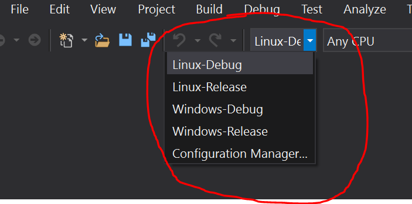

Building IoT on Windows
=======================

## Recommended Software
1. **[Visual Studio 2019](https://visualstudio.microsoft.com/vs/preview/)** (Community, Professional, Enterprise) with the latest updates. This is not required for building the repo, but it will help a lot if the intent is to change the code or add new bindings.
1. **[.NET Core SDK](https://dotnet.microsoft.com/download/dotnet-core/3.0)** To ensure the install worked, make sure you can call `dotnet` tool from a command prompt

## Building from the Command Line

From a (non-admin) Command Prompt window:

- `build.cmd` -  Will cause basic tool initialization and build the main library (System.Device.Gpio), the device bindings (projects under src/devices), tools and samples.

For more information on how to turn of parts of the build, please type `build.cmd -h` to see an up-to-date list

## Building from Visual Studio

In order to be able to open and build most projects in the repo with Visual Studio, you would have to already have run `build.cmd` from the root at least once. This is because this command will restore basic tooling and SDKs that most of the repo relies on. Once you have done that once, you should be able to open individual projects with Visual Studio, and should be able to build them in the IDE.

When opening the main library project (System.Device.Gpio) in Visual Studio, you can select the right configuration depending if you want to build the Linux or the Windows Configuration:

It is worth noting that files which are specific to the Linux configuration of a project, will have a filename like `*.Linux.cs` while the ones that are specific to Windows would have it like `*.Windows.cs` instead.
