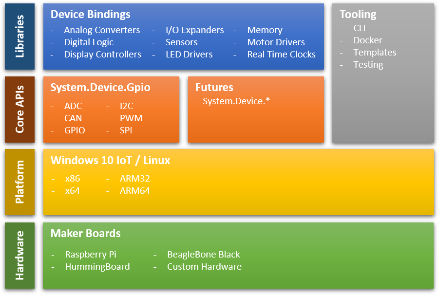

Our goal is to create a set of world-class APIs and tooling that will support a rich .NET IoT ecosystem.  Below shows a structure of components as part of our roadmap.

## Deliverables for vNext/Future

The following deliverables are not in any particular order:
* [ ] Add bindings for more devices
* [ ] Add/Test support on more boards
* [ ] Onboard more customers and work on making them successful
* [ ] Add infrastructure required for servicing bindings package
* [ ] Improve documentation for onboarding, adding device bindings, working with samples
* [ ] Improve the abstraction for devices in Iot.Device.Bindings package
* [ ] Collaborate with IoT Plug and Play
* [ ] Add E2E sample that leverages Azure IoT Hub to showcase the integration with Azure services
* [ ] Add testing for I2C, SPI, PWM protocols
* [ ] Add testing infrastructure for IoT.Device.Bindings
* [ ] Add control engineering algorithms (for example: PID)
* [ ] Support new protocols; for example I2S.
* [ ] Support common serial protocols: RS-485 Serial Port, Modbus, 1-wire
* [ ] Publish Docker images for a subset of samples

## Completed deliverables for our 3.0 release

* Support General-purpose input/output protocols: GPIO, SPI, I2C, and PWM
* Support analog-to-digital protocols: ADC
* Support CAN bus
* Support Raspberry Pi 3 on Linux and Windows 10 IoT Core RS5
* Support Hummingboard Edge on Linux and Windows 10 IoT Core RS5
* Support BeagleBoard Black on Linux and Windows 10 IoT Core RS5
* Support sysfs (/sys/class/gpio) for Generic/Portable Device Driver on Linux Kernel 3.6+
* Support libgpiod (/dev/gpiochipX) for Generic/Portable Device Driver on Linux Kernel 4.8+
* Stabilize System.Device.Gpio API
* Publish [System.Device.Gpio to NuGet.org](https://www.nuget.org/packages/System.Device.Gpio)
* Provide example dockerfiles for some samples
* Support x64
* Support ARM32
* Support ARM64
* Support Device Bindings for common sensors and microcontrollers such as those bundled with the [Microsoft IoT Starter Pack](https://www.adafruit.com/product/2733)
* Support Device Bindings and Canvas Widgets for LCDS, multi-panel [LED matrices](https://www.adafruit.com/product/607), and Displays
* Support Device Bindings for servo and stepper motors, motor controllers
* Stabilize IoT.Device.Bindings APIs for Device Bindings
* Publish [IoT.Device.Bindings to NuGet.org](https://www.nuget.org/packages/Iot.Device.Bindings)

  
More libraries and features are coming soon. Stay tuned!
