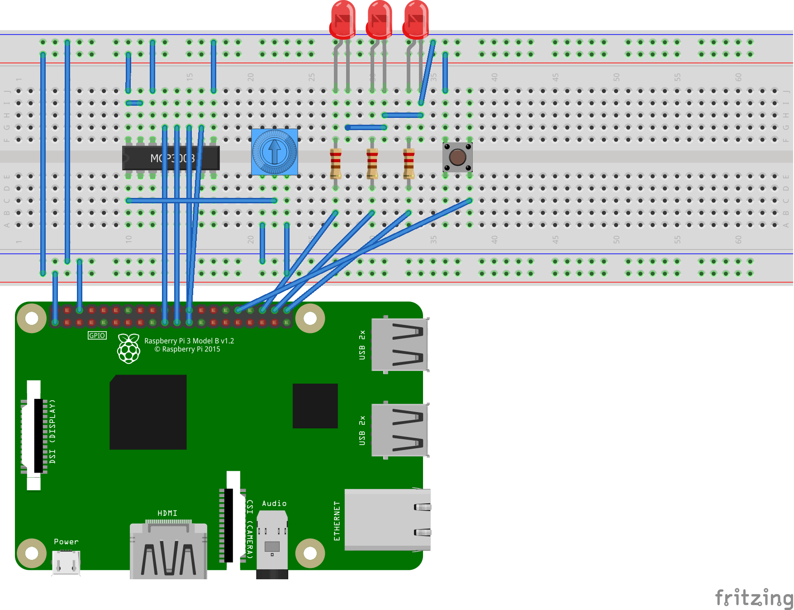

# .NET Core IoT Libraries

.NET Core can be used to build applications for [IoT](https://en.wikipedia.org/wiki/Internet_of_things) devices and scenarios. IoT applications typically interact with sensors, displays and input devices that require the use of [GPIO pins](https://en.wikipedia.org/wiki/General-purpose_input/output), serial ports or similar hardware.

This repository contains the [System.Device.Gpio](https://dotnet.myget.org/feed/dotnet-core/package/nuget/System.Device.Gpio) library and implementations for various boards like [Raspberry Pi](https://www.raspberrypi.org/) and [Hummingboard](https://www.solid-run.com/nxp-family/hummingboard/).

It also contains a growing set of community-maintained [device bindings](src/devices/README.md) for IoT components.

Note: System.Device.Gpio is in early preview. It is not yet supported and will continue to change. It is currently published to myget (requires use of [nuget.config](samples/led-blink/nuget.config)).

## How to Install and Get Started

You can install the latest daily pre-release build of the .NET Core System.Device.Gpio nuget package from the [dotnet.myget.org feed](https://dotnet.myget.org/feed/dotnet-core/package/nuget/System.Device.Gpio).

#### NuGet.exe
~~~~
nuget install System.Device.Gpio -PreRelease -Source https://dotnet.myget.org/F/dotnet-core/api/v3/index.json
~~~~

#### .NET CLI
~~~~
dotnet add package System.Device.Gpio --source https://dotnet.myget.org/F/dotnet-core/api/v3/index.json
~~~~

After installing, see the [samples/README.md](samples/README.md) for step by step instructions on building your first app.

## Community 

This project has adopted the code of conduct defined by the [Contributor Covenant](https://contributor-covenant.org/)
to clarify expected behavior in our community. For more information, see the [.NET Foundation Code of Conduct](https://www.dotnetfoundation.org/code-of-conduct).

## Contributing

Please contribute. We are primarily interested in the following:

* Improving quality and capability of the drivers for supported boards.
* Implementations for additional boards
* [.NET device bindings](src/devices) for a wide variety of sensors, chips, displays and other components.
* Links to blog posts or tweets that showcase .NET Core being used for great IoT scenarios (file an issue).
* Request a device binding or protocol that you need for your project (file an issue).

## Roadmap

We have the following deliverables on our intermediate-term roadmap (not in order of completion):

* [x] Support General-purpose input/output protocols: GPIO, SPI, I2C, and PWM
* [ ] Support common serial protocols: RS-485 Serial Port, CAN bus, Modbus
* [ ] Support digital audio bus protocols: I2S
* [x] Support Raspberry Pi 3 on Linux and Windows 10 IoT Core RS5
* [ ] Support Hummingboard Edge on Linux and Windows 10 IoT Core RS5
* [ ] Support BeagleBoard Black on Linux and Windows 10 IoT Core RS5
* [x] Support sysfs (/sys/class/gpio) for Generic/Portable Device Driver on Linux Kernel 3.6+
* [ ] Support libgpiod (/dev/gpiochipX) for Generic/Portable Device Driver on Linux Kernel 4.8+
* [ ] Stabilize System.Device.* API
* [ ] Publish System.Device.* API to NuGet.org
* [x] Provide dockerfiles for all samples
* [ ] Publish Docker images for a subset of samples
* [ ] Support x64
* [x] Support ARM32
* [ ] Support ARM64
* [ ] Support Device Bindings for common sensors and microcontrollers such as those bundled with the [Microsoft IoT Starter Pack](https://www.adafruit.com/product/2733)
* [ ] Support Device Bindings and Canvas Widgets for LCDS, multi-panel [LED matrices](https://www.adafruit.com/product/607), and Displays
* [ ] Support Device Bindings for servo and stepper motors, motor controllers, and drives
* [ ] Stabilize IoT.Device.* APIs for Device Bindings
* [ ] Publish IoT.Device.* Device Bindings to NuGet.org

## License

.NET Core (including the iot repo) is licensed under the [MIT license](LICENSE).
