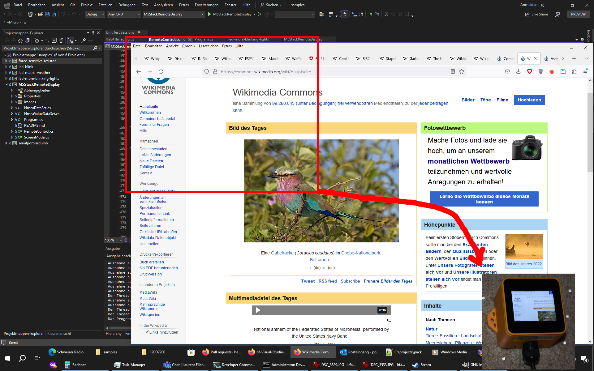

# Mirror the screen to an external display

This larger sample mirrors the screen (or parts of it) from Windows or Linux onto an external, small display. The sample is configured to talk to an M5Though IoT module, a readily available integrated piece of hardware from M5Stack. The device features a QVGA display with touchscreen, a power distribution unit connected to an ESP32 microcontroller.

To run the sample, load the [ConfigurableFirmata](https://github.com/firmata/ConfigurableFirmata) Firmware (V3.0 or later) onto the ESP32 first. The tool has some command line options:

```text
Ft4222 Connect to the screen using an FT4222 instead of an Arduino/ESP32.
INET   Connect using a network connection instead of serial (recommended, as it is faster). Provide the IP address as additional argument
--nmeaserver If an NMEA server is also available, the display can show some information from an NMEA stream (e.g. speed)
```

And this then looks as follows:


