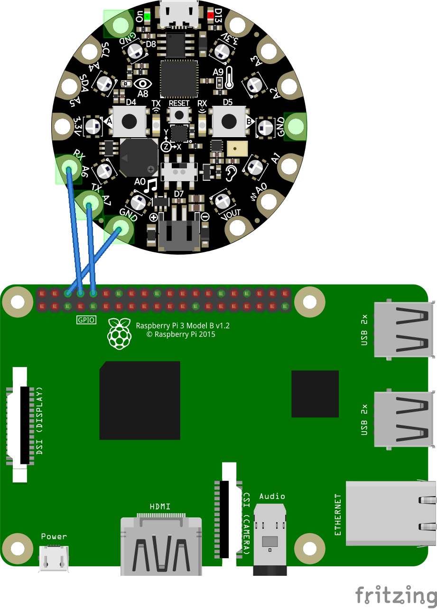

# Controlling Arduino with .NET using Raspberry Pi

## Overview

This sample shows how to control Arduino with .NET using serial port.

Sample consists of two parts:
- Arduino Playground Express app lighting 2 RGB LEDs in a circle (there are 10 LEDS in a shape of circle, consecutive LEDs are being lighted making effect of spinning - see diagram below for reference)
  - project has couple of parameters which can be controlled: rate of spinning, LED color, direction and also pausing the spinning
- .NET app using System.IO.Ports to communicate with Arduino - in this example we will use Raspberry Pi 3 model B.

In order to communicate we will use serial UART (aka. USART). To connect them you will need to first connect ground on both boards and then cross connect TX and RX lines together.

Next step is to invent protocol which Arduino understands.

Note: If you're planning to connect UART with i.e. RS232 you will need converter as they are using different voltage on the pins and connecting those directly may damage your board (RS232 usually uses +/-13V but can be even up to 25V while UART usually uses 3.3 or 5V).

## Diagram

[Fritzing Diagram](arduino-pi-sp.fzz) - `Arduino Playground Express` part is missing by default in Fritzing - it can be downloaded [here](https://github.com/adafruit/Fritzing-Library/blob/master/parts/Adafruit%20Circuit%20Playground%20Express.fzpz)



## Communication protocol

- Supported commands (sent by Raspberry Pi)
  - `DIR` - swap direction
  - `SPIN` - start/stop spinning
  - `COL RRGGBB` - set color to `RRGGBB` where `RRGGBB` is a hex number representing a color (i.e. `COL FF0000` will set color to red)
  - `RATE N` - set rate of spinning (`N` is delay between "moving" the light), default is 100. Low values might effectively have higher delay than expected (there is a delay related to reading from serial port)
- When Arduino processes a command it will respond with `OK` when command was recognized or `ERROR`.

## .NET app used for sending commands to Arduino

.NET part will be really simplistic - it will simply read one line from the console, send it using serial port and get a response from arduino.

Essential piece which transmit the data is just `sp.WriteLine("<command>")`

<details>
  <summary>.NET app</summary>

```csharp
using System;
using System.IO.Ports;
using System.Text;

namespace arduino_demo
{
    class Program
    {
        static void Main(string[] args)
        {
            if (args.Length == 0)
            {
                Console.WriteLine("simpleterm <portName> [<baudRate>=9600]");
                return;
            }

            string portName = args[0];
            int baudRate = args.Length >= 2 ? int.Parse(args[1]) : 9600;

            using (SerialPort sp = new SerialPort(portName))
            {
                sp.Encoding = Encoding.UTF8;
                sp.BaudRate = baudRate;
                sp.ReadTimeout = 1000;
                sp.WriteTimeout = 1000;
                sp.Open();

                bool finished = false;
                Console.CancelKeyPress += (a, b) =>
                {
                    finished = true;
                    // close port to kill pending operations
                    sp.Close();
                };

                Console.WriteLine("Type '!q' or Ctrl-C to exit...");
                Console.WriteLine("Example commands:");
                Console.WriteLine("  DIR");
                Console.WriteLine("    change direction of spinning");
                Console.WriteLine("  RATE 300");
                Console.WriteLine("    change rate to 300ms");
                Console.WriteLine("  COL FF0000");
                Console.WriteLine("    change LED color to red");
                Console.WriteLine("  SPIN");
                Console.WriteLine("    start/stop spinning");

                while (!finished)
                {
                    string line = Console.ReadLine();
                    if (line == "!q")
                        break;

                    try
                    {
                        sp.WriteLine(line);
                    }
                    catch (TimeoutException)
                    {
                        Console.WriteLine("ERROR: Sending command timed out");
                    }

                    if (finished)
                        break;

                    // if RATE is set to really high Arduino may fail to respond in time
                    // then on the next command you might get an old message
                    // ReadExisting will read everything from the internal buffer
                    string existingData = sp.ReadExisting();
                    Console.Write(existingData);
                    if (!existingData.Contains('\n') && !existingData.Contains('\r'))
                    {
                        // we didn't get the response yet, let's wait for it then
                        try
                        {
                            Console.WriteLine(sp.ReadLine());
                        }
                        catch (TimeoutException)
                        {
                            Console.WriteLine($"ERROR: No response in {sp.ReadTimeout}ms.");
                        }
                    }
                }
            }
        }
    }
}
```

</details>

To setup such app from the scratch (assumes your folder name is `arduino-demo` and that UART on Raspberry Pi is `/dev/ttyS0`):

```
dotnet new console
dotnet add package System.IO.Ports
```

ensure you got following nuget.config:

```xml
<?xml version="1.0" encoding="utf-8"?>
<configuration>
  <packageSources>
    <add key="dotnet-core" value="https://dotnet.myget.org/F/dotnet-core/api/v3/index.json" />
  </packageSources>
</configuration>
```

add runtime identifier in the property group to make it easier to publish:

```xml
<RuntimeIdentifier>linux-arm</RuntimeIdentifier>
```

edit the app and then to publish it (note: in many cases it might be easier to publish app elsewhere than Raspbery Pi and then copy it over to Raspberry Pi through i.e. SSH - if copying from Windows you might need to also add executable permission to your executable)

```
dotnet publish
```

publish command will produce binaries in `bin/Debug/netcoreapp3.0/linux-arm/publish`
To run your app simply call it while in that directory

```
./arduino-demo /dev/ttyS0
```

Note: this version might be out of date and not contain recent fixes - please see dogfooding instructions to test latest version of System.IO.Ports

### To dogfood latest bits

[See example csproj file](arduino-demo.csproj) and edit versions accordingly (currently contains latest as of writing this demo). It contains comments explaining how to edit it and find latest versions.

## Arduino example app

The most interesting part of the code is `serial_on_line_read` and `SPIN_PIXEL_ONCE` macro.
Please read comments added in the code for more details (first couple of lines explain commands being sent over serial port).

Please refer to Arduino tutorials on how to use Arduino sketch files and how to upload them to Arduino.
The example was built using [Arduino IDE](https://www.arduino.cc/en/Main/Software).

<details>
<summary>Arduino sketch</summary>

```c++
// COMMANDS:
//   DIR - swap direction
//   SPIN - start/stop spinning
//   COL RRGGBB - set color to RRGGBB where RRGGBB is a hex number representing a color (i.e. COL FF0000 will set color to red)
//   RATE N - set rate of spinning (N is delay between "moving" the light), default is 100.
//            Low values might effectively have higher delay than expected (there is a delay related to reading from serial port)
//
// NOTE: incorrect numbers will get converted into 0 which will cause the light to turn off

#include <Adafruit_CircuitPlayground.h>
#include <errno.h>

#define NO_LIGHTS 10
#define serport Serial1

int dir = -1;
int color = 0x0000FF;
int spin_rate = 100;
bool spin = true;

int pixel1;
int pixel2;

// dir is +1 or -1
// adding number of lights so that modulo works correctly
// (negative numbers have different modulo rules in C++ than in math)
#define SPIN_PIXEL_ONCE(pix) (pix = (pix + dir + NO_LIGHTS) % NO_LIGHTS)

void setup() {
  CircuitPlayground.begin();
  serport.begin(9600);

  CircuitPlayground.setBrightness(255);
 
  // Can be any two pixels
  pixel1 = 0;
  pixel2 = 5;
}

// this should be called in a loop
// when there is data available on serial port it will read it and process, specifically
// when line of text is read it will call serial_on_line_read with a line as an argument
void serial_process() {
  static const int len = 101;
  static char serial_recv_buff[len];
  static char* curr = serial_recv_buff;
  static char* end = serial_recv_buff + len;
  while (serport.available() > 0) {
    char c = serport.read();
    if (c == '\n' || c == '\r') {
      if (curr != serial_recv_buff) {
        *curr = '\0';
        String line = serial_recv_buff;
        serial_on_line_read(line);
      }
      curr = serial_recv_buff;
    }
    else {
      *curr++ = c;
      if (curr == end) {
        // overflow detected...
        curr = serial_recv_buff;
      }
    }
  }
}

int hex_to_num(const String& hex) {
  char* end;
  int ret = strtol(hex.c_str(), &end, 16);
  if (errno != 0) {
    errno = 0;
    return 0;
  }
  return ret;
}

// called by serial_process when line is read over serial port
void serial_on_line_read(const String& line) {
  if (line == "DIR") {
    dir = -dir;
    serport.println("OK");
  }
  else if (line == "SPIN") {
    spin = !spin;
    serport.println("OK");
  }
  else if (line.startsWith("COL ")) {
    String hex = line.substring(4);
    color = hex_to_num(hex);
    serport.println("OK");
  }
  else if (line.startsWith("RATE ")) {
    String rate = line.substring(5);
    spin_rate = rate.toInt();
    serport.println("OK");
  }
  else {
    serport.println("ERROR");
  }
}

void loop() {
  serial_process();

  CircuitPlayground.clearPixels();
 
  CircuitPlayground.setPixelColor(pixel1, color);
  CircuitPlayground.setPixelColor(pixel2, color);

  if (spin) {
    SPIN_PIXEL_ONCE(pixel1);
    SPIN_PIXEL_ONCE(pixel2);
  }
 
  delay(spin_rate);
}
```

</details>
