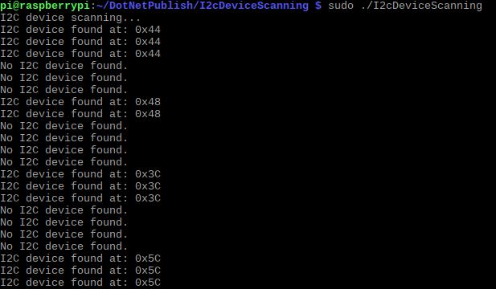

# I2C Device Scanning
This sample is used to demonstrate I2C device scanning.

## Circuit
The I2C pin of the sensor to scan the address is connected to the corresponding I2C pin of the Raspberry Pi.

## Code
```C#
static void Main(string[] args)
{
    Console.WriteLine("I2C device scanning...");

    while (true)
    {
        // I2C bus ID
        ScanDevice(1);

        // scanning every 5s
        Thread.Sleep(5000);
    }
}

public static void ScanDevice(int busId)
{
    I2cDevice device;
    bool isFound = false;

    for (int address = 1; address < 127; address++)
    {
        I2cConnectionSettings settings = new I2cConnectionSettings(busId, address);
        device = RuntimeInformation.IsOSPlatform(OSPlatform.Linux) ? (I2cDevice)new UnixI2cDevice(settings) : new Windows10I2cDevice(settings);

        try
        {
            using (device)
            {
                device.WriteByte(0);

                Console.WriteLine($"I2C device found at: 0x{Convert.ToString(address, 16).ToUpper()}");
                isFound = true;
            }
        }
        catch (Exception)
        {

        }
    }

    if (!isFound)
    {
        Console.WriteLine("No I2C device found.");
    }
}

```

## Result
