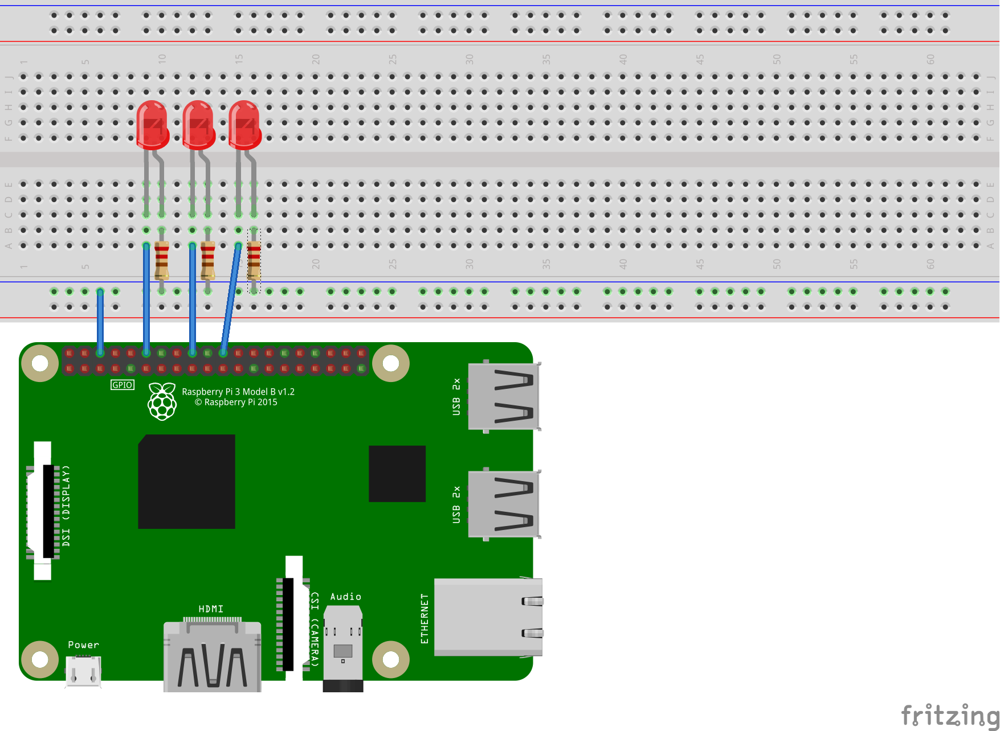

# Blink multiple LEDs with .NET on a Raspberry Pi

This [sample](Program.cs) demonstrates blinking multiple LEDs. The sample also demonstrates the most basic usage of the [.NET Core GPIO library](https://www.nuget.org/packages/System.Device.Gpio). The [Blink an LED](../led-blink/README.md) sample demonstrates a slightly simpler model if you just want to blink a single LED. That sample also demonstrates how to use these samples with Docker containers.

The following code toggles multiple GPIO pins on and off, which powers the LEDs.

```csharp
int lightTime = 1000;
int dimTime = 200;
int[] pins = new int[] {18, 24, 25};

using GpioController controller = new();

// configure pins
foreach (int pin in pins)
{
    controller.OpenPin(pin, PinMode.Output);
    controller.Write(pin, 0);
    Console.WriteLine($"GPIO pin enabled for use: {pin}");
}

// turn LED on and off
int index = 0;
while (true)
{
    int pin = pins[index];
    Console.WriteLine($"Light pin {pin} for {lightTime}ms");
    controller.Write(pin, PinValue.High);
    Thread.Sleep(lightTime);

    Console.WriteLine($"Dim pin {pin} for {dimTime}ms");
    controller.Write(pin, PinValue.Low);
    Thread.Sleep(dimTime);
    index++;

    if (index >= pins.Length)
    {
        index = 0;
    }
}

```

The following [fritzing diagram](rpi-led-multiple.fzz) demonstrates how you should configure your breadboard to match the code above.



## Resources

* [.NET IoT Docs](https://docs.microsoft.com/dotnet/iot/)
* [Diffused LEDs](https://www.adafruit.com/product/4203)
* [All about LEDs](https://learn.adafruit.com/all-about-leds)
* [Blinking an LED with Arduino](https://learn.adafruit.com/adafruit-arduino-lesson-2-leds/blinking-the-led)
* [Blinking an LED with Python](https://learn.adafruit.com/blinking-an-led-with-beaglebone-black/writing-a-program)
