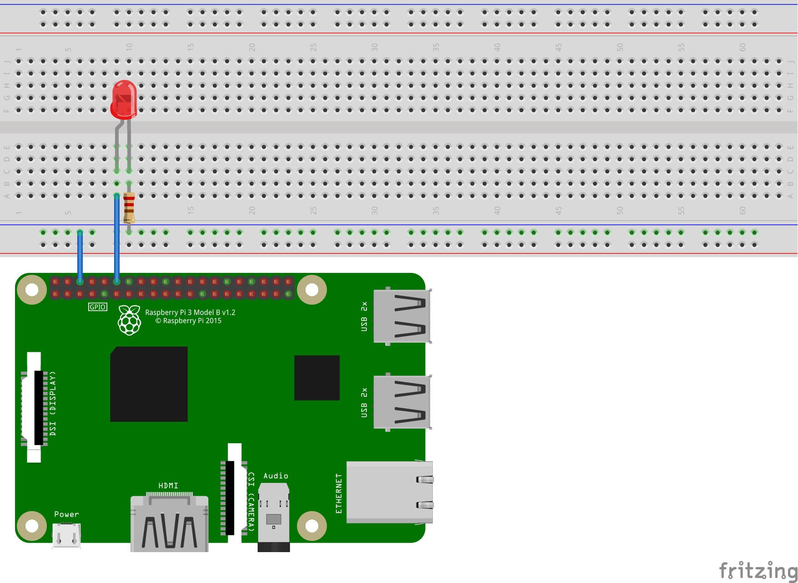

# Blink an LED with .NET Core on a Raspberry Pi

This [sample](Program.cs) demonstrates blinking an LED. The sample also demonstrates the most basic usage of the [.NET Core GPIO library](https://www.nuget.org/packages/System.Device.Gpio).

The following code toggles a GPIO pin on and off, which powers the LED.

```csharp
int pin = 18;
GpioController controller = new GpioController();
controller.OpenPin(pin, PinMode.Output);

int lightTimeInMilliseconds = 1000;
int dimTimeInMilliseconds = 200;

// turn LED on and off
while (true)
{
    Console.WriteLine($"Light for {lightTimeInMilliseconds}ms");
    controller.Write(pin, PinValue.High);
    Thread.Sleep(lightTimeInMilliseconds);
    Console.WriteLine($"Dim for {dimTimeInMilliseconds}ms");
    controller.Write(pin, PinValue.Low);
    Thread.Sleep(dimTimeInMilliseconds); 
}
```

The following [fritzing diagram](rpi-led.fzz) demonstrates how you should wire your device to match the code above.



## Extending the sample to multiple LEDs

The sample can be be adapted to use multiple LEDs. The following code defines an array of integers that specifies the pins that will be connected to LEDs. You can add or remove integers from the array, to account for the LEDs you want to use. The rest of the program iterates on the array in various ways.

```csharp
var pins = new int[] {18, 24, 25};
var lightTime = 1000;
var dimTime = 200;

Console.WriteLine($"Let's blink an LED!");
using GpioController controller = new GpioController();

// open pins as output mode
foreach (var pin in pins)
{
    controller.OpenPin(pin, PinMode.Output);
    Console.WriteLine($"GPIO pin enabled for use: {pin}");
}

Console.CancelKeyPress += (s, e) =>
{
    // turn off all pins when the program is terminated, with CTRL-C
    foreach (var pin in pins)
    {
        Console.WriteLine($"Dim pin {pin}");
        controller.Write(pin, PinValue.Low);
    }
};

// LED behavior
while (true)
{
    // turn each LED on and off, one at a time
    foreach (var pin in pins)
    {
        Console.WriteLine($"Light LED at pin {pin} for {lightTime}ms");
        controller.Write(pin, PinValue.High);
        Thread.Sleep(lightTime);

        Console.WriteLine($"Dim LED at pin {pin} for {dimTime}ms");
        controller.Write(pin, PinValue.Low);
        Thread.Sleep(dimTime);
    }

    // turns the pins on and off and various intervals
    // uses modulus math to turn on an arbitrary number of the LEDs with each iteration
    for (int i = 0; i < 6; i++)
    {
        // Light or dim each LED
        for (int j = 0; j < pins.Length; j++)
        {
            var pin = pins[j];
            // need a `0` or a `1` for the PinValue
            var pinValue = (i + j) % 2;
            Console.WriteLine($"Set pin {pin} as {(PinValue)pinValue} for {lightTime}ms");
            controller.Write(pin, pinValue);
        }

        Thread.Sleep(lightTime);
    }
}
```

The following [fritzing diagram](rpi-led-multiple.fzz) demonstrates how you should wire your device to match the code above.


## Resources

* [Diffused LEDs](https://www.adafruit.com/product/297)
* [All about LEDs](https://learn.adafruit.com/all-about-leds)
- [Blinking an LED with Arduino](https://learn.adafruit.com/adafruit-arduino-lesson-2-leds/blinking-the-led)
- [Blinking an LED with Python](https://learn.adafruit.com/blinking-an-led-with-beaglebone-black/writing-a-program)