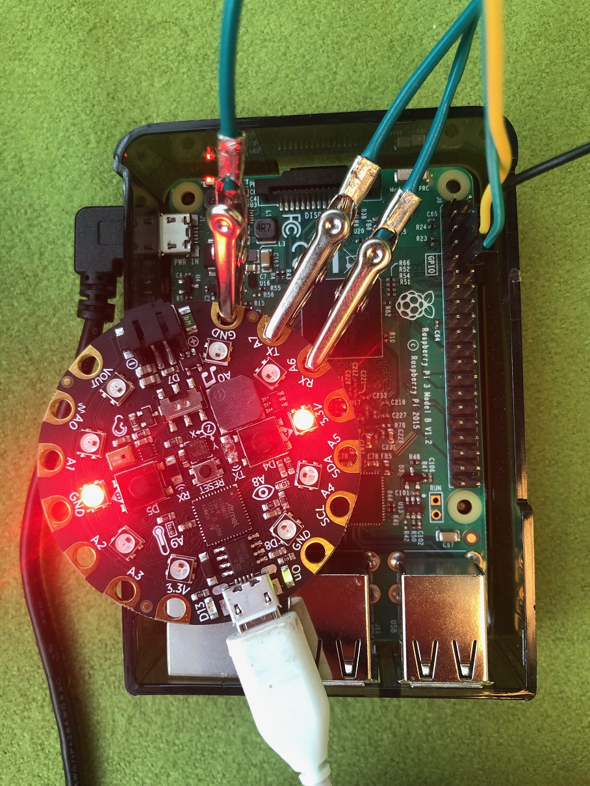
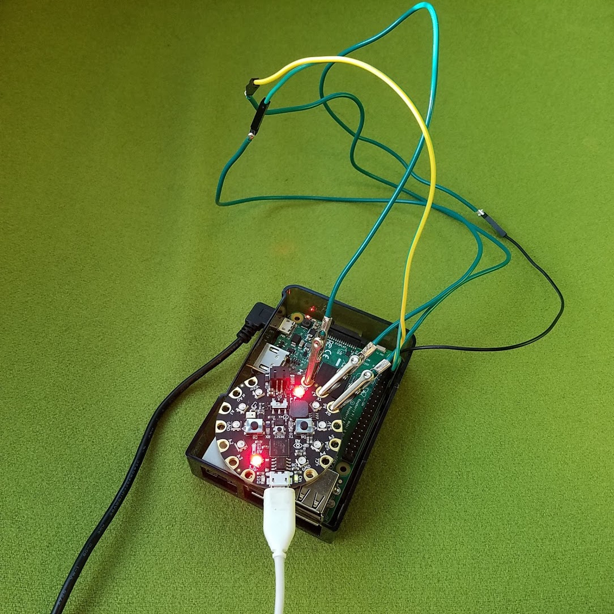

# Controlling Arduino with .NET using Raspberry Pi

https://www.youtube.com/watch?v=TW4K64hfa5U



## Overview

This sample shows how to control Arduino with .NET using serial port.

Sample consists of two parts:
- Arduino Playground Express app lighting 2 RGB LEDs in a circle (there are 10 LEDS in a shape of circle, consecutive LEDs are being lighted making effect of spinning - see diagram below for reference)
  - project has couple of parameters which can be controlled: rate of spinning, LED color, direction and also pausing the spinning
- .NET app using System.IO.Ports to communicate with Arduino - in this example we will use Raspberry Pi 3 model B.

In order to communicate we will use serial UART (aka. USART). To connect them you will need to first connect ground on both boards and then cross connect TX and RX lines together.

Next step is to invent protocol which Arduino understands.

Note: If you're planning to connect UART with i.e. RS232 you will need converter as they are using different voltage on the pins and connecting those directly may damage your board (RS232 usually uses +/-13V but can be even up to 25V while UART usually uses 3.3 or 5V).

## Diagram

[Fritzing Diagram](arduino-pi-sp.fzz) - `Arduino Playground Express` part is missing by default in Fritzing - it can be downloaded [here](https://github.com/adafruit/Fritzing-Library/blob/master/parts/Adafruit%20Circuit%20Playground%20Express.fzpz)


## Communication protocol

- Supported commands (sent by Raspberry Pi)
  - `DIR` - swap direction
  - `SPIN` - start/stop spinning
  - `COL RRGGBB` - set color to `RRGGBB` where `RRGGBB` is a hex number representing a color (i.e. `COL FF0000` will set color to red)
  - `RATE N` - set rate of spinning (`N` is delay between "moving" the light), default is 100. Low values might effectively have higher delay than expected (there is a delay related to reading from serial port)
- When Arduino processes a command it will respond with `OK` when command was recognized or `ERROR`.

## .NET app used for sending commands to Arduino

.NET part will be really simplistic - it will simply read one line from the console, send it using serial port and get a response from arduino.

Essential piece which transmit the data is just `sp.WriteLine("<command>")`

[See .NET app code.](Program.cs)

To setup such app from the scratch (assumes your folder name is `arduino-demo` and that UART on Raspberry Pi is `/dev/ttyS0`):

```
dotnet new console
dotnet add package System.IO.Ports -v 4.6.0-preview.18571.3
```

add runtime identifier in the property group to make it easier to publish (you can also provide it during publishing: `dotnet publish -r linux-arm`):

```xml
<RuntimeIdentifier>linux-arm</RuntimeIdentifier>
```

edit the app and then to publish it (note: in many cases it might be easier to publish app elsewhere than Raspbery Pi and then copy it over to Raspberry Pi through i.e. SSH - if copying from Windows you might need to also add executable permission to your executable)

```
dotnet publish
```

publish command will produce binaries in `bin/Debug/net5.0/linux-arm/publish`
To run your app simply call it while in that directory

```
./arduino-demo /dev/ttyS0
```

## Arduino example app

The most interesting part of the code is `serial_on_line_read` and `SPIN_PIXEL_ONCE` macro.
Please read comments added in the code for more details (first couple of lines explain commands being sent over serial port).

Please refer to Arduino tutorials on how to use Arduino sketch files and how to upload them to Arduino.
The example was built using [Arduino IDE](https://www.arduino.cc/en/Main/Software).

[See Arduino sketch file](uart-demo.ino)


