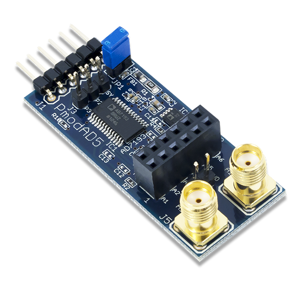

# AD7193 - 4-Channel, 4.8 kHz, Ultralow Noise, 24-Bit Sigma-Delta Analog-to-Digital Converter with PGA
The AD7193 is a low noise, complete analog front end for high precision measurement applications. It contains a low noise,  24-bit sigma-delta (Σ-Δ) analog-to-digital converter (ADC).  The on-chip low noise gain stage means that signals of small amplitude can interface directly to the ADC.  
The device can be configured to have four differential inputs or eight pseudo differential inputs. The on-chip channel sequencer allows several channels to be enabled simultaneously, and the AD7193 sequentially converts on each enabled channel, simplifyingcommunication with the part. The on-chip 4.92 MHz clock can be used as the clock source to the ADC or, alternatively, an externalclock or crystal can be used. The output data rate from the part can be varied from 4.7 Hz to 4.8 kHz.
The device has a very flexible digital filter, including a fast settling option. Variables such as output data rate and settling time are dependent on the option selected. The AD7193 also includes a zero latency option. 
The part operates with a power supply from 3 V to 5.25 V. It consumes a current of 4.6 5 mA,  and it is available in a 28-lead TSSOP package and a 32-lead LFCSP package. 

## Images


## Usage
In your Main method you can setup the device, and let the conversion begin. 
Both Single Coversion mode (with approximately 9 samples-per-second) and Continuous Conversion mode (with the maximum of 4800 samples-per-second) are supported.
```C#
// set SPI bus ID: 0
// AD7193 CS Pin: 1
SpiConnectionSettings settings = new SpiConnectionSettings(0, 1);
settings.ClockFrequency = Ad7193.MaximumSpiFrequency;
settings.Mode = SpiMode.Mode3;
SpiDevice ad7193SpiDevice = SpiDevice.Create(settings);

ad7193 = new Ad7193(ad7193SpiDevice);

Console.WriteLine($"-- Resetting and calibrating AD7193.");
ad7193.Reset();
ad7193.SetPGAGain(Ad7193.Gain.X1);
ad7193.Calibrate();
ad7193.SetPsuedoDifferentialInputs(false);
ad7193.AppendStatusRegisterToData = true;
ad7193.JitterCorrection = true;

ad7193.AdcValueReceived += Ad7193_AdcValueReceived;


Console.WriteLine("Starting 100 single conversion on CH0...");
ad7193.SetChannel(Ad7193.Channel.CH00);

for (int i = 0; i < 100; i++)
{
	ad7193.StartSingleConversion();
	ad7193.WaitForADC();
	ad7193.ReadADCValue();
	Thread.Sleep(25);
}

Thread.Sleep(1000);


Console.WriteLine();
Console.WriteLine();
Console.WriteLine("Starting continuous conversion on CH0 and CH1...");
ad7193.SetChannel(Ad7193.Channel.CH00 | Ad7193.Channel.CH01);
ad7193.StartContinuousConversion();

while (true)
{
	if (ad7193.HasErrors)
	{
		Console.WriteLine();
		Console.WriteLine($"AD7193 status: {ad7193.Status}");
		Console.WriteLine($"AD7193 mode: {ad7193.Mode}");
		Console.WriteLine($"AD7193 config: {ad7193.Config}");
		Console.WriteLine();
		Thread.Sleep(5000);
	}
	Thread.Sleep(250);
}
```

You will also need a method to process the digitalized values. This is done by defining an event handler on the AD7193 object.

```C#
private static void Ad7193_AdcValueReceived(object sender, Iot.Device.Ad7193.AdcValueReceivedEventArgs e)
{
	if (firstDataRead == DateTime.MinValue) firstDataRead = DateTime.UtcNow;
	double secondsElapsed = (DateTime.UtcNow - firstDataRead).TotalSeconds;

	samplesTaken++;

	// show the results in every 0.25 seconds
	if (secondsElapsed - lastChecked > 0.25)
	{
		double sps = (double)(samplesTaken - lastCount) / (secondsElapsed - lastChecked);

		lastCount = samplesTaken;
		lastChecked = secondsElapsed;

		Iot.Device.Ad7193.AdcValue adcValue = e.AdcValue;

		Console.WriteLine($"ADC value on channel {adcValue.Channel}: {adcValue.Voltage.ToString("0.0000").PadLeft(9)} V [{adcValue.Raw.ToString("N0").PadLeft(13)}] | sample rate: {sps.ToString("N1")} SPS");
	}
}
```

The whole sample project can be found in the samples folder.

## References
[Analog Devices AD7193](https://www.analog.com/media/en/technical-documentation/data-sheets/AD7193.pdf)
[Digilent Pmod AD5](https://reference.digilentinc.com/reference/pmod/pmodad5/start)
[Pmod interface specification 1.2](https://reference.digilentinc.com/_media/reference/pmod/pmod-interface-specification-1_2_0.pdf)
