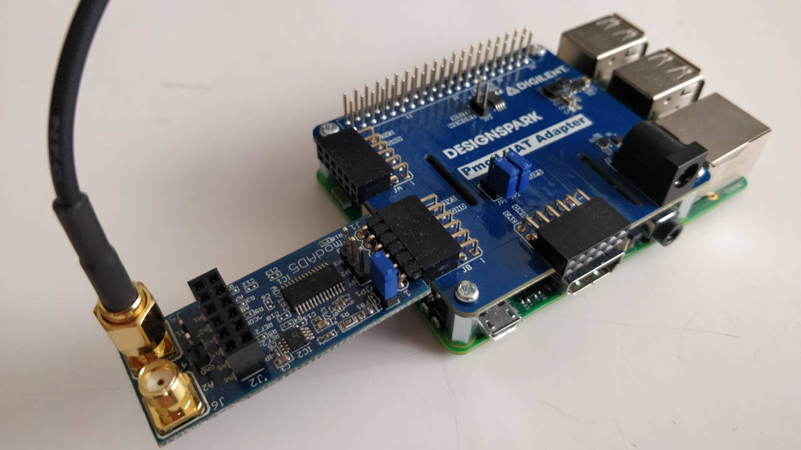
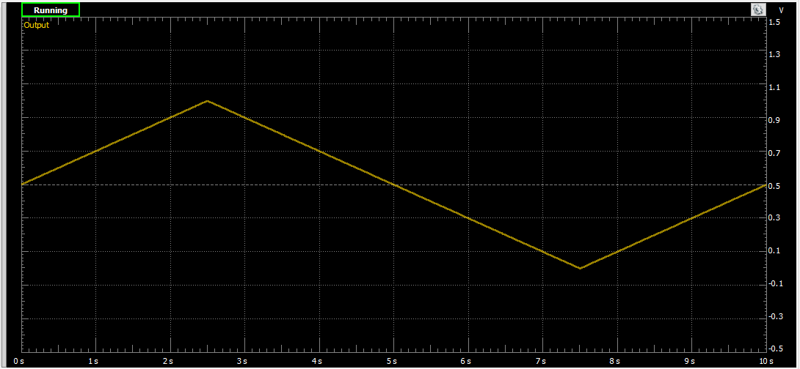
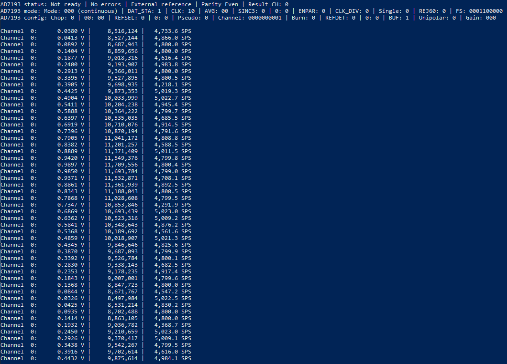

# AD7193 - Samples

## Required hardware
* [AD7193](https://www.analog.com/media/en/technical-documentation/data-sheets/AD7193.pdf)
* Any supported IoT device with an SPI bus

## Hardware used for testing
* [Pmod AD5](https://reference.digilentinc.com/reference/pmod/pmodad5/start) (an AD7193 frontend)
* [Raspberry Pi 3 Model B+](https://www.raspberrypi.org/products/raspberry-pi-3-model-b-plus/)
* [Pmod HAT Adapter](https://reference.digilentinc.com/reference/add-ons/pmod-hat/reference-manual) (Raspberry Pi Pmod HAT)
* [Analog Discovery 2](https://reference.digilentinc.com/reference/instrumentation/analog-discovery-2/reference-manual) (for signal generation)
* BNC to SMA cable

## Circuit, wiring and signal input




## Installation on Raspberry Pi
Before you publish your binaries on Raspberry Pi, you must restore the .NET Core packages for the project
> dotnet restore

Open and edit the credentials on the DeployToPi.ps1 file

Run the DeployToPi.ps1 script in a PowerShell window.
> .\DeployToPi.ps1

You can optionally attach the Visual Studio debugger, and debug your application running on the Pi

## Code
```C#
private static Ad7193 ad7193;
private static DateTime firstDataRead;
private static double lastChecked = 0;
private static int lastCount = 0;
private static int samplesTaken = 0;

static void Main(string[] args)
{
	// set SPI bus ID: 0
	// AD7193 CS Pin: 1
	SpiConnectionSettings settings = new SpiConnectionSettings(0, 1);
	settings.ClockFrequency = Ad7193.MaximumSpiFrequency;
	settings.Mode = SpiMode.Mode3;
	SpiDevice ad7193SpiDevice = SpiDevice.Create(settings);


	ad7193 = new Ad7193(ad7193SpiDevice);

	Console.WriteLine($"-- Resetting and calibrating AD7193.");
	ad7193.Reset();
	ad7193.SetPGAGain(Ad7193.Gain.X1);
	ad7193.Calibrate();
	ad7193.SetPsuedoDifferentialInputs(false);
	ad7193.AppendStatusRegisterToData = true;
	ad7193.JitterCorrection = true;

	ad7193.AdcValueReceived += Ad7193_AdcValueReceived;


	Console.WriteLine("Starting 100 single conversion on CH0...");
	ad7193.SetChannel(Ad7193.Channel.CH00);

	for (int i = 0; i < 100; i++)
	{
		ad7193.StartSingleConversion();
		ad7193.WaitForADC();
		ad7193.ReadADCValue();
		Thread.Sleep(25);
	}

	Thread.Sleep(1000);


	Console.WriteLine();
	Console.WriteLine();
	Console.WriteLine("Starting continuous conversion on CH0 and CH1...");
	ad7193.SetChannel(Ad7193.Channel.CH00 | Ad7193.Channel.CH01);
	ad7193.StartContinuousConversion();

	while (true)
	{
		if (ad7193.HasErrors)
		{
			Console.WriteLine();
			Console.WriteLine($"AD7193 status: {ad7193.Status}");
			Console.WriteLine($"AD7193 mode: {ad7193.Mode}");
			Console.WriteLine($"AD7193 config: {ad7193.Config}");
			Console.WriteLine();
			Thread.Sleep(5000);
		}
		Thread.Sleep(250);
	}
}

private static void Ad7193_AdcValueReceived(object sender, Iot.Device.Ad7193.AdcValueReceivedEventArgs e)
{
	if (firstDataRead == DateTime.MinValue) firstDataRead = DateTime.UtcNow;
	double secondsElapsed = (DateTime.UtcNow - firstDataRead).TotalSeconds;

	samplesTaken++;

	// show the results in every 0.25 seconds
	if (secondsElapsed - lastChecked > 0.25)
	{
		double sps = (double)(samplesTaken - lastCount) / (secondsElapsed - lastChecked);

		lastCount = samplesTaken;
		lastChecked = secondsElapsed;

		Iot.Device.Ad7193.AdcValue adcValue = e.AdcValue;

		Console.WriteLine($"ADC value on channel {adcValue.Channel}: {adcValue.Voltage.ToString("0.0000").PadLeft(9)} V [{adcValue.Raw.ToString("N0").PadLeft(13)}] | sample rate: {sps.ToString("N1")} SPS");
	}
}
```

## Result
You can see that the values are oscillating between 1.0 V and 0.0 V at the rate of 4800 SPS as expected.

