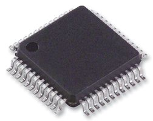

# ADG731
#### 2-Channel, Serially Controlled 4 Ohm 1.8 V to 5.5 V, +/- 2.5 V, Analog Multiplexer
The ADG731 is a monolithic, CMOS, 32-channel/dual 16-channel analog multiplexer with a serially controlled 3-wire interface. The ADG731 switches one of 32 inputs (S1–S32) to a common output, D. 

The mulitplexer utilizes a 3-wire serial interface that is com-patible with SPI®, QSPI™, MICROWIRE™, and some DSP interface standards. On power-up, the Internal Shift Register contains all zeros and all switches are in the OFF state.

The multiplexer is designed on an enhanced submicronprocess that provides low power dissipation yet gives high switching speed with very low on resistance and leakage currents.
They operate from a single supply of 1.8 V to 5.5 V or a ±2.5 V dual supply, making them ideally suited to a variety of applications. On resistance is in the region of a few ohms, is closely matched between switches, and is very flat over the full signal range.

These parts can operate equally well as either multiplexers or demultiplexers and have an input signal range that extends to the supplies. In the OFF condition, signal levels up to the supplies are blocked. All channels exhibit break-before-make switching action, preventing momentary shorting when switching channels. 

The ADG731 is a serially controlled 32-channel multiplexer. It is available in either a 48-lead LFCSP or TQFP package.

## Images


## Usage
In your Main method you can setup the device, and let the conversion begin. 
```C#
SpiConnectionSettings settings = new SpiConnectionSettings(0, 1)
{
	ClockFrequency = ((ISpiDeviceMetadata)Adg731.GetDeviceMetadata()).MaximumSpiFrequency,
	Mode = SpiMode.Mode3
};
SpiDevice adg731SpiDevice = SpiDevice.Create(settings);

Console.WriteLine($"Connecting to ADG731 using SPI {adg731SpiDevice.ConnectionSettings.Mode.ToString()} at {adg731SpiDevice.ConnectionSettings.ClockFrequency / 1000.0:N1} kHz...");

s_adg731 = new Adg731(adg731SpiDevice);
s_adg731.IsEnabled = true;
s_adg731.IsSelected = true;

int loopcounter = 0;
while (true)
{
	s_adg731.ActiveChannel = loopcounter % ((IMultiplexerDeviceMetadata)Adg731.GetDeviceMetadata()).MultiplexerChannelCount;
	Console.WriteLine($"Channel changed to {s_adg731.ActiveChannel}");
	loopcounter++;
	Thread.Sleep(500);
}
```

The whole sample project can be found in the [samples folder](samples/).

## References
[Analog Devices ADG731](https://www.analog.com/media/en/technical-documentation/data-sheets/ADG725_731.pdf)
