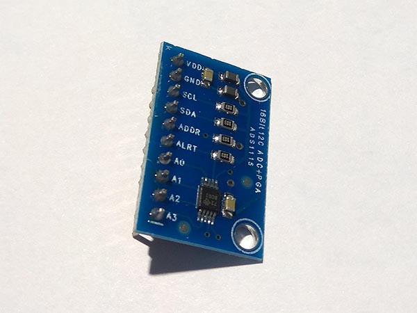
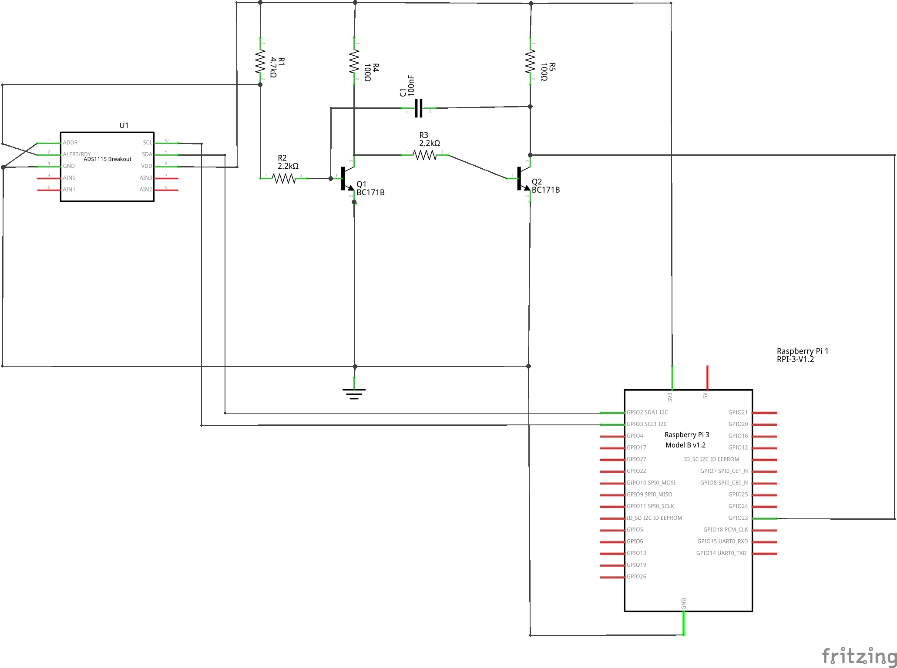

# ADS1115 - Analog to Digital Converter
ADS1115 is an Analog-to-Digital converter (ADC) with 16 bits of resolution.

## Sensor Image


## Usage
```C#
// set I2C bus ID: 1
// ADS1115 Addr Pin connect to GND
I2cConnectionSettings settings = new I2cConnectionSettings(1, (int)I2cAddress.GND);
I2cDevice device = I2cDevice.Create(settings);

// pass in I2cDevice
// measure the voltage AIN0
// set the maximum range to 6.144V
using (Ads1115 adc = new Ads1115(device, InputMultiplexer.AIN0, MeasuringRange.FS6144))
{
    // read raw data form the sensor
    short raw = adc.ReadRaw();
    // raw data convert to voltage
    double voltage = adc.RawToVoltage(raw);
}
```

See the samples project for more examples and usage for different applications. 

If you want to use the interrupt pin, the pulses generated by the ADS1115 might be to short to be properly recognized in the software, i.e. on a Raspberry Pi. The schematic below shows a way of increasing the pulse length so that it is properly recognized (from about 10us to 150us). This uses discrete electronics, but an implementation with an NE555 or equivalent would likely work as well (Just note that you need a type that works at 3.3V). 



## References
https://cdn-shop.adafruit.com/datasheets/ads1115.pdf
