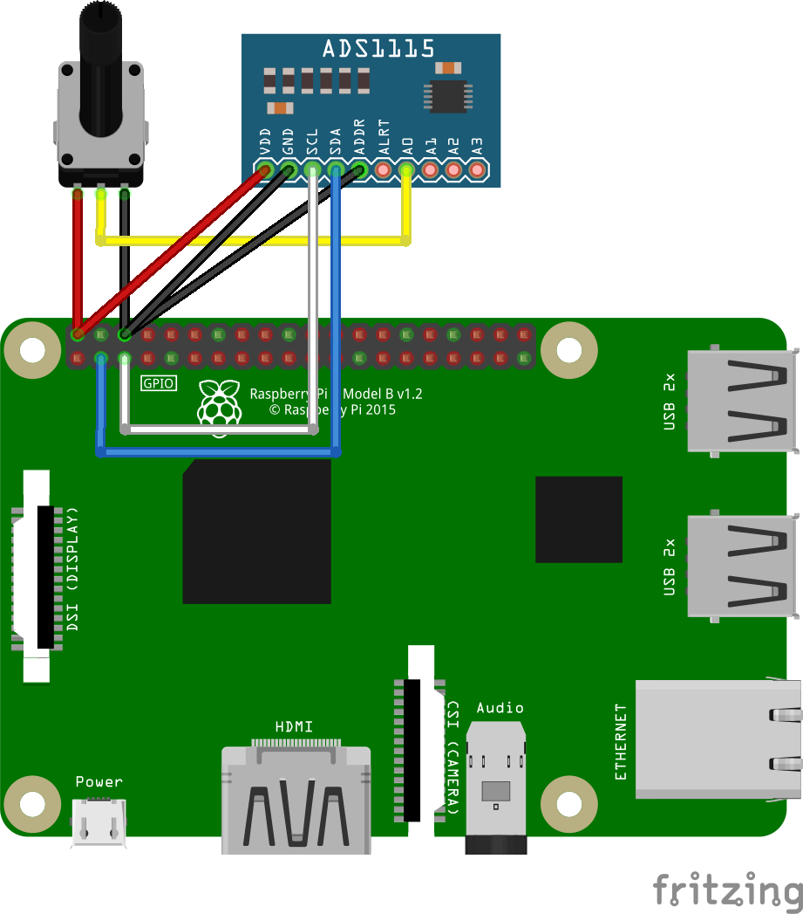

# ADS1115 - Samples

## Hardware Required
* ADS1115
* Rotary Potentiometer
* Male/Female Jumper Wires

## Circuit


ADS1115
* ADDR - GND
* SCL - SCL
* SDA - SDA
* VCC - 5V
* GND - GND
* A0 - Rotary Potentiometer Pin 2

Rotary Potentiometer
* Pin 1 - 5V
* Pin 2 - ADS1115 Pin A0
* Pin 3 - GND

## Code
```C#
// set I2C bus ID: 1
// ADS1115 Addr Pin connect to GND
I2cConnectionSettings settings = new I2cConnectionSettings(1, (int)I2cAddress.GND);
// get I2cDevice (in Linux)
UnixI2cDevice device = new UnixI2cDevice(settings);

// pass in I2cDevice
// measure the voltage AIN0
// set the maximum range to 6.144V
using (Ads1115 adc = new Ads1115(device, InputMultiplexer.AIN0, MeasuringRange.FS6144))
{
    // loop
    while (true)
    {
        // read raw data form the sensor
        short raw = adc.ReadRaw();
        // raw data convert to voltage
        double voltage = adc.RawToVoltage(raw);

        Console.WriteLine($"ADS1115 Raw Data: {raw}");
        Console.WriteLine($"Voltage: {voltage}");
        Console.WriteLine();

        // wait for 2s
        Thread.Sleep(2000);
    }
}
```

## Result

