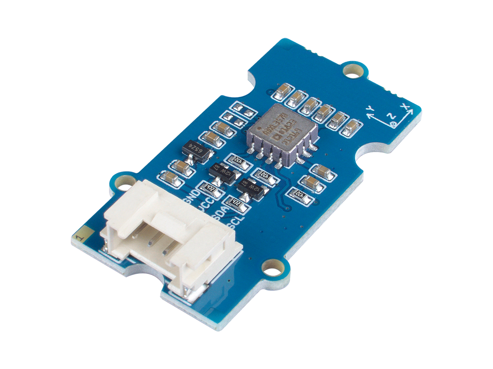

# ADXL357 - Accelerometer

ADXL357 is a 3-Axis digital accelerometer 40g with 20-bit resolution measurement at up to ±40g.
Sensitivity is configurable (±10g, ±20g, ±40g).
Has a built in temperature sensor.

## Sensor Image


Source: https://wiki.seeedstudio.com/Grove-3-Axis_Digital_Accelerometer_40g-ADXL357/

## Usage

```csharp
I2cConnectionSettings i2CConnectionSettings = new I2cConnectionSettings(1, Adxl357.DefaultI2CAddress);
I2cDevice device = I2cDevice.Create(i2CConnectionSettings);
using Adxl357 sensor = new Adxl357(device, AccelerometerRange.Range40G);
int calibrationBufferLength = 10;
int calibrationInterval = 100;
await sensor.CalibrateAccelerationSensor(calibrationBufferLength, calibrationInterval).ConfigureAwait(false);
while (true)
{
    // read data
    Vector3 data = sensor.Acceleration;

    Console.WriteLine($"X: {data.X.ToString("0.00")} g");
    Console.WriteLine($"Y: {data.Y.ToString("0.00")} g");
    Console.WriteLine($"Z: {data.Z.ToString("0.00")} g");
    Console.WriteLine();

    // wait for 500ms
    Thread.Sleep(500);
}
```

## References

https://www.analog.com/en/products/adxl357.html
