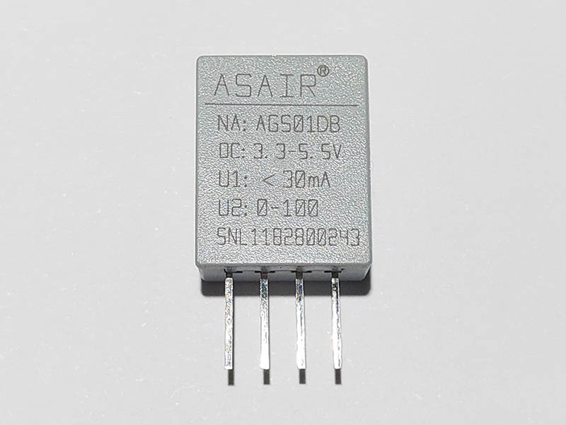

# AGS01DB - MEMS VOC Gas Sensor
AGS01DB is a MEMS VOC gas sensor with calibrated digital signal output. It uses special digital module acquisition technology and gas sensing technology to ensure that the product has high reliability and excellent long-term stability.

## Sensor Image


## Usage
```C#
I2cConnectionSettings settings = new I2cConnectionSettings(1, Ags01db.DefaultI2cAddress);
I2cDevice device = I2cDevice.Create(settings);

using (Ags01db sensor = new Ags01db(device))
{
    // read AGS01DB version
    byte version = sensor.Version;

    // read VOC concentration
    double concentration = sensor.Concentration;
}

```

## References
Products Page in English: http://www.aosong.com/en/products-33.html

Datasheet in English: [To be supplemented]()

Datasheet in Chinese: http://www.aosong.com/userfiles/files/media/AGS01DB%E6%B0%94%E4%BD%93%E4%BC%A0%E6%84%9F%E5%99%A8%E6%A8%A1%E5%9D%97%E8%AF%B4%E6%98%8E%E4%B9%A6V10.pdf
