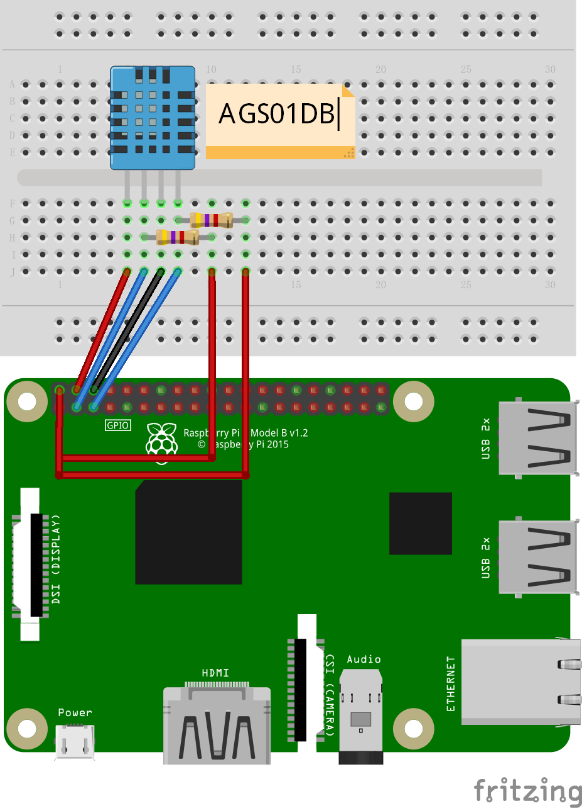

# AGS01DB - Samples

## Hardware Required
* AGS01DB
* 4.7kΩ resistance × 2
* Male/Female Jumper Wires

## Circuit


* SCL - SCL
* SDA - SDA
* VCC - 5V
* GND - GND

SDA, SCL need pull-up resistance.

## Code
```C#
I2cConnectionSettings settings = new I2cConnectionSettings(1, Ags01db.DefaultI2cAddress);
UnixI2cDevice device = new UnixI2cDevice(settings);

using (Ags01db sensor = new Ags01db(device))
{
    // read AGS01DB version
    Console.WriteLine($"Version: {sensor.Version}");
    Console.WriteLine();

    while (true)
    {
        // read concentration
        Console.WriteLine($"VOC Gas Concentration: {sensor.Concentration}ppm");
        Console.WriteLine();

        Thread.Sleep(3000);
    }
}
```

## Result

