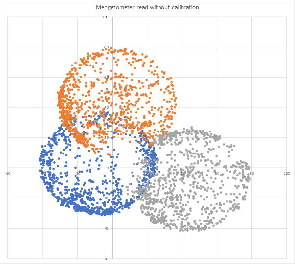

# AK8963 - Magnetometer

The AK8963 is a magnetometer that can be controlled either thru I2C either thru SPI. It is present in other sensors like the [MPU9250](../Mpu9250/README.md). This implementation fully supports the I2C mode and the usage thru the MPU9250. It does not support SPI.

## Usage

You can find an example in the [sample](./samples/ak8963.sample.cs) directory. Usage is straight forward including the possibility to have a calibration.

```csharp
var mpui2CConnectionSettingmpus = new I2cConnectionSettings(1, Ak8963.Ak8963.DefaultI2cAddress);
// This will use the default I2C interface
Ak8963 ak8963 = new Ak8963(I2cDevice.Create(mpui2CConnectionSettingmpus));
if (!ak8963.CheckVersion())
    throw new IOException($"This device does not contain the correct signature 0x48 for a AK8963");
Console.Clear();
while (!Console.KeyAvailable)
{
    var magne = ak8963.ReadMagnetometer(true);
    Console.WriteLine($"Mag X = {magne.X, 15}");
    Console.WriteLine($"Mag Y = {magne.Y, 15}");
    Console.WriteLine($"Mag Z = {magne.Z, 15}");
    Thread.Sleep(100);
}
```

## Calibration and bias

You can get access to the self tests and calibration thru the ```CalibrateMagnetometer``` function which will return the bias calibration. Be aware that the calibration takes couple of seconds.

```csharp
var magBias = ak8963.CalibrateMagnetometer();
Console.WriteLine($"Factory Bias:");
Console.WriteLine($"Mag X = {magBias.X}");
Console.WriteLine($"Mag Y = {magBias.Y}");
Console.WriteLine($"Mag Z = {magBias.Z}");
Console.WriteLine($"Bias from calibration:");
Console.WriteLine($"Mag X = {ak8963.MagnometerBias.X}");
Console.WriteLine($"Mag Y = {ak8963.MagnometerBias.Y}");
Console.WriteLine($"Mag Z = {ak8963.MagnometerBias.Z}");
```

You will find a full example on how to extract raw data without calibration on the [MPU9250 sample](../Mpu9250/samples/Mpu9250.sample.cs).

If no calibration is performed, you will get a raw data cloud which looks like this:



Running the calibration properly require to **move the sensor in all the possible directions** while performing the calibration. You should consider running it with enough samples, at least few hundreds. The default is set to 1000. While moving the sensor in all direction, far from any magnetic field, you will get the previous clouds. Calculating the average from those clouds and subtracting it from the read value will give you a centered cloud of data like this:


To create those cloud point graphs, every cloud is a coordinate of X-Y, Y-Z and Z-X. 

Once the calibration is done, you will be able to read the data with the bias corrected using the ```ReadMagnetometer``` function. You will still be able to read the data without any calibration using the ```ReadMagnetometerWithoutCalibration``` function.

## Using a different I2C interface

This sensor is used for example in the [MPU9250](../Mpu9250/README.md). The MPU9250 is in this case a master I2C controlling the slave AK8963 I2C sensor. An abstract class is available to implement basic I2C operation:

```csharp
public abstract class Ak8963I2cBase
{
    public abstract void WriteRegister(I2cDevice i2CDevice, Register reg, byte data);
    public abstract byte ReadByte(I2cDevice i2CDevice, Register reg);
    public abstract void ReadBytes(I2cDevice i2CDevice, Register reg, Span<byte> readBytes);
}
```

For example the I2C basic implementation is the following:

```csharp
public class Ak8963I2c : Ak8963I2cBase
{
    public override byte ReadByte(I2cDevice i2cDevice, Register reg)
    {
        i2cDevice.WriteByte((byte)reg);
        return i2cDevice.ReadByte();
    }

    public override void ReadBytes(I2cDevice i2cDevice, Register reg, Span<byte> readBytes)
    {
        i2cDevice.WriteByte((byte)reg);
        i2cDevice.Read(readBytes);
    }

    public override void WriteRegister(I2cDevice i2cDevice, Register reg, byte data)
    {
        Span<byte> dataout = stackalloc byte[] { (byte)reg, data };
        i2cDevice.Write(dataout);
    }
}
```

The class embedded into the MPU9250 is more complex, for example here is the code to do the WriteRegister operation:

```csharp
public override void WriteRegister(I2cDevice i2cDevice, Ak8963.Register reg, byte data)
{
    Span<byte> dataout = stackalloc byte[2] { (byte)Register.I2C_SLV0_ADDR, Ak8963.Ak8963.DefaultI2cAddress };
    i2cDevice.Write(dataout);
    dataout[0] = (byte)Register.I2C_SLV0_REG;
    dataout[1] = (byte)reg;
    i2cDevice.Write(dataout);
    dataout[0] = (byte)Register.I2C_SLV0_DO;
    dataout[1] = data;
    i2cDevice.Write(dataout);
    dataout[0] = (byte)Register.I2C_SLV0_CTRL;
    dataout[1] = 0x81;
    i2cDevice.Write(dataout);
}
```

If you have to use a different I2C interface, you have to use the constructor where you can pass it:

```csharp
ak8963 = new Ak8963(_i2cDevice, new Ak8963Attached(), false);
```

## Circuit

Only I2C is supported in this version.

* SCL - SCL
* SDA - SDA
* VCC - 3.3V
* GND - GND

Depending on the version you have, you may have to select I2C over SPI. This is done in different way depending on the board you'll have. 

## Reference

Documentation for the AK8963 can be found here: https://www.akm.com/akm/en/file/datasheet/AK8963C.pdf