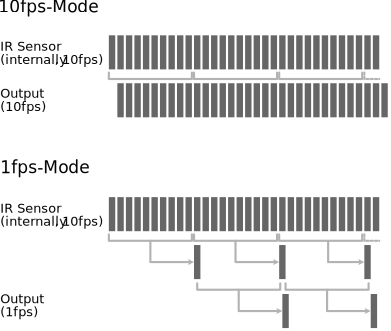

# AMG88xx Infrared Array Sensor Family

The sensors of the AMG88xx family of infrared array sensors have 64 thermophile pixels arranged in an 8×8 matrix. The sensor works as a thermal infrared camera. It can detect objects (e.g. human bodies) from a distance of up 5-7m. A pixel can measure object temperatures in a range of 0 to 80°C / -20 to 100°C with a resolution of 0.25°C and an accuracy of ±2.5°C / ±4.5°C. The sensor has a view field angle of 60° and a 7.5° view angle per pixel.

The manufacturer (Panasonic) names the following applications: home appliances (microwaves and air-conditioners), building automation (people counting, air conditioning control), home automation (people detection), factory automation (fault prevention). The sensor delivers a heat image through its digital interface (I2C) at a rate of 1 or 10 frames per second.
Additionally an interrupt pin can raise an event when any individual pixel goes above or below a configured threshold.


## Documentation

- Product [homepage](https://industry.panasonic.eu/components/sensors/grid-eye)
- Product [flyer](https://eu.industrial.panasonic.com/sites/default/pidseu/files/downloads/files/)grid-eye_flyer_english_web.pdf
- Reference [Specification](https://mediap.industry.panasonic.eu/assets/custom-upload/Components/Sensors/Industrial%20Sensors/Infrared%20Array%20Sensor%20Grid-EYE/grid_eye_reference_specifications_160205.pdf)
- [FAQ](https://mediap.industry.panasonic.eu/assets/custom-upload/Components/Sensors/Industrial%20Sensors/Infrared%20Array%20Sensor%20Grid-EYE/faqs_grideye_v1.0.pdf)
- Application [note](https://mediap.industry.panasonic.eu/assets/custom-upload/Components/Sensors/Industrial%20Sensors/Infrared%20Array%20Sensor%20Grid-EYE/application_notes_grid-eye_0.pdf)

### Device Family

the [AMG88](https://industrial.panasonic.com/cdbs/www-data/pdf/ADI8000/ADI8000COL13.pdf) family consists of 4 members:

|Type   |Resolution|Gain |Vcc|Obj. Temp. Range|Resolution|Accuracy|
|-------|----------|-----|---|----------------|----------|--------|
|AMG8833| 8x8      | High|3V3|0-80°C          |0.25°C    |±2.5°C  |
|AMG8834| 8x8      | Low |3V3|-20-100°C       |0.25°C    |±4.5°C  |
|AMG8853| 8x8      | High|5V0|0-80°C          |0.25°C    |±2.5°C  |
|AMG8854| 8x8      | Low |5V0|-20-100°C       |0.25°C    |±4.5°C  |

The sensor is equipped with an on-chip thermistor which can be read out.
The thermistor has a measurement range of -20...80°C at a resolution of 0.0625°C.

## Binding Notes

The Amg88xx binding provides a lean interface to retrieve the pixel array and to control the sensor. All sensor functions are covered. Any further processing, e.g. pattern recognition, is beyond the scope of the binding.

### Thermal image / Pixel array

The temperature readings of the pixel array can be read as a thermal image with 64 pixels arranged in an 8x8 matrix.
The pixel array can be read out at any time and speed. However, the sensor updates the corresponding registers depending on the configured frame rate.

The sensor has an integrated thermistor which can be readout to get the chip temperature.

**Note:** The chip temperature does *not* equal to the environmental temperature.

The current image can be read from the sensor into the binding by:

```csharp
public void ReadImage()
```

The temperature of a pixel specified by its coordinates can be read using an indexer:

```csharp
public Temperature this[int x, int y]
```

The whole temperature image can be read as a two-dimensional array:

```csharp
public Temperature[,] TemperatureImage
```

The raw reading (12-bit two's complement format) of a pixel specified by its number can be read using an indexer:

```csharp
public Int16 this[int n]
```

**Note**: there is no statement in the reference specification regarding the synchronization between an update of the pixel registers and the readout operation. So, you may read out pixel data from two subsequent frames in one readout operation. However, for normal application this shouldn't be relevant.

Property:

```csharp
public Temperature SensorTemperature
```

**Note**: the thermistor temperature is **not** equivalent to the

### Operating Mode / Power Control

The sensor supports four operating modes to control power consumption:

- Normal
- Sleep Mode
- Stand-by with 60 seconds intermittence
- Stand-by with 10 seconds intermittence

Property:

```csharp
public OperatingMode OperatingMode
```

**Note**: refer to the reference specification for further details on mode transitions and sensor behavior.

### Reset

The sensor supports two types of resets.

- **Reset:** Resets all flags and registers to default values
- **Resetting all flags:** Resets all flags (status register, interrupt flag, interrupt table)

```csharp
public void Reset()
public void ResetAllFlags()
```

**Note**: resetting the interrupt related flags is only required if you want to clear flags while the readings are still within the hysteresis span. See interrupts section for further details on interrupt behavior.

### Sensor Status

The sensor status indicates if any pixel or the chip internal thermistor overran the upper or lower operating range limit. It also flags on the occurrence of an interrupt. The status can be read out and reset per flag:

```csharp
public bool HasTemperatureOverflow();
public void ClearTemperatureOverflow();

public bool HasThermistorOverflow();
public void ClearThermistorOverflow();

public bool HasInterrupt();
public void ClearInterrupt();

public void ClearAllFlags();
```

**Note**: resetting the interrupt flag is only required if you want to clear flags while the readings are still within the hysteresis span (but already within the lower-upper range). This method does not clear the interrupt flags of the individual pixels.
See interrupts section for further details on interrupt behavior.

*Note*: the thermistor overflow flag is only menthioned in early versions of the reference specification.
It is not clear whether this is a specification error or a change in a newer revision of the sensor.

### Frame Rate

**Default:** 10fps

The sensor supports frame rates of 1fps and 10fps. The frame rate defines the update interval of the pixels. This is independent from the readout interval through the I2C interface.

Property:

```csharp
public FrameRate FrameRate
```

### Moving average

**Default:** off

The sensor supports a moving average mode. In this mode it builds the twice moving average for each pixel.

- If the frame rate is set to 10fps the sensor takes the average of the readings *n* and *n+1* and yields their average as output.
- If the frame rate is set to 1fps the sensor takes the readings of 10 frames (as the sensor runs internally always at 10fps) and builds the average.
The average of two averages of 10 readings is the resulting output.



The noise per pixel will decrease to 1/sqrt2 when using the moving average mode.

Property:

```csharp
public bool UseMovingAverageMode
```

***Important***: the reference specification states that the current mode can be read, but it doesn't seem to work at the time being. In this case the property is always read as ```false```.

### Interrupt control, levels and pixel flags

The sensor can raise an interrupt if any pixel passes a given value. The event is signaled by the interrupt flag of the status register. Additionally the INT pin of the sensor can be pulled low.

Properties:

```csharp
public InterruptMode PixelTemperatureInterruptMode
public bool InterruptPinEnabled
```

The interrupt levels can be configured. The lower and upper limit as well as the hysteresis level can be set and read. Initially the register is filled with zeros. The levels apply to all pixels equally.

Properties:

```csharp
public Temperature InterruptLowerLevel
public Temperature InterruptUpperLevel
public Temperature InterruptHysteresis
```

After the sensor raised an interrupt the triggering pixels can be readout from the interrupt table register.

```csharp
public bool[,] GetInterruptFlagTable()
```


Interrupt levels and hysteresis

Note:

- be aware that the interrupt flag in the status register is reset automatically if no pixel temperature exceeds the lower or upper threshold. It is **not** required to reset the flag manually.
- any flag in the interrupt flag table is automatically reset if the corresponding pixel is no long exceed the lower or upper threshold.
- if a hysteresis is applied and the reading of a pixel is not passing the threshold anymore, while at the same time the reading is still within the hysteresis span, the interrupt flag can be cleared by using the ```ResetAllFlags``` method.

## Example

### Overview

The [sample application](https://github.com/dotnet/iot/tree/main/src/devices/Amg88xx/samples) demonstrates the key functions of the sensor and the binding:

- thermal image readout
- interrupt triggering based on temperature levels incl. hysteresis
- sensor states
- noise reduction by using the sensor's moving average function

There are AMG88xx breakout boards available from a variety of vendors. You can use any of them as long as it provides access to the I2C interface of the sensor.

**Note:** There are also boards available with additional interfaces or even with an integrated Arduino or compatible circuit. You can use this binding only if the boards gives you access to the I2C interface only.

### Wiring

For demonstration purpose the INT-pin of the sensor is connected to GPIO PIN 5 of the RPi. Additionally an LED is connected to GPIO PIN 6 of the RPi. The LED signals the occurrence of an interrupt.
The resistor depends on the LED type; however 150R-220R is a safe choice for a standard red LED. Or precisely: `R = (3,3V -  U LED,forward) / I LED, forward`


