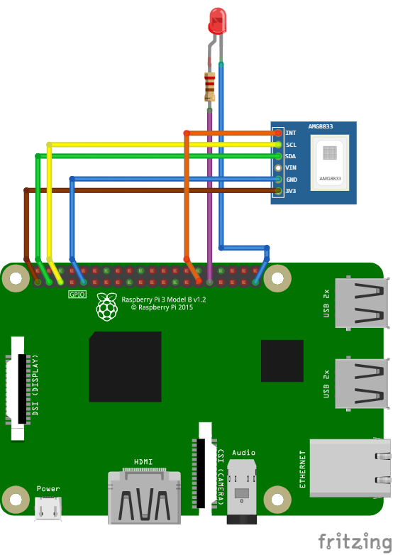

# Sample application for the AMG8xx binding

## Overview
The sample application demonstrates the key functions of the sensor and the binding
* thermal image readout
* interrupt triggering based on temperature levels incl. hysteresis
* sensor states
* noise reduction by using the sensor's moving average function

There are AMG88xx breakout boards available from a variety of vendors. You can use any of them as long as it provides access to the I2C interface of the sensor.

**Note:** There are also boards available with additional interfaces or even with an integrated Arduino or compatible circuit. You can use this binding only if the boards gives you access to the I2C interface only.

## Wiring
For demonstration purpose the INT-pin of the sensor is connected to GPIO PIN 5 of the RPi. Additionally an LED is connected to GPIO PIN 6 of the RPi. The LED signals the occurrence of an interrupt.
The resistor depends on the LED type; however 150R-220R is a safe choice for a standard red LED. Or precisely: R = (3,3V -  U LED,forward) / I LED, forward

## References
You should refer to the README.md of the binding for more useful information as well as to the reference specification of the AMG88xx sensor family.

**Reference Specification**: https://mediap.industry.panasonic.eu/assets/custom-upload/Components/Sensors/Industrial%20Sensors/Infrared%20Array%20Sensor%20Grid-EYE/grid_eye_reference_specifications_160205.pdf

**Application Note**: https://mediap.industry.panasonic.eu/assets/custom-upload/Components/Sensors/Industrial%20Sensors/Infrared%20Array%20Sensor%20Grid-EYE/application_notes_grid-eye_0.pdf
