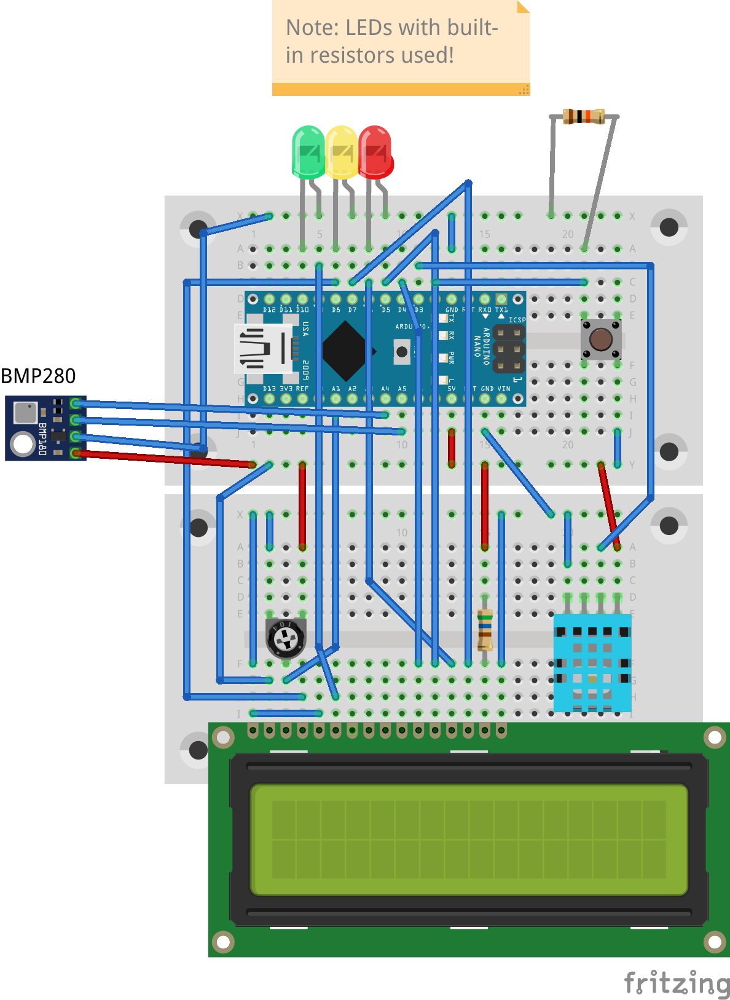

# SPI, GPIO and I2C drivers for Arduino with Firmata

This binding supports GPIO, PWM, SPI and I2C access from a normal Desktop environment (Windows, Linux) through an Arduino board or a variety of other microcontroller boards. This is done through an Arduino program called "Firmata" developed for this particular purpose.

## Device family

This binding remotely controls Arduino boards directly from PC Software. It provides support for accessing GPIO ports as well as I2C devices, SPI devices, PWM output and analog input. The Arduino is remote controlled by individual commands from the PC, the C# program will run on the PC, and not on the Arduino, so the connection cannot be removed while the device is being used.

**Supported Board Types**
The following board types are known to work with this binding. Many others may work as well.

- Arduino AVR based boards: Arduino UNO, Arduino Nano, Arduino Pro Mini
- 32 Bit Arduino Boards: Arduino Due
- ESP32 (over serial and Wifi)

Known problems:

- The Arduino Pro Mini (and possibly a few other boards with a similarly slow clock rate) require that the baud rate be set to 57600 or less to work reliably.

## Desktop Requirements

In order to get an Arduino board working with the PC, you need to Install the Arduino IDE together with the drivers for your board type. If you get a simple sketch uploaded and running (such as the blinking LED example) you are fine to start. If you're new to the Arduino world, read the introductions at <https://www.arduino.cc/en/Guide> for a quick start. The explanations below assume you have the Arduino board connected through an USB cable with your PC and you know how to upload a sketch. Once the sketch has been uploaded, the IDE is no longer required.

## Preparing your Arduino

### Quick start

You need to upload a special sketch to the Arduino. This sketch implements the "Firmata-Protocol", a communication protocol that allows to remotely control all the inputs and outputs of the board. See [Firmata Protocol](https://github.com/firmata/protocol/blob/master/protocol.md) for details. We call this sketch (or variants of it, see below) the Firmata firmware.

The binding requires Firmata Version 2.6, which is implemented i.e. by the ConfigurableFirmata project.

- Open the Arduino IDE
- Go to the library manager and check that you have the "ConfigurableFirmata" library installed
- Load the ConfigurableFirmata sample from the Arduino IDE's sample directory or go to <http://firmatabuilder.com/> to create your own custom firmata firmware. Make sure you have at least the features checked that you will need.
- Compile and upload this sketch to your Arduino.

After these steps, you can start coding with Iot.Devices.Arduino and make your Arduino do whatever you want, from blinking LEDS to your personal weather station. For usage and examples see the samples folder. Note that ConfigurableFirmata uses a default UART speed of 57600 baud. It is recommended to increase it to at least 115200, though.

When the firmware starts, the on-board-LED flashes a few times, indicating the loaded firmware version (currently 2 + 11 blinks). After that, the board will enter idle state and wait for connections.

### Advanced features

Some of the features of this binding require extended features in the Arduino firmware. These include SPI support and DHT sensor support. These features are only available in the main development branch.

#### Download for Windows

- Go to `C:\users\<username>\documents\arduino\libraries` and delete the "ConfigurableFirmata" folder (save any work if you've changed anything there)
- Replace it with a clone of [Configurable Firmata](https://github.com/firmata/ConfigurableFirmata).

#### Download for Linux

To install the current development version of ConfigurableFirmata on linux, perform these steps in a shell:

```sh
cd ~/Arduino/libraries
rm -rd ConfigurableFirmata
git clone https://github.com/firmata/ConfigurableFirmata
```

#### Final steps

- Make sure you have the "DHT Sensor Library" from Adafruit installed (use the library manager for that).
- You can now enable the DHT and SPI features at the beginning of the ConfigurableFirmata.ino file. Because the new firmware will have additional features, it is recommended to use the .ino file from the examples folder of the repository. So the best start is to open the file that now lies in `C:\users\<username>\documents\arduino\libraries\ConfigurableFirmata\examples\ConfigurableFirmata\ConfigurableFirmata.ino`. The file has some comments at the top to enable or disable certain modules.
- Compile and re-upload the sketch.

## Usage

See the examples for some advanced use cases.

Basic start:

```csharp
// Portname is "COM3", "COM4" on Windows, "/dev/ttyUSB0" or similar on linux
Console.WriteLine($"Connecting to Arduino on {portName}");
ArduinoBoard board = new ArduinoBoard("COM3", 115200);
try
{
    board.LogMessages += BoardOnLogMessages; // Get log messages
    Console.WriteLine($"Connection successful. Firmware version: {board.FirmwareVersion}, Builder: {board.FirmwareName}");
    // Add code that uses the board here.
}
catch (TimeoutException x)
{
    Console.WriteLine($"No answer from board: {x.Message} ");
}
finally
{
    port.Close();
    board?.Dispose();
}

```

On Windows, only one application can use the serial port at a time, therefore you'll get "permission denied" errors when you try to run your program while i.e. the Serial Port Monitor of the Arduino IDE is open when you start your program. On the other hand, trying to upload a new sketch while the C# program runs will also fail. Note that the serial port monitor is of little use when the firmata firmware is loaded, since the communication protocol uses a binary format. Most of the output therefore will look like garbage.

## Known limitations

All communication is routed through the USB cable immitating a serial port with a limited bandwith. Therefore, some not insignificant delays are to be expected when sending commands or retrieving data. Communicating with sensors which have time-critical behavior will most likely not work reliably for this reason and the standard bindings provided for these won't work. This includes sensors like the DHT11, DHT22 or HCSR-04. For some of these, special Firmata modules are available to execute the time-critical part directly on the Arduino. This problem does not exist for sensors using I2C or SPI protocols.

For the moment this binding supports GPIO, Analog In, SPI, I2C and DHT on all platforms.

## Samples

The samples were mostly tested using an Arduino Nano, but they will certainly also run on an Arduino Uno, which is technically almost identical to the Nano. For 32-Bit ARM-based Arduinos (such as the Due), the latest development firmware could be required (see "Advanced features" above).

The image below shows the required hardware to run all the tests combined on a breadboard.



### Test code

The project "Arduino.sample" contains a console application that allows testing individual features, such as digital output (blinking LED), digital input (button), analog input or I2C communication.

### Monitor

The project "Arduino.Monitor" is a simple real-world example. The program can run in the background and shows current environment temperature, CPU usage, CPU temperature and many other data sets on an external display. With this, you can keep an eye on your CPU temperature or the current time while the screen is off or while you're running full-screen games. The prerequisites from the [Hardware Monitor](../HardwareMonitor/README.md) need to be installed as well.
