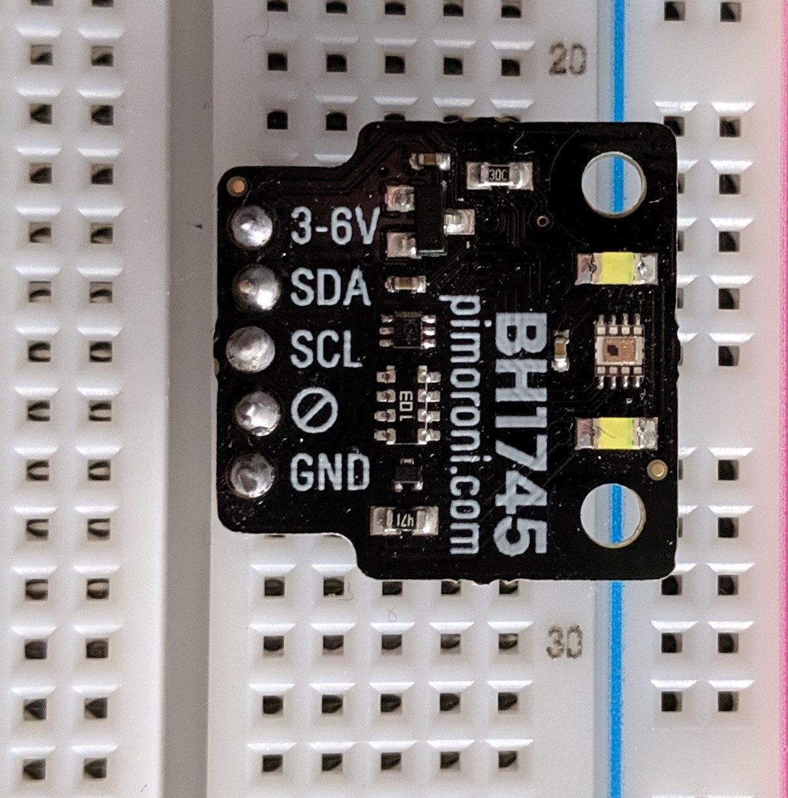

# Bh1745 - RGB Sensor

## Summary

The Bh1745 is a digital color sensor able to detect 3 distinct channels of light (red, green, blue) and is most
suitable to obtain the illuminance and color temperature of ambient light. The device can detect light intensity
in a range of 0.005 to 40 000 lux.

## Usage

2 examples on how to use this device binding are available in the [samples folder](samples).

The quality of the color measurements is very reliant on the lighting. For accurate color readings it is advisable to calibrate the sensor on first use and to use it under stable lighting conditions.

Some breakout boards come with built in LEDs for this purpose (some of the API functionality may also have been repurposed to control these LEDs).

## References

[Datasheet of the Bh1745](https://www.mouser.co.uk/datasheet/2/348/bh1745nuc-e-519994.pdf)
