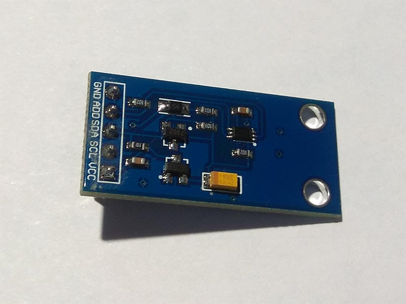

# BH1750FVI - Ambient Light Sensor
BH1750FVI is an digital Ambient Light Sensor IC for I2C bus interface. This IC is the most suitable to obtain the ambient light data for adjusting LCD and Keypad backlight power of Mobile phone. It is possible to detect wide range at High resolution.

## Sensor Image


## Usage
```C#
I2cConnectionSettings settings = new I2cConnectionSettings(busId: 1, (int)I2cAddress.AddPinLow);
// get I2cDevice (in Linux)
UnixI2cDevice device = new UnixI2cDevice(settings);
// get I2cDevice (in Win10)
//Windows10I2cDevice device = new Windows10I2cDevice(settings);

using (Bh1750fvi sensor = new Bh1750fvi(device))
{
    // read illuminance(Lux)
    double illuminance = sensor.Illuminance;
}

```

## References
https://cdn.datasheetspdf.com/pdf-down/B/H/1/BH1750FVI_Rohm.pdf