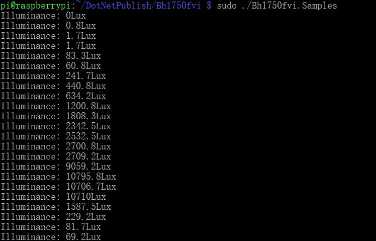

# BH1750FVI - Samples

## Hardware Required
* BH1750FVI
* Male/Female Jumper Wires

## Circuit


* SCL - SCL
* SDA - SDA
* VCC - 5V
* GND - GND
* ADDR - GND

## Code
```C#
I2cConnectionSettings settings = new I2cConnectionSettings(busId: 1, (int)I2cAddress.AddPinLow);
UnixI2cDevice device = new UnixI2cDevice(settings);

using (Bh1750fvi sensor = new Bh1750fvi(device))
{
    while (true)
    {
        Console.WriteLine($"Illuminance: {sensor.Illuminance}Lux");

        Thread.Sleep(1000);
    }
}
```

## Result

