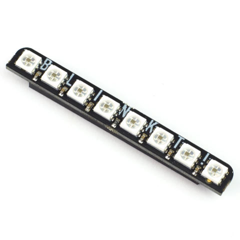

# Blinkt

## Summary

The Pimoroni Blinkt! RGB LED strip. Eight individually controlled APA102 RGB LEDs packaged to sit on the 40-pin header of Raspberry Pi models.



## Device Family

Homepage - <https://shop.pimoroni.com/products/blinkt>

## Binding Notes

The api is similar to the Python library linked in references below.

## Usage

Set the color of the pixels as you wish. Then call `Show()` to update the Blinkt! device.

```csharp

using IBlinkt blinkt = new Blinkt();

// Show all red
blinkt.SetAll(255,0,0);
blinkt.Show();
Thread.Sleep(TimeSpan.FromSeconds(5));

// Show a bright green only for pixel 4
blinkt.SetPixel(4, 0,255,0, 0.5);
blinkt.Show();
Thread.Sleep(TimeSpan.FromSeconds(5));

// Reset pixels
blinkt.Clear();

for(var i = 0; i < Blinkt.NumPixels; i++)
{
    blinkt.SetPixel(i, i * 255, i * 64, i * 128, i  / (double) Blinkt.NumPixels);
}

blinkt.Show();
Thread.Sleep(TimeSpan.FromSeconds(5));
```

## References

Pimoroni Python library <https://github.com/pimoroni/blinkt>
