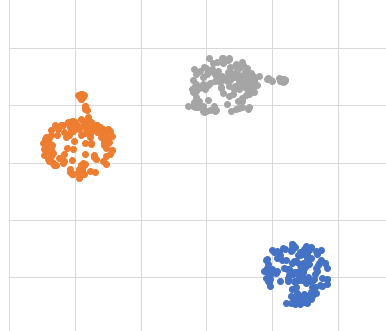
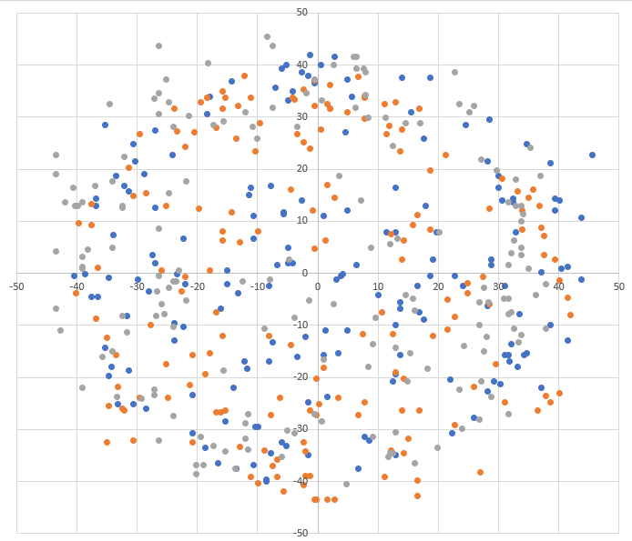

# Bmm150 - Magnetometer

The Bmm150 is a magnetometer that can be controlled either thru I2C either thru SPI.
This implementation was tested in a ESP32 platform, specificaly in a  [M5Stack Gray](https://shop.m5stack.com/products/grey-development-core).

## Documentation

Documentation for the Bmm150 can be [found here](https://www.bosch-sensortec.com/media/boschsensortec/downloads/datasheets/bst-bmm150-ds001.pdf)

## Usage

You can find an example in the [sample](./samples/Program.cs) directory. Usage is straight forward including the possibility to have a calibration.

```csharp
I2cConnectionSettings mpui2CConnectionSettingmpus = new(1, Bmm150.DefaultI2cAddress);

using Bmm150 bmm150 = new Bmm150(I2cDevice.Create(mpui2CConnectionSettingmpus));

Console.WriteLine($"Please move your device in all directions...");

bmm150.CalibrateMagnetometer();

Console.WriteLine($"Calibration completed.");

while (true)
{
    Vector3 magne = bmm150.ReadMagnetometer(true, TimeSpan.FromMilliseconds(11));

    var head_dir = Math.Atan2(magne.X, magne.Y) * 180.0 / Math.PI;

    Console.WriteLine($"Mag data: X={magne.X,15}, Y={magne.Y,15}, Z={magne.Z,15}, head_dir: {head_dir}");

    Thread.Sleep(100);
}
```

### Expected output

```console
Please move your device in all directions...
Calibration completed.
Mag data: X=    32.97089767, Y=   -10.99029922, Z=   -27.41439819, head_dir: 108.43494945
Mag data: X=    38.83239364, Y=   -10.62395668, Z=    -22.2116661, head_dir: 105.30084201
Mag data: X=    43.96039581, Y=     -8.4257431, Z=     4.60182046, head_dir: 100.85010634
Mag data: X=    42.49582672, Y=   -8.059553146, Z=   9.0047292709, head_dir: 100.7388972
Mag data: X=    42.86371994, Y=    -12.8224802, Z=     8.20643711, head_dir: 106.65430547
Mag data: X=    36.26864242, Y=    -6.22794914, Z=   -21.41402244, head_dir: 99.74364301
Mag data: X=    29.30693054, Y=    -9.89108943, Z=   -32.21274185, head_dir: 108.6495335
Mag data: X=    15.75333309, Y=    -8.42620182, Z=  -37.029045104, head_dir: 118.14159082
Mag data: X=      4.7626357, Y=    -6.22806167, Z=   -42.23312759, head_dir: 142.59463794
Mag data: X=    -4.39627885, Y=    -6.59441852, Z=   -36.22841644, head_dir: -146.309933
Mag data: X=   -10.25779819, Y=    -5.12889909, Z=   -38.62528991, head_dir: -116.56504656
Mag data: X=  -19.050889968, Y=     0.73272651, Z=  -37.033847808, head_dir: -87.7974031
Mag data: X=   -35.90294647, Y=     1.46542632, Z=   -18.61460113, head_dir: -87.66269127
Mag data: X=   -37.73472976, Y=     8.42620182, Z=   -13.41051959, head_dir: -77.41230537
Mag data: X=   -37.73472976, Y=     9.52527141, Z=   -12.20957756, head_dir: -75.83294707
Mag data: X=   -18.31749725, Y=     0.73269987, Z=   -31.42057418, head_dir: -87.70938928
Mag data: X=    -2.19813942, Y=    -7.69348812, Z=  -37.029045104, head_dir: -164.054600542
```

## Calibration

You can get access perfom calibration thru the ```CalibrateMagnetometer``` function which will. Be aware that the calibration takes a few seconds.

```csharp
bmm150.CalibrateMagnetometer();
```

If no calibration is performed, you will get a raw data cloud which looks like this:



Running the calibration properly require to **move the sensor in all the possible directions** while performing the calibration. You should consider running it with enough samples, at least few hundreds. The default is set to 100. While moving the sensor in all direction, far from any magnetic field, you will get the previous clouds. Calculating the average from those clouds and subtracting it from the read value will give you a centered cloud of data like this:



To create those cloud point graphs, every cloud is a coordinate of X-Y, Y-Z and Z-X.

Once the calibration is done, you will be able to read the data with the bias corrected using the ```ReadMagnetometer``` function. You will still be able to read the data without any calibration using the ```ReadMagnetometerWithoutCalibration``` function.

## Not supported/implemented features of the Bmm150

* Device Self-Tests
* Device Reset
* Toggle operation modes (defaults to normal mode)

## Notes

* The BMI160 embedd this BMM150.
