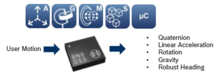

# BMO055 Sensors

## Summary

Those sensors are intelligent 9-axis absolute orientation sensors. Most of the implementations are using I2C sensors but the sensor supports as well HID over I2C and serial port communication. This class only support supports I2C. 

All operations for a current usage has been developped. The individual interruption level settings for each sensor has not been implemented. If needed, they are quite straight forward to implement.

## Device Family



**BMO055** [datasheet](https://ae-bst.resource.bosch.com/media/_tech/media/datasheets/BST-BNO055-DS000.pdf)

You will find this device as ["Inertial Measurement Unit"](https://www.dexterindustries.com/product/imu-sensor/) or ["Adafruit BNO055 Absolute Orientation Sensor"](https://learn.adafruit.com/adafruit-bno055-absolute-orientation-sensor/overview)

## Usage

Create a ```Bno055Sensor``` class and pass the I2C device. The default I2C address is provided in the class.

```csharp
I2cDevice i2cDevice = new UnixI2cDevice(new I2cConnectionSettings(1, Bno055Sensor.DefaultI2cAddress));
Bno055Sensor bno055Sensor = new Bno055Sensor(i2cDevice);
Console.WriteLine($"Id: {bno055Sensor.Info.ChipId}, AccId: {bno055Sensor.Info.AcceleratorId}, GyroId: {bno055Sensor.Info.GyroscopeId}, MagId: {bno055Sensor.Info.MagnetometerId}");
Console.WriteLine($"Firmware version: {bno055Sensor.Info.FirmwareVersion}, Bootloader: {bno055Sensor.Info.BootloaderVersion}");
Console.WriteLine($"Temperature source: {bno055Sensor.TemperatureSource}, Operation mode: {bno055Sensor.OperationMode}, Units: {bno055Sensor.Units}");
Console.WriteLine($"Powermode: {bno055Sensor.PowerMode}");
```

You can easilly access the sensor information and settings thru the properties.

## Calibration

To get accurate measurement, it is better to wait for the Magnetometer to calibrate. As in your phone, when the calibration is needed, it is necessary to move the sensor in the air to help for the qualibration.

The following code shows how to check the qualibration:

```csharp
Console.WriteLine("Checking the magnetometer calibration, move the sensor up to the calibration will be complete if needed");
var calibrationStatus = bno055Sensor.GetCalibrationStatus();
while ((calibrationStatus & CalibrationStatus.MagnetometerSuccess) != (CalibrationStatus.MagnetometerSuccess))
{
    Console.Write($".");
    calibrationStatus = bno055Sensor.GetCalibrationStatus();
    Thread.Sleep(200);
}

Console.WriteLine();
Console.WriteLine("Calibration completed");
```

Please note that it is not really necessary to check the qualibration of the other senosors and the system. The qualibraiton is done all the time. The important one is the Magnetometer.

## Accessing sensor data

Simply access the various sensor data thru their properties. Note that it is better to read at once the data and then display them, or manipulate them rather than acccessing the sub element everytime. The reason is because in the first case, you'll do 1 measurement and the data will be consistent, in the second case, you'll do 1 measurement every time you access 1 sub property which means, the data will be inconsistent.

*Wrong way:*

```csharp
// Data will be inconsistent in this case!
// Do not access the data like this
Console.WriteLine($"Magnetomer X: {bno055Sensor.Magnetometer.X} Y: {bno055Sensor.Magnetometer.Y} Z: {bno055Sensor.Magnetometer.Z}");
```

**Good way:**

```csharp
// First read and store the data
var magneto = bno055Sensor.Magnetometer;
// Then manipulate the data
Console.WriteLine($"Magnetomer X: {magneto.X} Y: {magneto.Y} Z: {magneto.Z}");
```

The sensor offers 9-axis measurement. Here is an example showing all the sensor properties you can access:

```csharp
while(!Console.KeyAvailable)
{
    Console.Clear();
    var magneto = bno055Sensor.Magnetometer;
    Console.WriteLine($"Magnetomer X: {magneto.X} Y: {magneto.Y} Z: {magneto.Z}");
    var gyro = bno055Sensor.Gyroscope;
    Console.WriteLine($"Gyroscope X: {gyro.X} Y: {gyro.Y} Z: {gyro.Z}");
    var accele = bno055Sensor.Accelerometer;
    Console.WriteLine($"Acceleration X: {accele.X} Y: {accele.Y} Z: {accele.Z}");
    var orien = bno055Sensor.Orientation;
    Console.WriteLine($"Orientation Heading: {orien.X} Roll: {orien.Y} Pitch: {orien.Z}");
    var line = bno055Sensor.LinearAcceleration;
    Console.WriteLine($"Linear acceleration X: {line.X} Y: {line.Y} Z: {line.Z}");
    var gravity = bno055Sensor.Gravity;
    Console.WriteLine($"Gravity X: {gravity.X} Y: {gravity.Y} Z: {gravity.Z}");
    var qua = bno055Sensor.Quaternion;
    Console.WriteLine($"Quaternion X: {qua.X} Y: {qua.Y} Z: {qua.Z} W: {qua.W}");
    var temp = bno055Sensor.Temperature;
    Console.WriteLine($"Temperature: {temp} °C");
    Thread.Sleep(100);
}
```

## Information regarding sensors and units

* *Orientation*: 
    * Absolute Orientation (Euler Vector, 100Hz)
    * Three axis orientation data based on a 360° sphere
    * Heading = Vector3.X; Roll = Vector3.Y; Pitch = Vector3.Z
    * Units availabel are Degrees (default) or Radians, you can change with
    ```csharp
    bno055Sensor.Units = bno055Sensor.Units | Units.EulerAnglesRadians;
    ```
* *Quaternion*
    * Absolute Orientation (Quaterion, 100Hz)
    * Four point quaternion output for more accurate data manipulation
    * Unit is 1 Quaternion = 2^14 returned data

* *Magnetometer*
    * Magnetic Field Strength Vector (20Hz)
    * Three axis of magnetic field sensing in micro Tesla (uT)

* *Acceleration*
    * Acceleration Vector (100Hz)
    * Three axis of acceleration (gravity + linear motion) 
    * Default unit in m/s^2, can be changed for mg 

* *LinearAcceleration*
    * Linear Acceleration Vector (100Hz)
    * Three axis of linear acceleration data (acceleration minus gravity)
    * Default unit in m/s^2, can be changed for mg 

* *Gravity*
    * Gravity Vector (100Hz)
    * Three axis of gravitational acceleration (minus any movement)
    * Default unit in m/s^2, can be changed for mg 

* *Gyroscope*
    * Angular Velocity Vector (100Hz)
    * Three axis of 'rotation speed'
    * Default unit is Degree per second but can be changed to Radian per second

* *Temperature*
    * Temperature (1Hz)
    * Ambient temperature in degrees celsius
    * Default can be changed for Farenheit
    * Temperature can be measured thru the Gyroscope or the Accelerometer
    * Precision seems better with the Gyroscope, so it is set by default. You can change the source like this:
    ```csharp
    bno055Sensor.TemperatureSource = TemperatureSource.Accelerometer;
    ```

## Sensor data calibration

You can get and set the sensor data qualibration. Every sensor which permit the operation has a function to get the calibration data and set the calibration data.

This is an example of how to get and set the calibration data for the Accelerometer.

```csharp
Vector4 calib = bno055Sensor.GetAccelerometerCalibrationData();
// Change, transform the calibration data
bno055Sensor.SetAccelerometerCalibrationData(calib);
```

## Remapping the accelerometer axis

It is possible to remap the acceleroter axis as well as get their configuration.

For example, you can change the X axis for a negative signe likle this:

```csharp
var axisMap = bno055Sensor.GetAxisMap();
axisMap[0].Sign = AxisSign.Negative;
bno055Sensor.SetAxisMap(axisMap[0], axisMap[1], axisMap[2]);
```

In the returned array, X is the first element, Y the second and Z the last one.