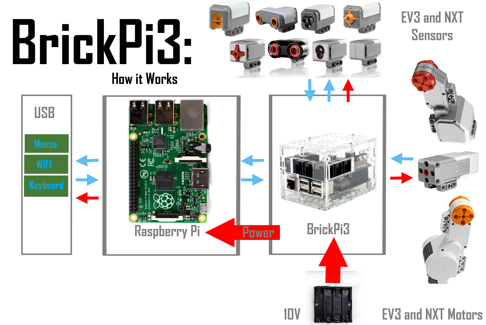

# BrickPi3

## Summary

You will need a BrickPi3 from [Dexter Industries](https://www.dexterindustries.com/brickpi/) and a Raspberry Pi 3. That said, any board will work with the BrickPi3 as it is using SPI. You’ll just need to link the pins from your board to the BrickPi3 ones the correct way.

You will need as well Lego NXT or Lego EV3 sensors and or motors to fully enjoy this device. See [Lego Mindstorms](https://www.lego.com/en-us/mindstorms) for more information.

- [Device family](./README.md#device-family)
- [BrickPi3 requirements](./README.md#make-sure-you-have-a-brickpi3)
- [Know limitations](./README.md#known-limitations)
- [Using the driver](./README.md#how-to-use-the-driver)
  - [Accessing BrickPi3 information](./README.md#accessing-brickpi3-information)
  - [Using sensors](./README.md#using-sensors)
  - [Using motors](./README.md#using-motors)
    - [Making a motor moving depending on the position of another motor](./README.md#making-a-motor-moving-depending-on-the-position-of-another-motor)
    - [Setting power to motors](./README.md#setting-power-to-motors)
    - [Reading encoders](./README.md#reading-encoders)
    - [Setting motor speed with degree per seconds](./README.md#setting-motor-speed-with-degree-per-seconds)
- [Using high level classes](./README.md#how-to-use-the-high-level-classes)
  - [Using the Sensor classes](./README.md#using-the-sensor-classes)
  - [Using Motors](./README.md#using-motors)
- [Using GrovePi port](./README.md#using-grovepi-port)
- [Tests](./README.md#tests)

## Device family

The device supported is the BrickPi3 [Dexter Industries](https://www.dexterindustries.com/brickpi/). It does implement all the features offered to pilot motors, get values from sensor. The first version of BrickPi is not supported.



More information on [Dexter Industries website](https://www.dexterindustries.com/BrickPi/brickpi3-technical-design-details/).

## Make sure you have a BrickPi3

There are multiple versions of BrickPi, this code is only working for BrickPi3. The main difference between the 2 BrickPi is the switch available close to the battery alimentation. If you have a switch, you have a BrickPi3.
If you have a previous version, you can find the code on for Windows 10 IoT Core on [Laurent Ellerbach's GitHub](https://github.com/ellerbach/BrickPi). So far, there is no port planned from this Windows 10 IoT Core version.

## Known limitations

This version include a pure driver so you can directly access to the raw results. High level classes has been created and most of the NXT and EV3 sensors has been tested. Please open a GitHub issue if you have any issue with any sensor.

For I2C sensors, the code has been tested very little. Color sensors may return incorrect data, you need to allow time when measuring and not calling a refresh of the sensor too often. This is a limitation of the sensor itself.

## How to use the driver

The main [BrickPi3.samples](https://github.com/dotnet/iot/tree/main/src/devices/BrickPi3/samples) contains a series of test showing how to use every elements of the driver.

Create a ```Brick``` class.

```csharp
Brick brick = new Brick();
// Do whatever you want, read sensors, set motors, etc
// once finished, and class will be disposed, all motors will be floated and sensors reinitialized
```

If you have multiple BrickPi3 and want to change the address of a specific BrickPi3, use the ```SetAddress``` function. Be aware that once changed in the firmware it stays. By default the address 1.

Once you've done that, create, you can create a new brick by passing this address to the constructor. In this example, it will create a BrickPi3 with address 2.

If you want to use BrickPi3 on another board than the RaspberryPi and you have to change the defauklt SPI bus and chip select line, you can do it as well in the constructor. Please note that for Raspbarry Pi, the default is 0 for bus Id and 1 for chip select line.

```csharp
Brick brick = new Brick(2);
```

### Accessing BrickPi3 information

The BrickPi3Info class offers information like the board Id, manufacturer. You can easily access them like in the following code:

```csharp
var brickinfo = brick.BrickPi3Info;
Console.WriteLine($"Manufacturer: {brickinfo.Manufacturer}");
Console.WriteLine($"Board: {brickinfo.Board}");
Console.WriteLine($"Hardware version: {brickinfo.HardwareVersion}");
var hdv = brickinfo.GetHardwareVersion();
for (int i = 0; i < hdv.Length; i++)
    Console.WriteLine($"Hardware version {i}: {hdv[i]}");
Console.WriteLine($"Software version: {brickinfo.SoftwareVersion}");
var swv = brickinfo.GetSoftwareVersion();
for (int i = 0; i < swv.Length; i++)
    Console.WriteLine($"Software version {i}: {swv[i]}");
Console.WriteLine($"Id: {brickinfo.Id}");
```

You can as well adjust the brightness of the embedded led. The minimum value is 0 (switched off) and maximum 100 (full light). Here is an example:

```csharp
for (int i = 0; i < 10; i++)
{
    brick.SetLed((byte)(i * 10));
    Thread.Sleep(500);
}
for (int i = 0; i < 10; i++)
{
    brick.SetLed((byte)(100 - i * 10));
    Thread.Sleep(500);
}
brick.SetLed(255);
```

You can get the various voltage of the board including the battery voltage:

```csharp
var voltage = brick.BrickPi3Voltage;
Console.WriteLine($"3.3V: {voltage.Voltage3V3}");
Console.WriteLine($"5V: {voltage.Voltage5V}");
Console.WriteLine($"9V: {voltage.Voltage9V}");
Console.WriteLine($"Battery voltage: {voltage.VoltageBattery}");
```

### Using sensors

To setup a sensor, you need first to set the type of sensor then you can read the data. The below example setup an NXT Touch sensor on port 1 and read the results in continue.

```csharp
Console.WriteLine("Running 100 reads on EV3 touch sensor on port 1.");
EV3TouchSensor touch = new EV3TouchSensor(brick, BrickPortSensor.PortS1);
// Alternative to test NXT touch sensor
// NXTTouchSensor touch = new NXTTouchSensor(brick, BrickPortSensor.PORT_S2);
int count = 0;
while (count < 100)
{
    Console.WriteLine(string.Format("NXT Touch, IsPRessed: {0}, ReadAsString: {1}, Selected mode: {2}",
        touch.IsPressed(), touch.ReadAsString(), touch.SelectedMode()));
    Task.Delay(300).Wait(); ;
}
```

Please note that the function ```Brick.GetSensor``` returns an array of byte, it's up to you to interpret correctly the data out of this function. Please read the [documentation](https://www.dexterindustries.com/BrickPi/brickpi3-technical-design-details/brickpi3-communication-protocol/) to have the full details of what every sensor return.

It is **strongly recommended** to use the high level classes implementing the logic to decode correctly the raw values of sensor like in the previous example.

### Using motors

There are many ways you can use motors, either by setting the power, either by reading the encoder, either by setting a degree per second speed. Those 3 examples will show you how to use each of them.

#### Making a motor moving depending on the position of another motor

In this example, the motor on port D is used to set the position of the motor A. A simple NXT touch sensor is used to end the sequence when it is pressed.

You can see as well the MotorStatus classes containing all information on the motor. Flags are useful to understand if you have issues with the power or an overload of the motors.

To reinitialize the encoder, simply set the offset to the current version like shown in the first 2 lines.

```csharp
brick.OffsetMotorEncoder((byte)MotorPort.PortD, brick.GetMotorEncoder((byte)MotorPort.PortD));
brick.OffsetMotorEncoder((byte)MotorPort.PortA, brick.GetMotorEncoder((byte)MotorPort.PortA));
brick.SetMotorPositionKD((byte)MotorPort.PortA);
brick.SetMotorPositionKP((byte)MotorPort.PortA);
// Float motor D
brick.SetMotorPower((byte)MotorPort.PortD, (byte)MotorSpeed.Float);
// set some limits
brick.SetMotorLimits((byte)MotorPort.PortA, 50, 200);
brick.SetSensorType((byte)SensorPort.Port1, SensorType.EV3Touch);
Console.WriteLine("Read Motor A and D positions. Press EV3 Touch sensor on port 1 to stop.");
//run until we press the button on port2
while (brick.GetSensor((byte)SensorPort.Port1)[0] == 0)
{
    var target = brick.GetMotorEncoder((byte)MotorPort.PortD);
    brick.SetMotorPosition((byte)MotorPort.PortA, target);
    var status = brick.GetMotorStatus((byte)MotorPort.PortA);
    Console.WriteLine($"Motor A Target Degrees Per Second: {target}; Motor A speed: {status.Speed}; DPS: {status.Dps}; Encoder: {status.Encoder}; Flags: {status.Flags}");
    Thread.Sleep(20);
}
```

Please note that this example uses directly the low level functions available on the Brick class.

#### Setting power to motors

This simple example increases the speed of a motor and decreases it after. Use ```MotorSpeed.Float``` to float the motor. Setting speed at 0 do not have the exact same effect. It does block the motor. Float will just let the motor goes its own way. To stop the motor, setup a speed of 0.

```csharp
Console.WriteLine("Speed test on Motor D, increasing and decreasing speed from 0 to maximum");
Console.WriteLine("Acceleration on Motor D");
for (int i = 0; i < 10; i++)
{
    brick.SetMotorPower((byte)MotorPort.PortD, (byte)(i * 10));
    Task.Delay(1000).Wait();
}
brick.SetMotorPower((byte)MotorPort.PortD, (byte)MotorSpeed.Float);
Console.WriteLine("Waiting 1 second");
Thread.Sleep(1000);
Console.WriteLine("Deceleration on Motor D");
for (int i = 0; i < 10; i++)
{
    brick.SetMotorPower((byte)MotorPort.PortD, (byte)(100 - i * 10));
    Task.Delay(1000).Wait();
}
brick.SetMotorPower((byte)MotorPort.PortD, (byte)MotorSpeed.Float);
Console.WriteLine("End of test on Motor D");
```

#### Reading encoders

On top of the motor position example, here is another example to read the encoder of a motor. It's an easy way to understand if the motor is correctly plugged if any of the function you want to use is not working. Moving it will change the encoder value. Please note that the encoder value can be negative as well. The first line reset the encoder.

```csharp
Console.WriteLine("Read encoder of Motor D 100 times. Reset position to 0 to start");
brick.OffsetMotorEncoder((byte)MotorPort.PortD, brick.GetMotorEncoder((byte)MotorPort.PortD));
for (int i = 0; i < 100; i++)
{
    var encodermotor = brick.GetMotorEncoder((byte)MotorPort.PortD);
    Console.WriteLine($"Encoder: {encodermotor}");
    Thread.Sleep(200);
}
```

#### Setting motor speed with degree per seconds

Another way to pilot the motors is to set a specific speed in degree per seconds. In the below example, no limit has been set but it's possible to setup a limit like in the motor position example. Setting up limits reduces the risk of overheat on the motors.

```csharp
brick.OffsetMotorEncoder((byte)MotorPort.PortD, brick.GetMotorEncoder((byte)MotorPort.PortD));
brick.OffsetMotorEncoder((byte)MotorPort.PortA, brick.GetMotorEncoder((byte)MotorPort.PortA));
// Float motor D
brick.SetMotorPower((byte)MotorPort.PortD, (byte)MotorSpeed.Float);
brick.SetSensorType((byte)SensorPort.Port1, SensorType.EV3Touch);
Console.WriteLine("Control Motor A speed with Motor D encoder. Turn Motor D to control speed of Motor A");
Console.WriteLine("Press EV3 Touch sensor on port 1 to stop the test");
//run until we press the button on port 1
while (brick.GetSensor((byte)SensorPort.Port1)[0] == 0)
{
    var target = brick.GetMotorEncoder((byte)MotorPort.PortD);
    brick.SetMotorDps((byte)MotorPort.PortA, target);
    var status = brick.GetMotorStatus((byte)MotorPort.PortA);
    Console.WriteLine($"Motor A Target Degrees Per Second: {target}; Motor A speed: {status.Speed}; DPS: {status.Dps}; Encoder: {status.Encoder}; Flags: {status.Flags}");
    Thread.Sleep(20);
}
```

Motors can be adjusted the KP and KD settings of the motor. If you set KP higher, the motor will be more responsive to errors in position, at the cost of perhaps overshooting and oscillating. KP slows down the motor as it approaches the target, and helps to prevent overshoot. In general, if you increase KP, you should also increase KD to keep the motor from overshooting and oscillating.

## How to use the high level classes

There are high level classes to handle directly objects like NXT Touch sensors or EV3 Color sensor. There is as well a Motor  and a Vehicle class to make it easier to pilot and control the motors rather than thru the low level driver.

### Using the Sensor classes

Using the sensor classes is straight forward. Just reference a class and initialized it. Access properties and function. The ```ReadRaw()```, ```ReadAsString()``` functions are common to all sensors, ```Value``` and ```ValueAsString``` properties as well.
A changed property event on the properties is raised with a minimum period you can determined when creating the class (or later).

Example creating a NXT Touch Sensor on port S2:

```csharp
Brick brick = new Brick();

NXTTouchSensor touch = new NXTTouchSensor(brick, BrickPortSensor.PortS2);
Console.WriteLine($"NXT Touch, Raw: {touch.ReadRaw()}, ReadASString: {touch.ReadAsString()}, IsPressed: {touch.IsPressed()}, NumberNodes: {touch.NumberOfModes()}, SensorName: {touch.GetSensorName()}");
```

Example of creating an EV3 Touch sensor on port S1 and will tell it to check changes in properties every 20 milliseconds.

```csharp
EV3TouchSensor ev3Touch = new EV3TouchSensor(brick, BrickPortSensor.PortS1, 20);
```

This allow to have as many sensors as you want as well as having multiple BrickPi3. Just pass to the sensor the Brick class and you're good to go.

All sensors will return a ```int.MaxValue``` in case of error when reading the data. Test the value when using it. This choice is to avoid having exceptions to handle when using those high level classes.

### Using Motors

Motors are as well really easy to use. You have functions ```Start()```, ```Stop()```, ```SetSpeed(speed)``` and ```GetSpeed()``` which as you can expect will start, stop, change the speed and give you the current speed. A speed property is available as well and will change the speed.

Lego motors have an encoder which gives you the position in 0.5 degree precision. You can get access thru function ```GetTachoCount()```. As the numbers can get big quite fast, you can reset this counter by using ```SetTachoCount(newnumber)```. A ```TachoCount``` property is available as well. This property like for sensors can raise an event on a minimum time base you can setup.

```csharp
Brick brick = new Brick();

Motor motor = new Motor(brick, BrickPortMotor.PORT_D);
motor.SetSpeed(100); //speed goes from -100 to +100, others will float the motor
motor.Start();
motor.SetSpeed(motor.GetSpeed() + 10);
Console.WriteLine($"Encoder: {motor.GetTachoCount()}");
Console.WriteLine($"Encoder: {motor.TachoCount}"); //same as previous line
Console.WriteLine($"Speed: {motor.GetSpeed()}");
Console.WriteLine($"Speed: {motor.Speed}"); //same as previous line
motor.SetPolarity(Polarity.OppositeDirection); // change the direction
motor.Stop();
```

Here is an example of the ```Vehicle``` class:

```csharp
Console.WriteLine("Vehicle drive test using Motor A for left, Motor D for right, not inverted direction");
Vehicle veh = new Vehicle(brick, BrickPortMotor.PortA, BrickPortMotor.PortD);
veh.DirectionOpposite = true;
Console.WriteLine("Driving backward");
veh.Backward(30, 5000);
Console.WriteLine("Driving forward");
veh.Foreward(30, 5000);
Console.WriteLine("Turning left");
veh.TrunLeftTime(30, 5000);
Console.WriteLine("Turning right");
veh.TrunRightTime(30, 5000);
Console.WriteLine("Turning left");
veh.TurnLeft(30, 180);
Console.WriteLine("Turning right");
veh.TurnRight(30, 180);
```

The ```Vehicle``` class offers functions with timeout allowing to drive for a certain amount of time. All timing are in milliseconds. Turning functions offers as well a degree mode which allows to turn by a certain degree rather than a specific time.

## Using GrovePi port

The only supported sensors in the GrovePi port present on BrickPi3 are I2C sensors. You can use ```System.Device.I2c``` to access it.

## Tests

A series of hardware tests for motors and sensors are available in [BrickPi3.samples](https://github.com/dotnet/iot/tree/main/src/devices/BrickPi3/samples). Those hardware tests offers a variety of low level access to the Brick class as well as high level thru the Motor and Sensor classes.

## Example

Refer to the [sample code](https://github.com/dotnet/iot/tree/main/src/devices/BrickPi3/samples) to understand on which port you'll need to plug motors and sensors. The available tests are the following:

```shell
./BrickPiHardwareTest -arg1 - arg2
where -arg1, arg2, etc are one of the following:
-nobrick: don't run the basic BrickPi tests.
-motor: run basic motor tests, motors need to be on port A and D.
-vehicle: run a vehicle test, motors need to be on port A and D.
-multi: run a multi sensor test
   EV3TouchSensor on port 1
   NXTTouchSensor on port 2
   NXTColorSensor on port 3
   NXTSoundSensor on port 4
   Press the EV3TouchSensor sensor to finish
-color: run an EV3 color test
   EV3TouchSensor on port 1
   EV3ColorSensor on port 2
-touch: run touch sensor test
   EV3TouchSensor on port 1
-nxtlight: run the NXT light sensor tests
   NXTLightSensor on port 4
-nxtus: run NXT Ultrasonic test on port 4
-nxtcolor: run NXT Color sensor test
   EV3TouchSensor on port 1
   NXTColorSensor on port 4
-irsensor: run EV3 IR sensor test on port 4
```

You always have to create a brick and initialize it. Then you can run your code. In this example, reading a Touch sensor.

```csharp
Brick _brick = new Brick();
Console.WriteLine("Running 100 reads on EV3 touch sensor on port 1.");
EV3TouchSensor touch = new EV3TouchSensor(_brick, BrickPortSensor.PortS1);
// Alternative to test NXT touch sensor
// NXTTouchSensor touch = new NXTTouchSensor(brick, BrickPortSensor.PORT_S2);
int count = 0;
while (count < 100)
{
    Console.WriteLine($"NXT Touch, IsPRessed: {touch.IsPressed()}, ReadAsString: {touch.ReadAsString()}, Selected mode: {touch.SelectedMode()}");
    Task.Delay(300).Wait(); ;
}
```
