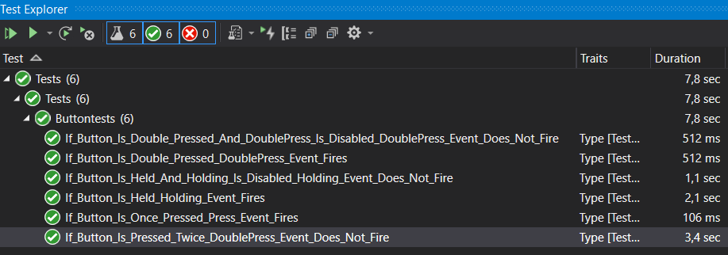

# Button

The `ButtonBase` class is a base implementation for buttons that is hardware independent and can be used across devices.
The `GpioButton` is a GPIO implementation of the button and inherits from the `ButtonBase` class. This implementation has been tested on an ESP32 platform, specifically on the [M5StickC Plus](https://shop.m5stack.com/products/m5stickc-plus-esp32-pico-mini-iot-development-kit).

## Documentation

Documentation for the M5StickC Plus, including pin mapping, can be [found here](https://docs.m5stack.com/en/core/m5stickc_plus).
Information regarding standard mouse events, used as inspiration for the button events, can be [found here](https://docs.microsoft.com/en-us/dotnet/desktop/winforms/input-mouse/events?view=netdesktop-5.0#standard-click-event-behavior).

## Configuring the pull-ups or pull-downs for the button

A general rule in electronics is that input pins not permanently tied to a wire whose state is `LOW` or `HIGH`, should always be pulled up or down with a resistor. The value of the resistor depends on the GPIO voltage range. Typically a `4.7K Ohm` resistor is good for both `3.3V` and `5V` boards, but you may need to use different values depending on the use-case.
For example, a button causes the input GPIO to have a stable state only during the pressed state (the two pins are shorted during the pressed state).
In order to ensure the released state to be either `LOW` or `HIGH`, a resistor must always be either added or configured in software to avoid unpredictable readings. The Button needs to know the released state in the `PinStateChanged` event in order to correctly detect when it gets pushed.

Many boards supports configuring in software an "internal" resistor which is part of the board hardware, but this configuration may not be available for all the GPIOs. The developer should **carefully read the board documentation** to verify whether or not the internal resistor configuration is available for the each GPIO. If the pin does not support being configured with an internal resistor, the constructor will throw an exception.

The Button binding uses the GPIO `PinMode` enumeration to tell the board to configure the GPIO with an internal pull-up, internal pull-down or without any internal resistors. In the latter case the user **must** either use an external resistor configured either as a pull-up (tied to `Vcc`) or as a pull-down (tied to `GND`).

### Button constructor breaking changes

In previous releases, the Button constructor accepted a `PinMode` parameter to specify the GPIO configuration. But this parameter allowed specifying `Input` (without internal resistors) and not taking into consideration the external resistor. Since this configuration could lead to confusion and floating pins, it was decided to remove this parameter and replace it with two Boolean values:

* `isPullUp`: tells whether the resistor (either internal or external) is pull-up or pull-down.
* `hasExternalResistor`: tells whether the resistor is internal or externally wired by the designer.

With these two parameters, there is no more any ambiguity.

> Important Note: the default value for `isPullUp` is `true` which is the same default configuration for the old constructors.

In order to ease the configuration, here is a simple table with the connections and the values for the two new parameters.

| Button Pin 1<br />(connected to the GPIO) | Button Pin 2 | `IsPullUp` | `IsExternalResistor` |
| ----------------------------------------- | ------------ | ---------- | -------------------- |
| Physical resistor to `Vcc`                | `GND`        | True       | True                 |
| Physical resistor to `GND`                | `Vcc`        | False      | True                 |
| Internal resistor to `Vcc`                | `GND`        | True       | False                |
| Internal resistor to `GND`                | `Vcc`        | False      | False                |

## Usage

You can find an example in the [samples](./samples/Program.cs) directory.

```csharp
// Initialize a new button with the corresponding button pin assuming internal pull-up
GpioButton button = new GpioButton(buttonPin: 37);

Debug.WriteLine("Button is initialized, starting to read state");

// Enable or disable holding or doublepress events
button.IsDoublePressEnabled = true;
button.IsHoldingEnabled = true;

// Write to debug if the button is down
button.ButtonDown += (sender, e) =>
{
    Debug.WriteLine($"buttondown IsPressed={button.IsPressed}");
};

// Write to debug if the button is up
button.ButtonUp += (sender, e) =>
{
    Debug.WriteLine($"buttonup IsPressed={button.IsPressed}");
};

// Write to debug if the button is pressed
button.Press += (sender, e) =>
{
    Debug.WriteLine($"Press");
};

// Write to debug if the button is double pressed
button.DoublePress += (sender, e) =>
{
    Debug.WriteLine($"Double press");
};

// Write to debug if the button is held and released
button.Holding += (sender, e) =>
{
    switch (e.HoldingState)
    {
        case ButtonHoldingState.Started:
            Debug.WriteLine($"Holding Started");
            break;
        case ButtonHoldingState.Completed:
            Debug.WriteLine($"Holding Completed");
            break;
    }
};

Thread.Sleep(Timeout.Infinite);
```

### Expected output

```console
Button is initialized, starting to read state
buttondown IsPressed=True
buttonup IsPressed=False
Press
buttondown IsPressed=True
buttonup IsPressed=False
Press
Double press
buttondown IsPressed=True
Holding Started
buttonup IsPressed=False
Press
Holding Completed
```

## Testing

The unit test project can be found in the [tests](./Tests/ButtonTests.cs) directory. You can simply run them using Visual Studio built-in test capabilities:


