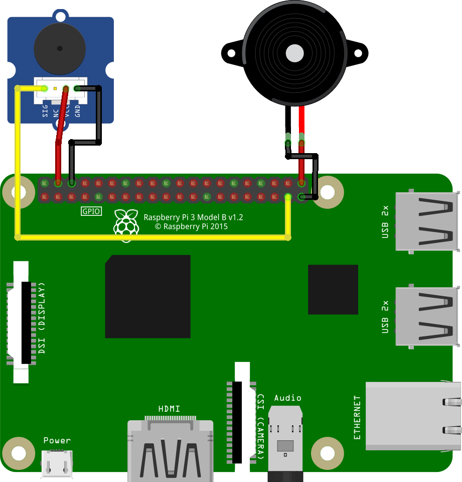


# Example of Alphabet song played using Buzzer


## Schematic

This sample demonstrates using two types of buzzers.
For buzzer with 3 pins: simply connect signal pin of buzzer to commutation pin (GPIO26), vcc pin to +5v, ground pin to ground. For buzzer with 2 pins: connect vcc pin of buzzer to commutation pin (GPIO21) and ground to ground.

You could use any types of buzzers in any order. No changes to code are required.
 



## Code

This sample contains a wrapper on a Buzzer called `MelodyPlayer`.


### MelodyPlayer and MelodyElement 

To create an instance of a MelodyPlayer use following line:

```csharp
MelodyPlayer player  =  new  MelodyPlayer(new  Buzzer(26, -1));
```

Constructor takes a single parameter type of `Buzzer`.

After initialization MelodyPlayer allows playing melody represented by sequence of `MelodyElement` objects.
MelodyElement is a base class for two types of elements:
* `NoteElement` - It will be played. So in a constructor it accepts `Note` and `Octave` to determine frequency of the sound and `Duration` to determine duration of the sound.
* `PauseElement` - It's supposed to make a pause between two NoteElements so it's only have duration of pause as constructor parameter.


### How to use

Following example demonstrates how to create MelodyElement sequence and how to play it using MelodyPlayer:

```csharp
IList<MelodyElement> sequence =  new  List<MelodyElement>()
{
	new  NoteElement(Note.C, Octave.Fourth, Duration.Quarter),
	new  PauseElement(Duration.Quarter),
	new  NoteElement(Note.C, Octave.Fourth, Duration.Quarter)
};

using (var  player  =  new  MelodyPlayer(new  Buzzer(21, -1)))
{
	player.Play(sequence, 100);
}
```

`Play` method MelodyPlayer accepts a sequence of MelodyElements as the first parameter and a tempo as the second.
Tempo is an amount of quarter notes per minute. So the more tempo is the quicker melody will be played.

Also there is an overload of `MelodyPlayer.Play` with 3 parameters: MelodyElement sequence, tempo and transposition value. Transposition increases or decreases every tone of melody sequence by desired amount of semitones. For example: following line will decrease every tone of sequence by one octave since octave consists of 12 semitones.

```csharp
player.Play(sequence, 100, -12);
```


### Parallel buzzer playing

As far as `MelodyPlayer.Play` method is not asynchronous, calls of this method are wrapped by task like this: 

```csharp
using (var  player1  =  new  MelodyPlayer(new  Buzzer(21, -1)))
using (var  player2  =  new  MelodyPlayer(new  Buzzer(26, -1)))
{
	Task.WaitAll(
		Task.Run(() =>  player1.Play(AlphabetSong, 100, -12)),
		Task.Run(() =>  player2.Play(AlphabetSong, 100)));
}
```

This approach allows playing two melodies independently however example above plays a single melody in the same time using two different buzzers.


### Alphabet song

Presented sample plays Alphabet song using two buzzers. The song is hardcoded in a `Buzzer.Sample.cs` file as a sequence of MelodyElements. Read more about Alphabet song on Wikipedia: https://en.wikipedia.org/wiki/Alphabet_song