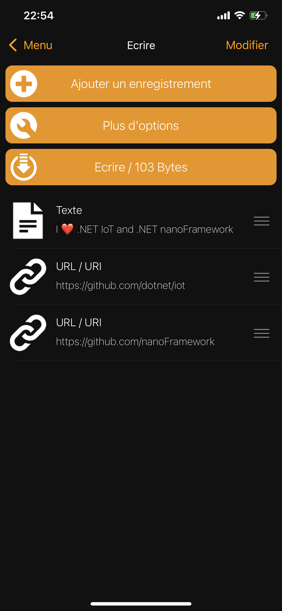
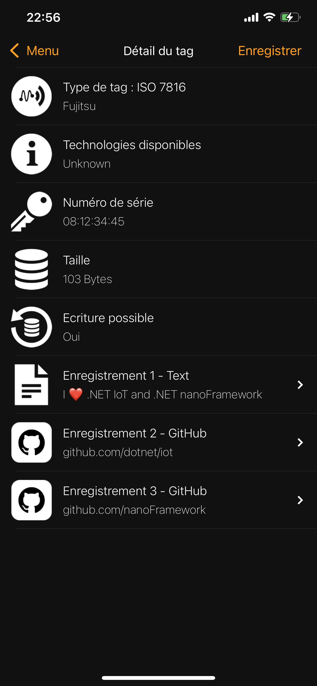

# Emulated card NDEF Tag

This class supports NDEF card emulation. So far, the only reader supported is the PN532.

## Documentation

You can find useful documentation on:

* [NFC Forum](https://nfc-forum.org/uploads/specifications/97-NFCForum-TS-T4T-1.2.pdf) for the high level communication protocol and payloads.
* [ST25TA64K](https://www.st.com/resource/en/datasheet/st25ta64k.pdf) as a good implementation detail from the card perspective.

## Usage

When you have created a PN52, you can use directly:

```csharp
EmulatedNdefTag ndef = new(pn532, new byte[] { 0x12, 0x34, 0x45 });
ndef.CardStatusChanged += NdefCardStatusChanged;
ndef.NdefReceived += NdefNdefReceived;
ndef.InitializeAndListen(cts.Token);
```

The constructor allow to adjust the last 3 bytes of the ID. By default, to avoid copying cards fully, the first byte is always fixed to 0x08.

The card will automatically place itself in the listen mode and will listen up to a cancellation token is set to cancel.

This implies in this mode that once the card is deselected and read already, placing it in listen more again can trigger the listener to select it again.

So you can use the `CardStatusChanged` event to adjust the needed behavior. Both `Initialize` and `Listen` functions can be used in a more granular way.

Here is an example of writing 3 tags on the emulated tag from a [phone application](https://apps.apple.com/app/nfc-tools/id1252962749):



Once the application write it to the card, you will get from this code:

```csharp
void NdefNdefReceived(object? sender, NdefMessage e)
{
    Console.WriteLine("New NDEF received!");
    foreach (var record in e.Records)
    {
        Console.WriteLine($"Record length: {record.Length}");
        if (TextRecord.IsTextRecord(record))
        {
            var text = new TextRecord(record);
            Console.WriteLine($"  Text: {text.Text}");
        }
        else if (UriRecord.IsUriRecord(record))
        {
            var uri = new UriRecord(record);
            Console.WriteLine($"  Uri: {uri.Uri}");
        }
    }
}

void NdefCardStatusChanged(object? sender, EmulatedTag.CardStatus e)
{
    Console.WriteLine($"Status of the emulated card changed to {e}");
}
```

The following outcome:

```text
Status of the emulated card changed to Activated
New NDEF received!
Record length: 48
  Text: I ?? .NET IoT and .NET nanoFramework
Record length: 26
  Uri: github.com/dotnet/iot
Record length: 29
  Uri: github.com/nanoFramework
Status of the emulated card changed to Released
```

And reading back what's on the emulated card with the phone application:



You can also get access to the `NdefMessage` property:

```csharp
ndef.NdefMessage.Records.Add(new TextRecord("I love NET IoT and .NET nanoFramework!", "en-us", Encoding.UTF8));
ndef.NdefMessage.Records.Add(new UriRecord(UriType.Https, "github.com/dotnet/iot"));
```

So when the card reader will read the card, it will be able to access the NDEF message you have saved in this property.

## Future improvements

So far, only PN532 can be setup as a card. Once more readers in this repository will have this ability, an interface will have to be put in place so more readers can be used for this purpose.
