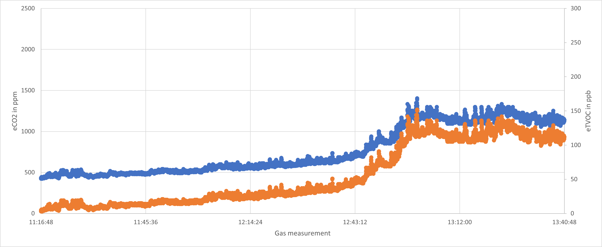

# CCS811 Samples

This sample applicaiton contains flow and menus allowing you to test easilly all the feature of the CSS811 and also show how to implement properly all readings.

You can test it thru:

- A native platform like a Raspberry PI
- A chip set providing GPIO and I2C like the FT4222

You can use the native GPIO support for the following pins or not:

- The address pin is used to select primary (0x5A) or secondary (0x5B) I2C device address.
- The Reset pin is sometime present or not. If present and you want to use it, this will perform a full hard reset.
- The Wake pin is used to select the chip and wake it up. If you don't want to use it, just put it to the ground.
- The Interupt pin allows interruption, if used, the interupt mode and events will be activated. This needs to be activated to be able to use the embedded Threshold feature.

You can select any of the mode.

A variety of tests and reading, including changing the temperature and humidity correction is proposed.

You can log the date an nicely import them later on in Excel. The following example shows a measurement over time. In blue, the equivalent CO2 in ppm and in orange the equivalent TVOC in ppb. Note that the measurement started to be accurate around 11:35 on this graph.



# Sample wiring

**Important**

In order to have this sensor working on a Raspberry Pi, you need to lower the bus speed. This sensor uses a mode called I2C stretching and it is not supported natively on Raspberry Pi. So you **must** lower the I2C clock to the minimum to make it working properly or use a software I2C with a low clock as well.

In order to do so, open a ssh session with your Raspberry and edit the /boot/config.txt file:

```bash
sudo nano /boot/config.txt
```

## Lowering the hardware I2C clock

Locate the line where you have ```dtparam=i2c_arm=on```, make sure you'll remove any # which can be in front and add ```,i2c_arm_baudrate=10000``` so the line will now bocome: ```dtparam=i2c_arm=on,i2c_arm_baudrate=10000```

Reboot:

```bash
sudo reboot
```

*Notes*

- This has an impact on the all bus! So if you are using other sensors, this will decrease the speed of all other sensors.
- Even with the bus speed reduced, you may have issues.

## Activating the Sofware I2C

Add the following line to use GPIO 17 for SCA and GPIO 27 for SCL:

```
dtoverlay=i2c-gpio,i2c_gpio_sda=17,i2c_gpio_scl=27,bus=3,i2c_gpio_delay_us=20
```

You can of course adjust the GPIO you want to use. The delay os 20 micro seconds correspond to about 10000 Hz.

Reboot:

```bash
sudo reboot
```

*Notes*

- This uses 2 extra GPIO
- This is the best solution especially if you are using extra I2C devices

This example uses the sofware I2C with GPIO 17 and 27 as explained in the previous section on a Raspberry Pi, Wake pin on GPIO 23 and Interrupt on GPIO 22.

