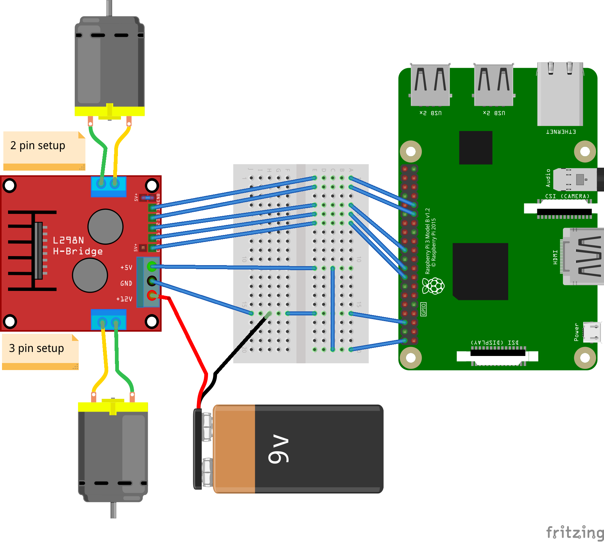
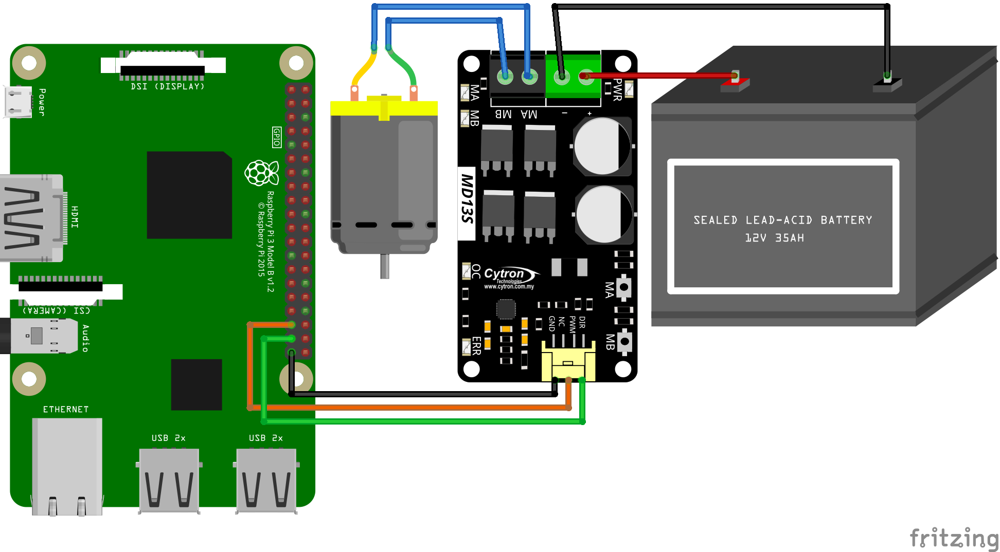

# DC Motor Controller

This is a generic class to control any DC motor.

DC motors are controlled by simply providing voltage on the inputs (inverted voltage inverts the direction).

DC motors can be controlled with 1, 2 or 3 pins.
Please refer to the [sample](./samples/Program.cs) to see how to connect it.

> **Important**: Never connect DC motor directly to your board, instead use i.e. H-bridge

## 3- vs 1/2-pin mode

2/1-pin mode should be used only if H-bridge allows the inputs to be changed frequently
otherwise excessive heat or damage may occur which may reduce life-time of the H-bridge.
It may also cause increased energy consumption due to energy being converted into heat.

## Usage

[See full sample](./samples/Program.cs) for more details.

```csharp
static void Main(string[] args)
{
    const double Period = 10.0;
    Stopwatch sw = Stopwatch.StartNew();
    // 1 pin mode
    // using (DCMotor motor = DCMotor.Create(6))
    // using (DCMotor motor = DCMotor.Create(PwmChannel.Create(0, 0, frequency: 50)))
    // 2 pin mode
    // using (DCMotor motor = DCMotor.Create(27, 22))
    // using (DCMotor motor = DCMotor.Create(new SoftwarePwmChannel(27, frequency: 50), 22))
    // 2 pin mode with BiDirectional Pin
    // using (DCMotor motor = DCMotor.Create(19, 26, null, true, true))
    // using (DCMotor motor = DCMotor.Create(PwmChannel.Create(0, 1, 100, 0.0), 26, null, true, true))
    // 3 pin mode
    // using (DCMotor motor = DCMotor.Create(PwmChannel.Create(0, 0, frequency: 50), 23, 24))
    // Start Stop mode - wrapper with additional methods to disable/enable output regardless of the Speed value
    // using (DCMotorWithStartStop motor = new DCMotorWithStartStop(DCMotor.Create( _any version above_ )))
    // Pin numbers use the logical (BCM) numbering scheme. See the Wiring section below.
    // 3 pin mode: 6 -> ENA (enable/PWM), 27 -> IN1, 22 -> IN2 on the H-bridge.
    using (DCMotor motor = DCMotor.Create(6, 27, 22))
    {
        bool done = false;
        Console.CancelKeyPress += (o, e) =>
        {
            done = true;
            e.Cancel = true;
        };

        string lastSpeedDisp = null;
        while (!done)
        {
            double time = sw.ElapsedMilliseconds / 1000.0;

            // Note: range is from -1 .. 1 (for 1 pin setup 0 .. 1)
            motor.Speed = Math.Sin(2.0 * Math.PI * time / Period);
            string disp = $"Speed = {motor.Speed:0.00}";
            if (disp != lastSpeedDisp)
            {
                lastSpeedDisp = disp;
                Console.WriteLine(disp);
            }

            Thread.Sleep(1);
        }
    }
}
```

## Wiring

All pin numbers passed to `DCMotor.Create` use the **logical (BCM/Broadcom)** GPIO numbering scheme, not the physical header positions. See the [Raspberry Pi GPIO pinout](https://www.raspberrypi.com/documentation/computers/raspberry-pi.html#gpio) to map BCM numbers to physical pins.

The 3-pin sample `DCMotor.Create(6, 27, 22)` connects to an H-bridge (e.g. L298N) as follows:

| `Create` argument | BCM pin | H-bridge input | Purpose |
| ----------------- | ------- | -------------- | ------- |
| `speedControlPin` | 6       | ENA (enable)   | PWM speed control |
| `directionPin`    | 27      | IN1            | Motor direction |
| `otherDirectionPin` | 22    | IN2            | Opposite of IN1 |

The rest of the wiring:

- The H-bridge outputs drive the motor.
- The motor power supply connects to the H-bridge (never directly to the board).
- The board and H-bridge grounds are connected together.

See the diagram below.




