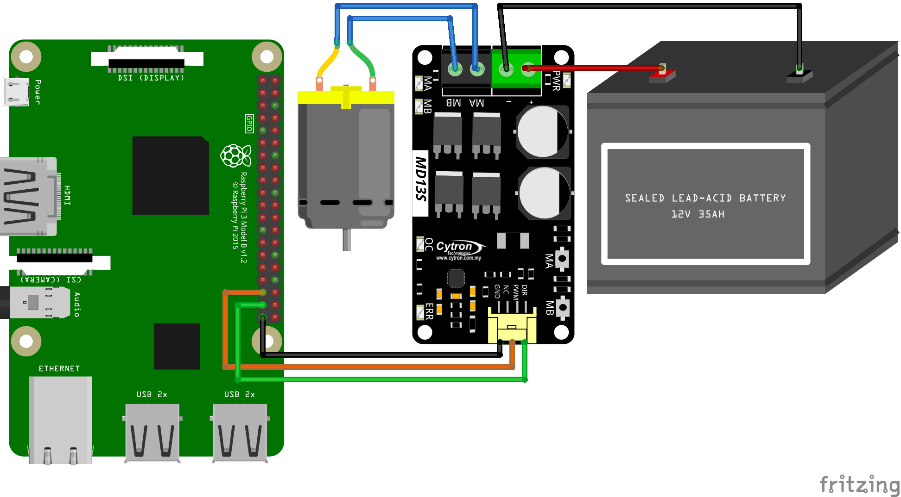

# DC Motor Controller sample



[Fritzing diagram](dcmotor.fzz)
[BiDirectional Pin Fritzing diagram](DCMotor2pinWithBiDirectionalPin.fzz)

[See full sample](Program.cs)

```csharp
static void Main(string[] args)
{
    const double Period = 10.0;
    Stopwatch sw = Stopwatch.StartNew();
    // 1 pin mode
    // using (DCMotor motor = DCMotor.Create(6))
    // using (DCMotor motor = DCMotor.Create(PwmChannel.Create(0, 0, frequency: 50)))
    // 2 pin mode
    // using (DCMotor motor = DCMotor.Create(27, 22))
    // using (DCMotor motor = DCMotor.Create(new SoftwarePwmChannel(27, frequency: 50), 22))
    // 2 pin mode with BiDirectional Pin
    // using (DCMotor.Create(19, 26, null, true, true))
    // using (DCMotor.Create(PwmChannel.Create(0, 1, 100, 0.0), 26, null, true, true))
    // 3 pin mode
    // using (DCMotor motor = DCMotor.Create(PwmChannel.Create(0, 0, frequency: 50), 23, 24))
    using (DCMotor motor = DCMotor.Create(6, 27, 22))
    {
        bool done = false;
        Console.CancelKeyPress += (o, e) =>
        {
            done = true;
            e.Cancel = true;
        };

        string lastSpeedDisp = null;
        while (!done)
        {
            double time = sw.ElapsedMilliseconds / 1000.0;

            // Note: range is from -1 .. 1 (for 1 pin setup 0 .. 1)
            motor.Speed = Math.Sin(2.0 * Math.PI * time / Period);
            string disp = $"Speed = {motor.Speed:0.00}";
            if (disp != lastSpeedDisp)
            {
                lastSpeedDisp = disp;
                Console.WriteLine(disp);
            }

            Thread.Sleep(1);
        }
    }
}
```
