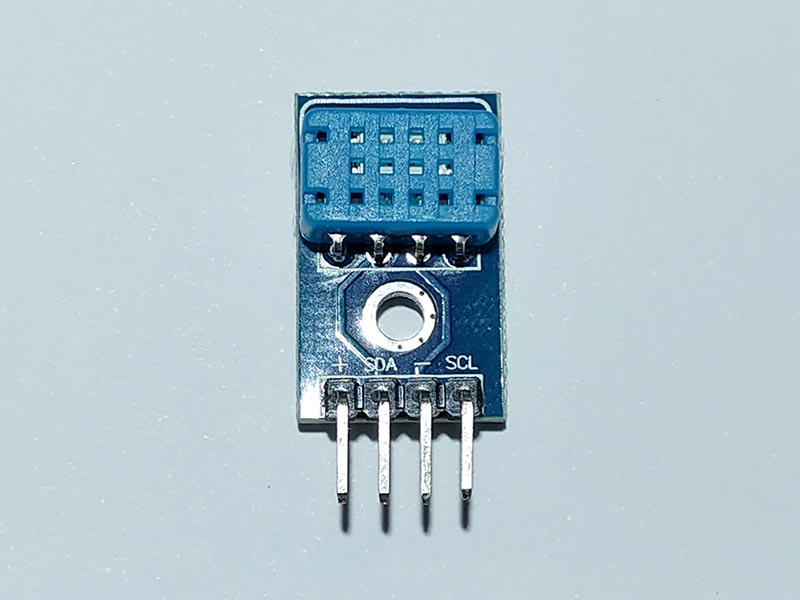

# DHT12 - Temperature & Humidity Sensor
DHT12 Digital temperature and humidity sensor is a calibrated digital output record of temperature and humidity, DHT11 The upgrade product. Application-specific digital temperature and humidity sensor module and semiconductor, ensure high reliability and excellent long-term stability.

## Sensor Image


## Usage
```C#
I2cConnectionSettings settings = new I2cConnectionSettings(1, Dht12.DefaultI2cAddress);
// get I2cDevice (in Linux)
UnixI2cDevice device = new UnixI2cDevice(settings);
// get I2cDevice (in Win10)
//Windows10I2cDevice device = new Windows10I2cDevice(settings);

using (Dht12 sensor = new Dht12(device))
{
    // read temperature
    double temperature = sensor.Temperature.Celsius;
    // read humidity
    double humidity = sensor.Humidity;
}
```

## References
https://cdn.datasheetspdf.com/pdf-down/D/H/T/DHT12-Aosong.pdf
