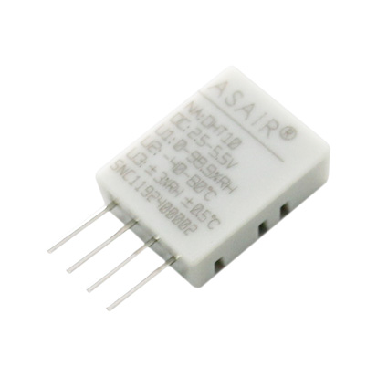
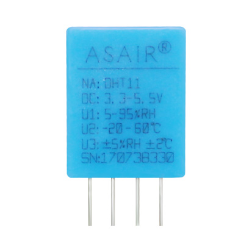
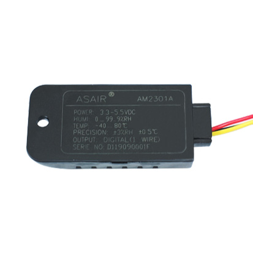
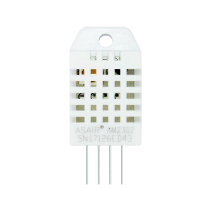

# DHTxx - Digital-Output Relative Humidity & Temperature Sensor Module

The DHT temperature and humidity sensors are very popular. This projects support DHT10, DHT11, DHT12, DHT21(AM2301), DHT22(AM2302).

## Comparison

|  | DHT10 | DHT11 | DHT12 | DHT21 | DHT22 |
| :------: | :------: | :------: | :------: | :------: | :------: |
| Image |  |  |  |  |  |
| Temperature Range | -40 ~ 80 ℃ | -20 ~ 60 ℃ | -20 ~ 60 ℃ | -40 ~ 80 ℃ | -40 ~ 80 ℃ |
| Humidity Range | 0 ~ 99.9 % | 5 ~ 95 % | 20 ~ 95 % | 0 ~ 99.9 % | 0 ~ 99.9 % |
| Temperature Accuracy | ±0.5 ℃ | ±2 ℃ | ±0.5 ℃ | ±0.5 ℃ | ±0.5 ℃ |
| Humidity Accuracy | ±3 % | ±5 % | ±4 % | ±3 % | ±2 % |
| Protocol | I2C | 1-Wire | I2C, 1-Wire | 1-Wire | 1-Wire |

## Usage

### 1-Wire Protocol

```csharp
// GPIO Pin
using (Dht11 dht = new Dht11(26))
{
    Temperature temperature = dht.Temperature;
    double humidity = dht.Humidity;
}
```

### I2C Protocol

Only DHT12 can use I2C protocol.

```csharp
I2cConnectionSettings settings = new I2cConnectionSettings(1, DhtSensor.DefaultI2cAddressDht12);
I2cDevice device = I2cDevice.Create(settings);

using (Dht12 dht = new Dht12(device))
{
    Temperature temperature = dht.Temperature;
    double humidity = dht.Humidity;
}
```

## References

* **DHT10** [datasheet (Currently only Chinese)](http://www.aosong.com/userfiles/files/media/DHT10%E8%A7%84%E6%A0%BC%E4%B9%A6.pdf)
* **DHT11** [datasheet](https://cdn.datasheetspdf.com/pdf-down/D/H/T/DHT11-Aosong.pdf)
* **DHT12** [datasheet](https://cdn.datasheetspdf.com/pdf-down/D/H/T/DHT12-Aosong.pdf)
* **DHT21** [datasheet](https://cdn.datasheetspdf.com/pdf-down/A/M/2/AM2301-Aosong.pdf)
* **DHT22** [datasheet](https://cdn-shop.adafruit.com/datasheets/DHT22.pdf)
