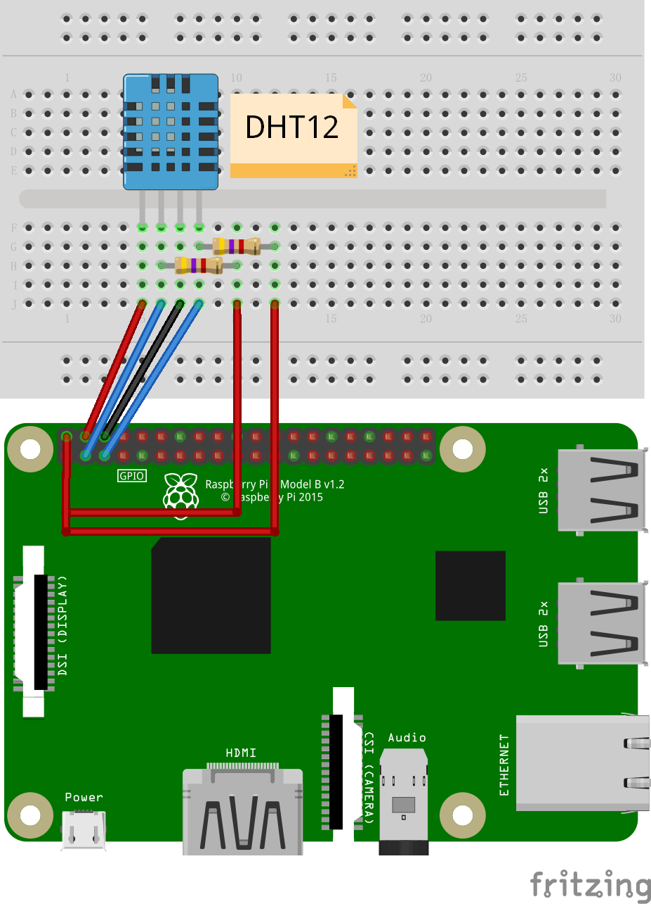
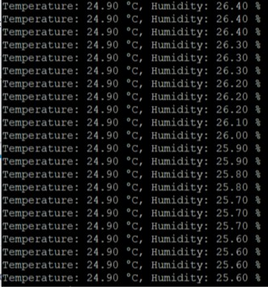

# Example of DHTxx

## Hardware Required

* DHT11/DHT12/DHT21/DHT22
* Male/Female Jumper Wires

## Circuit

### 1-Wire Protocol

Simply connect your DHTxx data pin to GPIO26 (physical pin 37), the ground to the ground (physical pin 6) and the VCC to +5V (physical pin 2).


Some sensors are already sold with the 10K resistor. Connect the GPIO26 to the *data* pin, its position can vary depending on the integrator.

### I2C Protocol



* SCL - SCL
* SDA - SDA
* VCC - 5V
* GND - GND

## Code

```csharp
using (DhtSensor dht = new DhtSensor(26, DhtType.DHT22))
{
    while (true)
    {
        Console.WriteLine($"Temperature: {dht.Temperature.Celsius.ToString("0.0")} °C, "Humidity: {dht.Humidity.ToString("0.0")} %");

        Thread.Sleep(1000);
    }
}
```

## Result



Note: reading this sensor is sensitive, if you can't read anything, make sure you have it correctly cabled. Also note you'll get better results when running in ```Release``` mode.


