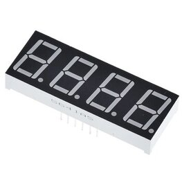

# LED Displays - 5641AS, HT16K33 and LED Matrix Display Driver

A number of LED displays have supported devices or can be extended as necessary.

## HT16K33 - LED Matrix Display Driver

The [Ht16k33](https://cdn-shop.adafruit.com/datasheets/ht16K33v110.pdf) is a multi-function LED controller driver. It is used as a [backpack driver for several Adafruit products](https://www.adafruit.com/?q=Ht16k33). It uses the I2C protocol.

This binding and samples are based on [adafruit/Adafruit_CircuitPython_HT16K33](https://github.com/adafruit/Adafruit_CircuitPython_HT16K33).

### 7-Segment Display

These [bright crisp displays](https://www.adafruit.com/product/1270) are good for showing numeric output. Besides the four 7-segments there is a top right dot (perhaps useful as a degrees symbol) and two sets of colon-dots (good for time-based projects). They come in several colors.


You can write the following code to control them or checkout a [larger sample](samples/Large4Digit7SegmentDisplay/Program.cs).

```csharp
// Initialize display (busId = 1 for Raspberry Pi 2 & 3)
using var display = new Large4Digit7SegmentDisplay(I2cDevice.Create(new I2cConnectionSettings(busId: 1, address: Ht16k33.DefaultI2cAddress));

// Set max brightness (automatically turns on display)
display.Brightness = display.MaxBrightness;

// Write time to the display
display.Write(DateTime.Now.ToString("H:mm").PadLeft(5));

// Wait 5 seconds
Thread.Sleep(5000);

// Turn on buffering
display.BufferingEnabled = true;

// Write -42°C to display using "decimal point" between 3rd and 4th digit as the ° character
display.Write("-42C");
display.Dots = Dot.DecimalPoint;

// Send buffer to the device
display.Flush();
```

### 14-Segment Display

This [display](https://shop.pimoroni.com/products/four-letter-phat?variant=39256047178) is good for showing alpha-numeric output, and its additional segments provide a wider range of characters


Checkout a [sample](samples/Large4Digit14SegmentDisplay/Program.cs).

### 8x8 and 16x8 LED Matrix

Make a [scrolling sign or a small video display](https://www.adafruit.com/product/1614) with [16x8](https://www.adafruit.com/product/2040), [8x8](https://www.adafruit.com/product/1632), and [Bicolor](https://www.adafruit.com/product/902) LED matrices. They are quite visible but not so large it won't plug into a breadboard!


You can write the following code to control them or checkout a [larger sample](samples/Matrix/Program.Matrix.cs) ([Bicolor sample](samples/Matrix8x8Bicolor/Program.Matrix8x8Bicolor.cs)).

```csharp
using Matrix8x8 matrix = new(I2cDevice.Create(new I2cConnectionSettings(busId: 1, Ht16k33.DefaultI2cAddress)))
    {
        // Set max brightness
        Brightness = Ht16k33.MaxBrightness,
        BufferingEnabled = true
    };

matrix.Clear();
// Set pixel in the top left
matrix[0, 0] = 1;
// Set pixel in the middle
matrix[3, 4] = 1;
matrix[4, 3] = 1;
// Set pixel in the bottom right
matrix[7, 7] = 1;
```

### Bi-Color Bargraph Usage

Make a [small linear display](https://www.adafruit.com/product/1721) with multiple colors using this elegant bi-color LED bargraph. Every bar has two LEDs inside so you can have it display red, green, yellow or with fast multiplexing (provided by the HT16K33 driver chip) any color in between.


You can write the following code to control them or checkout a [larger sample](samples/BiColorBargraph/Program.BiColorBargraph.cs).

```csharp
using BiColorBarGraph bargraph = new(I2cDevice.Create(new I2cConnectionSettings(busId: 1, Ht16k33.DefaultI2cAddress)))
    {
        // Set max brightness
        Brightness = Ht16k33.MaxBrightness,
        BufferingEnabled = true
    };

bargraph.Clear();
bargraph[0] = LedColor.RED;
bargraph[1] = LedColor.GREEN;
bargraph[2] = LedColor.YELLOW;
bargraph[3] = LedColor.OFF;
bargraph[4] = LedColor.RED;
```

## Other Displays

### GPIO Devices

The [5641AS](http://www.xlitx.com/datasheet/5641AS.pdf) segment display is similar to above devices but without colon and degrees LEDs. It can be used without a driver.



The following code initializes the pin scheme for the device - mapping pins on the device to the GPIO pins on the board - and creates the display.

```c#
var scheme = new LedSegmentDisplay5641ASPinScheme(16, 21, 6, 19, 26, 20, 5, 13,
                22, 27, 17, 4);

using var gpio = new System.Device.Gpio.GpioController();
using var display = new LedSegmentDisplay5641AS(scheme, gpio, false);
```

See the sample project for pin diagram and a stopwatch example.
