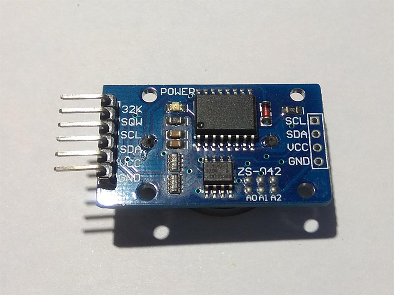

# DS3231 - Realtime Clock
DS3231 is a low-cost, extremely accurate I2C realtime clock (RTC) with an integrated temperature compensated crystal oscillator (TCXO) and crystal.

## Sensor Image


## Usage
```C#
I2cConnectionSettings settings = new I2cConnectionSettings(1, Ds3231.DefaultI2cAddress);
I2cDevice device = I2cDevice.Create(settings);

using (Ds3231 rtc = new Ds3231(device))
{
    // set DS3231 time
    rtc.DateTime = DateTime.Now;
    // read time
    DateTime dt = rtc.DateTime;
    // read temperature
    double temp = rtc.Temperature.Celsius;
}
```

## References
https://datasheets.maximintegrated.com/en/ds/DS3231.pdf
