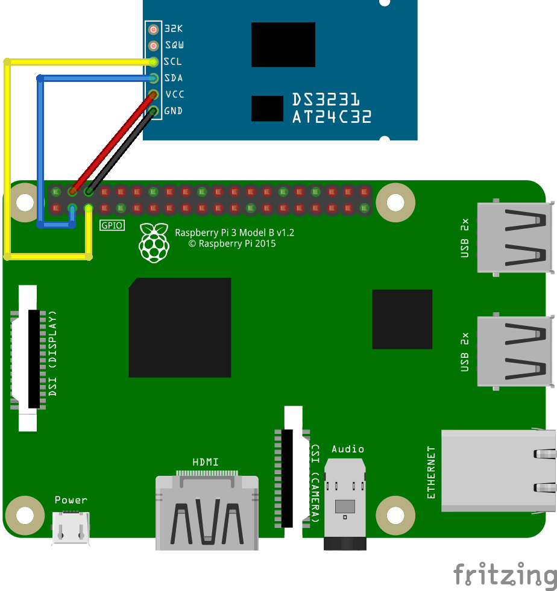

# Example of DS3231

## Hardware Required
* DS3231
* Male/Female Jumper Wires

## Circuit


Ds3231
* SCL - SCL
* SDA - SDA
* VCC - 5V
* GND - GND

## Code
```C#
I2cConnectionSettings settings = new I2cConnectionSettings(1, Iot.Device.Ds3231.Ds3231.I2cAddress);
// get I2cDevice (in Linux)
UnixI2cDevice device = new UnixI2cDevice(settings);

using (Iot.Device.Ds3231.Ds3231 rtc = new Iot.Device.Ds3231.Ds3231(device))
{
    // set DS3231 time
    rtc.DateTime = DateTime.Now;

    // loop
    while (true)
    {
        // read temperature
        double temp = rtc.Temperature;
        // read time
        DateTime dt = rtc.DateTime;

        Console.WriteLine($"Time: {dt.ToString("yyyy/MM/dd HH:mm:ss")}");
        Console.WriteLine($"Temperature: {temp} ℃");
        Console.WriteLine();

        // wait for a second
        Thread.Sleep(1000);
    }
}

```

## Result

