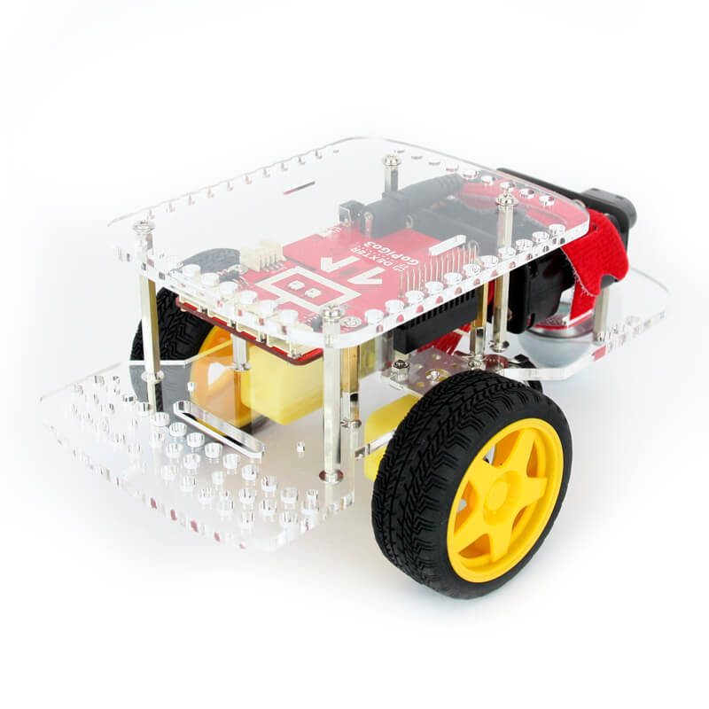

# GoPiGo3

## Summary

You will need a GoPiGo3 from [Dexter Industries](https://www.dexterindustries.com/gopigo3/) and a Raspberry Pi 3. That said, any board will work with the GoPiGo3 as it is using SPI. You’ll just need to link the pins from your board to the GoPiGo3 ones the correct way.

GoPiGo3 have the ability to use Grove sensors, analogic, digital and I2C as well as servomotors. In order to take full advantage of this robot, you can add Grove sensors as well as servomotors. They are not mandatory. This project already embedded couple of Grove sensors. It is very easy to create Grove sensors based on the ones provided.

- [Device family](./README.md#device-family)
- [GoPiGo3 requirements](./README.md#make-sure-you-have-a-GoPiGo3)
- [Know limitations](./README.md#known-limitations)
- [Using the driver](./README.md#how-to-use-the-driver)
  - [Accessing GoPiGo3 information](./README.md#accessing-GoPiGo3-information)
  - [Using sensors](./README.md#using-sensors)
  - [Using motors](./README.md#using-motors)
    - [Making a motor moving depending on the position of another motor](./README.md#making-a-motor-moving-depending-on-the-position-of-another-motor)
    - [Setting power to motors](./README.md#setting-power-to-motors)
    - [Reading encoders](./README.md#reading-encoders)
    - [Setting motor speed with degree per seconds](./README.md#setting-motor-speed-with-degree-per-seconds)
- [Using high level classes](./README.md#how-to-use-the-high-level-classes)
  - [Using the Sensor classes](./README.md#using-the-sensor-classes)
  - [Using Motors](./README.md#using-motors)
- [Tests](./README.md#tests)

## Device family

The device supported is the GoPiGo3 [Dexter Industries](https://www.dexterindustries.com/gopigo3/). It does implement all the features offered to pilot motors, get values from sensor. The supported version of GoPiGo is only the version 3.



## Make sure you have a GoPiGo3

There are multiple versions of GoPiGo, this code is only working for GoPiGo3. The previous version of GoPiGo is using I2C while this version is using SPI. So they won't be compatible. Just make sure you have the last version.

## Known limitations

This version include a pure driver so you can directly access to the raw results. High level classes has been created for various sensors has been tested. Please open a GitHub issue if you have any issue with any sensor. GoPiGo3 has been tested with the following sensors:


For I2C sensors, the code has been tested very little. And no high level classes has been built for those sensors.

## How to use the driver

The main [GoPiGo3.samples](https://github.com/dotnet/iot/tree/main/src/devices/GoPiGo3/samples) contains a series of test showing how to use every elements of the driver.

Create a ```GoPiGo``` class.

```csharp
// Default on the Raspberry is Bus ID = 0 and Chip Set Select Line = 1 for GoPiGo3
var settings = new SpiConnectionSettings(0, 1)
{
    // 500K is the SPI communication with GoPiGo
    ClockFrequency = 500000,
    Mode = SpiMode.Mode0,
    DataBitLength = 8
};
_goPiGo3 = new GoPiGo(SpiDevice.Create(settings));
// Do whatever you want, read sensors, set motors, etc
// once finished, and class will be disposed, all motors will be floated and sensors reinitialized
// The SpiDevice will the disposed when GoPiGo will be disposed
```

If you want to use GoPiGo3 on another board than the RaspberryPi and you have to change the default SPI bus and chip select line, you can do it as well in the constructor. Please note that for Raspberry Pi, the default is 0 for bus Id and 1 for chip select line.

### Accessing GoPiGo3 information

The GoPiGo3Info class offers information like the board Id, manufacturer. You can easily access them like in the following code:

```csharp
var goPiGoInfo = _goPiGo3.GoPiGo3Info;
Console.WriteLine($"Manufacturer: {goPiGoInfo.Manufacturer}");
Console.WriteLine($"Board: {goPiGoInfo.Board}");
Console.WriteLine($"Hardware version: {goPiGoInfo.HardwareVersion}");
var hdv = goPiGoInfo.GetHardwareVersion();
for (int i = 0; i < hdv.Length; i++)
    Console.WriteLine($"Hardware version {i}: {hdv[i]}");

Console.WriteLine($"Software version: {goPiGoInfo.SoftwareVersion}");
var swv = goPiGoInfo.GetSoftwareVersion();
for (int i = 0; i < swv.Length; i++)
    Console.WriteLine($"Software version {i}: {swv[i]}");

Console.WriteLine($"Id: {goPiGoInfo.Id}");
```

You can as well change the color of the embedded led. The minimum value is 0 and maximum 255. Here is an example:

```csharp
 // Eyes led
Console.WriteLine("Testing Led, changing colors for the leds on both eyes");
for (int red = 0; red < 255; red += 10)
{
    for (int green = 0; green < 255; green += 10)
    {
        for (int blue = 0; blue < 255; blue += 10)
        {
            _goPiGo3.SetLed((byte)GoPiGo3Led.LedEyeLeft + (byte)GoPiGo3Led.LedEyeRight, (byte)red, (byte)green, (byte)blue);
        }
    }
}
// Led wifi
Console.WriteLine("Changing wifi led to red");
_goPiGo3.SetLed((byte)GoPiGo3Led.LedWifi, 255, 0, 0);
Thread.Sleep(2000);
Console.WriteLine("Changing wifi led to blue");
_goPiGo3.SetLed((byte)GoPiGo3Led.LedWifi, 0, 0, 255);
Thread.Sleep(2000);
Console.WriteLine("Changing wifi led to green");
_goPiGo3.SetLed((byte)GoPiGo3Led.LedWifi, 0, 255, 0);
Thread.Sleep(2000);
_goPiGo3.SetLed((byte)GoPiGo3Led.LedEyeLeft + (byte)GoPiGo3Led.LedEyeRight + (byte)GoPiGo3Led.LedWifi, 0, 0, 0);
```

You can get the various voltage of the board including the battery voltage:

```csharp
// Get the voltage details
var voltage = _goPiGo3.GoPiGoVoltage;
Console.WriteLine($"5V: {voltage.Voltage5V}");
Console.WriteLine($"Battery voltage: {voltage.VoltageBattery}");
```

### Using sensors

To setup a sensor, you need first to set the type of sensor then you can read the data. The below example read an analogic input on the Grove1 port.

```csharp
_goPiGo.SetGroveType(GrovePort.Grove1, GroveSensorType.Custom);
_goPiGo.SetGroveMode(GrovePort.Grove1, GroveInputOutput.InputAnalog);
var _mode = Port == GrovePort.Grove1 ? GrovePort.Grove1Pin1 : GrovePort.Grove2Pin1;
var thevalue = _goPiGo.GetGroveAnalog(_mode);
```

It is **strongly recommended** to use the high level classes implementing the logic to decode correctly the raw values of sensor like in the previous example. If you want to build your own sensor classes, you can use those low level functions. You need to understand if the Pin1 is used (the yellow cable on Grove) and/or the Pin2 is used (the white cable). And of course, you'll need to know the sequence and how to read/write on those pins. You'll find detailed examples in the ```Sensors``` folder.

### Using motors

There are many ways you can use motors, either by setting the power, either by reading the encoder, either by setting a degree per second speed. Those 3 examples will show you how to use each of them.

#### Making a motor moving depending on the position of another motor

In this example, the motor on port D is used to set the position of the motor A. A simple NXT touch sensor is used to end the sequence when it is pressed.

You can see as well the ```MotorStatus``` classes containing all information on the motor. Flags are useful to understand if you have issues with the power or an overload of the motors.

To reinitialize the encoder, simply set the offset to the current version like shown in the first 2 lines.

```csharp
_goPiGo3.OffsetMotorEncoder(MotorPort.MotorRight, _goPiGo3.GetMotorEncoder(MotorPort.MotorRight));
_goPiGo3.OffsetMotorEncoder(MotorPort.MotorLeft, _goPiGo3.GetMotorEncoder(MotorPort.MotorLeft));
_goPiGo3.SetMotorPositionKD(MotorPort.MotorLeft);
_goPiGo3.SetMotorPositionKP(MotorPort.MotorLeft);
// Float motor Right
_goPiGo3.SetMotorPower(MotorPort.MotorRight, (byte)MotorSpeed.Float);
// set some limits
_goPiGo3.SetMotorLimits(MotorPort.MotorLeft, 50, 200);
Console.WriteLine("Read Motor Left and Right positions. Press enter stop the test.");
AddLines();
//run until we press enter
while (!Console.KeyAvailable)
{
    var target = _goPiGo3.GetMotorEncoder(MotorPort.MotorRight);
    _goPiGo3.SetMotorPosition(MotorPort.MotorLeft, target);
    var status = _goPiGo3.GetMotorStatus(MotorPort.MotorLeft);
    Console.WriteLine($"MotorLeft Target DPS: {target} Speed: {status.Speed} DPS: {status.Dps} Encoder: {status.Encoder} Flags: {status.Flags}");
    status = _goPiGo3.GetMotorStatus(MotorPort.MotorRight);
    Console.Write($"MotorRight Target DPS: {target} Speed: {status.Speed} DPS: {status.Dps} Encoder: {status.Encoder} Flags: {status.Flags}");
    Thread.Sleep(20);
}
```

Please note that this example uses directly the low level functions available on the GoPiGo class.

#### Setting power to motors

This simple example increases the speed of a motor and decreases it after. Use ```MotorSpeed.Float``` to float the motor. Setting speed at 0 do not have the exact same effect. It does block the motor. Float will just let the motor goes its own way. To stop the motor, setup a speed of 0.

```csharp
Console.WriteLine("Speed test on MotorLeft, increasing and decreasing speed from 0 to maximum");
Console.WriteLine("Acceleration on MotorLeft");
for (int i = 0; i < 10; i++)
{
    _goPiGo.SetMotorPower(MotorPort.MotorLeft, (byte)(i * 10));
    Task.Delay(1000).Wait();
}
_goPiGo.SetMotorPower(MotorPort.MotorLeft, (byte)MotorSpeed.Float);
Console.WriteLine("Waiting 1 second");
Thread.Sleep(1000);
Console.WriteLine("Deceleration on MotorLeft");
for (int i = 0; i < 10; i++)
{
    _goPiGo.SetMotorPower(MotorPort.MotorLeft, (byte)(100 - i * 10));
    Task.Delay(1000).Wait();
}
_goPiGo.SetMotorPower(MotorPort.MotorLeft, (byte)MotorSpeed.Float);
Console.WriteLine("End of test on MotorLeft");
```

#### Reading encoders

On top of the motor position example, here is another example to read the encoder of a motor. It's an easy way to understand if the motor is correctly plugged if any of the function you want to use is not working. Moving it will change the encoder value. Please note that the encoder value can be negative as well. The first line reset the encoder.

```csharp
Console.WriteLine("Read encoder of MotorLeft 100 times. Reset position to 0 to start");
_goPiGo.OffsetMotorEncoder(MotorPort.MotorLeft, brick.GetMotorEncoder(MotorPort.MotorLeft));
for (int i = 0; i < 100; i++)
{
    var encodermotor = _goPiGo.GetMotorEncoder(MotorPort.MotorLeft);
    Console.WriteLine($"Encoder: {encodermotor}");
    Thread.Sleep(200);
}
```

#### Setting motor speed with degree per seconds

Another way to pilot the motors is to set a specific speed in degree per seconds. In the below example, no limit has been set but it's possible to setup a limit like in the motor position example. Setting up limits reduces the risk of overheat on the motors.

```csharp
_goPiGo.OffsetMotorEncoder(MotorPort.MotorLeft, _goPiGo.GetMotorEncoder(MotorPort.MotorLeft));
_goPiGo.OffsetMotorEncoder(MotorPort.MotorRight, _goPiGo.GetMotorEncoder(MotorPort.MotorRight));
// Float MotorLeft
_goPiGo.SetMotorPower(MotorPort.MotorLeft, (byte)MotorSpeed.Float);
Console.WriteLine("Control MotorRight speed with MotorLeft encoder. Turn MotorLeft to control speed of Motor A");
while (!Console.KeyAvailable)
{
    var target = _goPiGo.GetMotorEncoder(MotorPort.MotorLeft);
    _goPiGo.SetMotorDps(MotorPort.MotorRight, target);
    var status = goPiGo.GetMotorStatus(MotorPort.MotorRight);
    Console.WriteLine($"Motor A Target Degrees Per Second: {target}; Motor A speed: {status.Speed}; DPS: {status.Dps}; Encoder: {status.Encoder}; Flags: {status.Flags}");
    Thread.Sleep(20);
}
```

Motors can be adjusted the KP and KD settings of the motor. If you set KP higher, the motor will be more responsive to errors in position, at the cost of perhaps overshooting and oscillating. KP slows down the motor as it approaches the target, and helps to prevent overshoot. In general, if you increase KP, you should also increase KD to keep the motor from overshooting and oscillating.

## How to use the high level classes

There are high level classes to handle directly sensors like analogic sensors, buzzers, leds, buttons. There is as well a Motor and a Vehicle class to make it easier to pilot and control the motors rather than thru the low level driver.

### Using the Sensor classes

Using the sensor classes is straight forward. Just reference a class and initialized it. Access properties which are common to all sensors, ```Value``` and ```ToString()```.

Example creating an Ultrasonic sensor on Grove1 port:

```csharp
UltraSonicSensor ultraSonic = new UltraSonicSensor(_goPiGo3, GrovePort.Grove1);
Console.WriteLine($"Test {ultraSonic.SensorName} on port {ultraSonic.Port}. Gives the distance. Press enter to stop the test.");
while (!Console.KeyAvailable)
{                
    Console.CursorLeft = 0;
    Console.Write($"Value: {ultraSonic.Value}, Value as String: {ultraSonic}");
    Thread.Sleep(100);
}
```

### Using Motors

Motors are as well really easy to use. You have functions ```Start()```, ```Stop()```, ```SetSpeed(speed)``` and ```GetSpeed()``` which as you can expect will start, stop, change the speed and give you the current speed. A speed property is available as well and will change the speed.

The motors have an encoder which gives you the position the precision can be found in the property ```EncoderTicksPerRotation``` (degree precision). You can get access thru function ```GetTachoCount()```. As the numbers can get big quite fast, you can reset this counter by using ```SetTachoCount(newnumber)```. A ```TachoCount``` property is available as well. This property like for sensors can raise an event on a minimum time base you can setup.

```csharp
GoPiGo _goPiGo = new GoPiGo();

Motor motor = new Motor(_goPiGo, MotorPort.MotorLeft);
motor.SetSpeed(100); //speed goes from -100 to +100, others will float the motor
motor.Start();
motor.SetSpeed(motor.GetSpeed() + 10);
Console.WriteLine($"Encoder: {motor.GetTachoCount()}");
Console.WriteLine($"Encoder: {motor.TachoCount}"); //same as previous line
Console.WriteLine($"Speed: {motor.GetSpeed()}");
Console.WriteLine($"Speed: {motor.Speed}"); //same as previous line
motor.SetPolarity(Polarity.OppositeDirection); // change the direction
motor.Stop();
```

Here is an example of the ```Vehicle``` class:

```csharp
Console.WriteLine("Vehicle drive test using Motor A for left, MotorLeft for right, not inverted direction");
Vehicle veh = new Vehicle(_goPiGo, MotorPort.MotorRight, MotorPort.MotorLeft);
veh.DirectionOpposite = true;
Console.WriteLine("Driving backward");
veh.Backward(30, 5000);
Console.WriteLine("Driving forward");
veh.Foreward(30, 5000);
Console.WriteLine("Turning left");
veh.TrunLeftTime(30, 5000);
Console.WriteLine("Turning right");
veh.TrunRightTime(30, 5000);
Console.WriteLine("Turning left");
veh.TurnLeft(30, 180);
Console.WriteLine("Turning right");
veh.TurnRight(30, 180);
```

The ```Vehicle``` class offers functions with timeout allowing to drive for a certain amount of time. All timing are in milliseconds. Turning functions offers as well a degree mode which allows to turn by a certain degree rather than a specific time.

## Tests

A series of hardware tests for motors and sensors are available in [GoPiGo3.samples](https://github.com/dotnet/iot/tree/main/src/devices/GoPiGo3/samples). Those hardware tests offers a variety of low level access to the Brick class as well as high level thru the Motor and Sensor classes.

You can select the tests you want to run:

```text
Choose a test by entering the number and press enter:
  1. Basic GoPiGo3 info and embedded led test
  2. Control left motor from motor right position
  3. Read encoder of right motor
  4. Test both servo motors
  5. Test Ultrasonic sensor on Grove1
  6. Test buzzer on Grove1
  7. Change buzzer tone on Grove1 with a potentiometer on Grove2
  8. Test sound sensor on Grove1
  9. Test a relay on Grove1
 10. Test a button on Grove1
 11. Control a led light on Grove2 from a light sensor on Grove1
 12. Test MotorLeft speed based on encoder
 13. Test driving the vehicle
```
