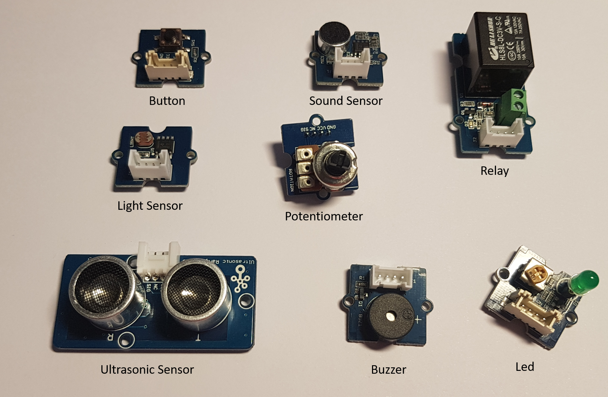

# GoPiGo3

The provided examples covers almost all high level sensor classes as well as motors and GoPiGo3 information. This is the code used to test the hardware.

# Schematic

Just plug your GoPiGo3 shield on your Raspberry Pi.

If you are using another board with compatible pins with the Raspberry Pi, you will be able to use it as well without any change. If you are using a board with a different pin out, make sure you connect the SPI of your board to the SPI of GoPiGo3.

This is the list of tested and fully supported sensors. They are all either analogic either digital, input or output, PWM or not sensors. Generic sensors can be found in the ```Sensors``` folder of the main GoPiGo3 class. 



More information on [Dexter Industries website](https://www.dexterindustries.com/GoPiGo3Pi//).

Please note the for analogic sensors the ADC is 4095 (12 bits).

# Code

The code illustrate how to use most sensors as well as motors. It is the code used to test the hardware devices. As explained in the main documentation, we do recommend to use the high level classes to access the sensors and the motors rather than the low level one. That said the example contains examples on how to use all of them.

Refer to the code to understand on which port you'll need to plug motors and sensors. The available tests are the following:

```
Choose a test by entering the number and press enter:
  1. Basic GoPiGo3 info and embedded led test
  2. Control left motor from motor right position
  3. Read encoder of right motor
  4. Test both servo motors
  5. Test Ultrasonic sensor on Grove1
  6. Test buzzer on Grove1
  7. Change buzzer tone on Grove1 with a potentiometer on Grove2
  8. Test sound sensor on Grove1
  9. Test a relay on Grove1
 10. Test a button on Grove1
 11. Control a led light on Grove2 from a light sensor on Grove1
 12. Test MotorLeft speed based on encoder
 13. Test driving the vehicle
```

You always have to create a GoPiGo3 and initialize it. Then you can run your code. In this example, reading an analogic sound sensor.

```csharp
var settings = new SpiConnectionSettings(0, 1)
{
    // 500K is the SPI communication with GoPiGo
    ClockFrequency = 500000,
    Mode = SpiMode.Mode0,
    DataBitLength = 8
};
GoPiGo _goPiGo3 = new GoPiGo(SpiDevice.Create(settings));
SoundSensor soundSensor = new SoundSensor(_goPiGo3, GrovePort.Grove1);
Console.WriteLine($"Test {soundSensor.SensorName} on port {soundSensor.Port}. Press a key to finish the test");
while (!Console.KeyAvailable)
{
    Console.Write($"{soundSensor.SensorName}: {soundSensor.ValueAsString} which is {soundSensor.ValueAsPercent} %");
    Thread.Sleep(100);
}
```

Please keep in mind that default behavior when GoPiGo is disposed, the SpiDevice as well. You can override this default behavior by changing ```autoDispose``` to false.
