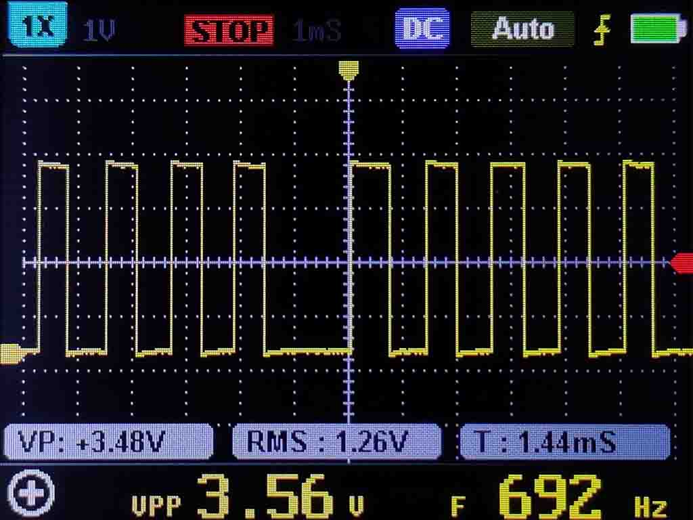
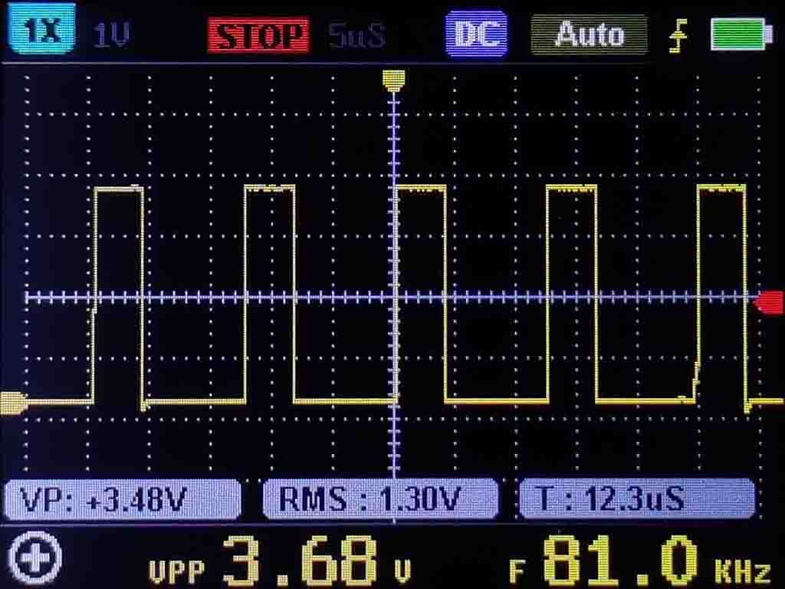
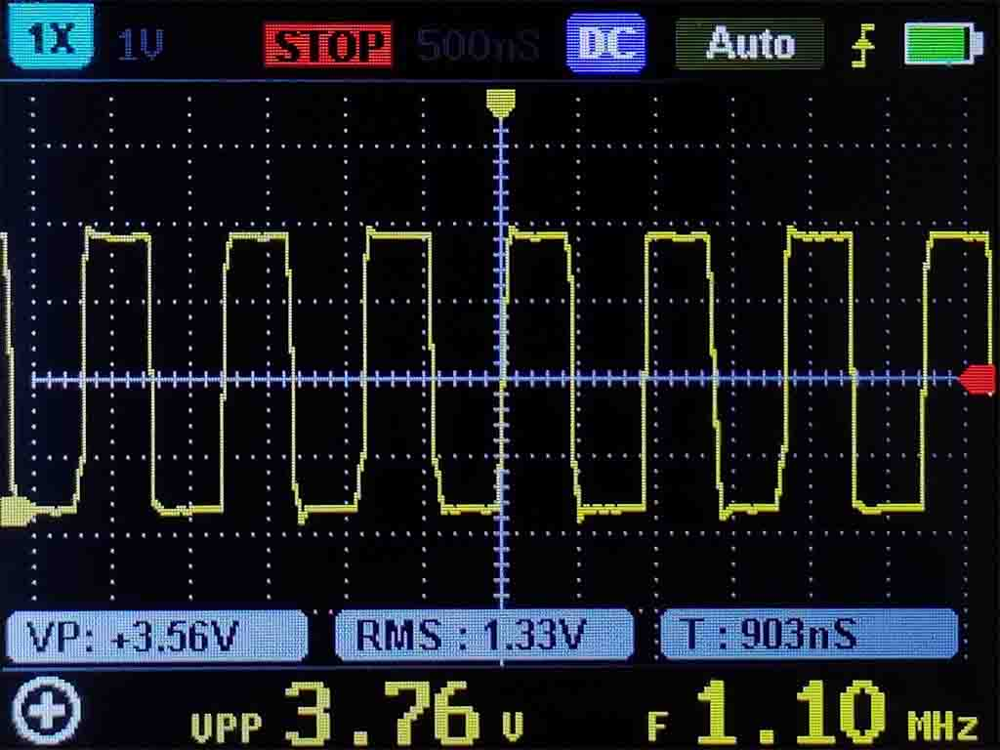
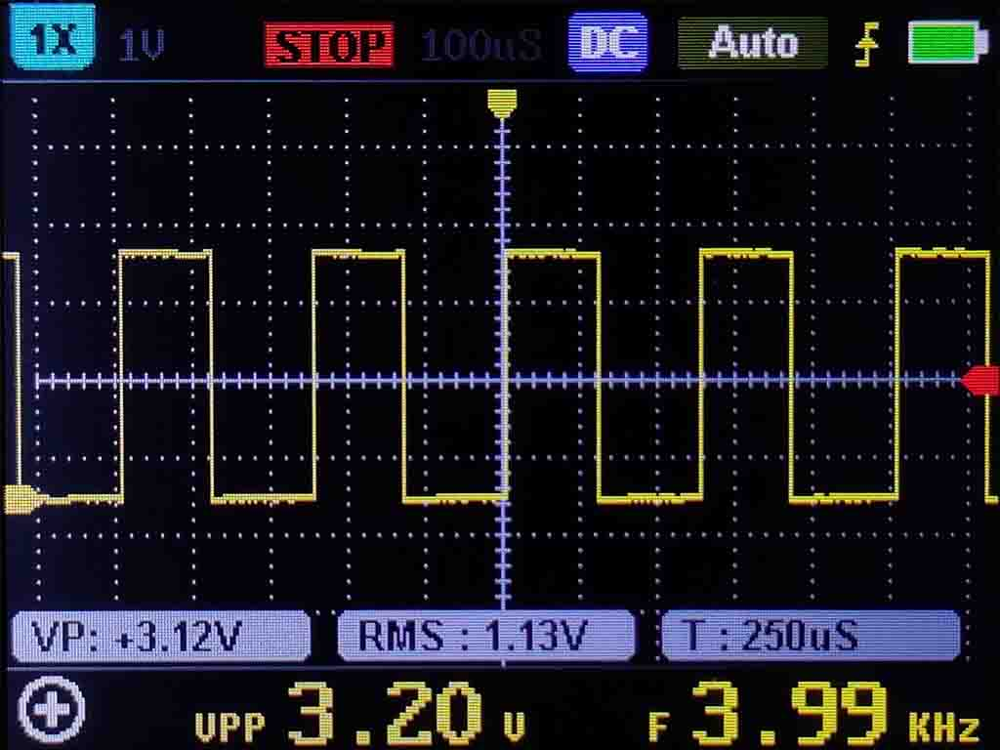
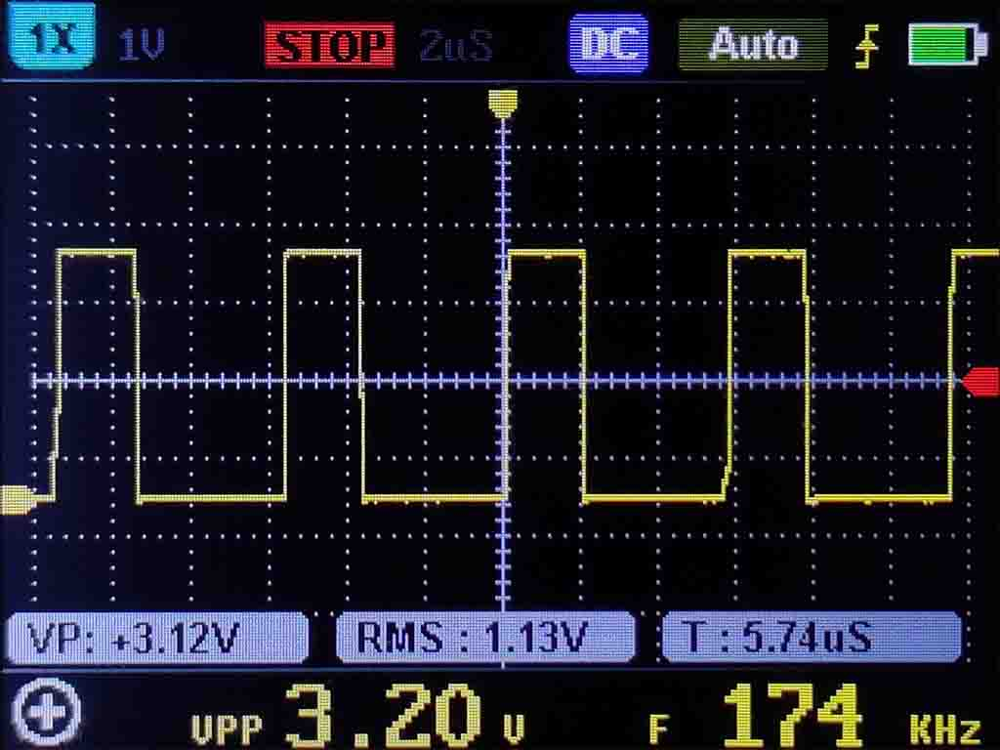
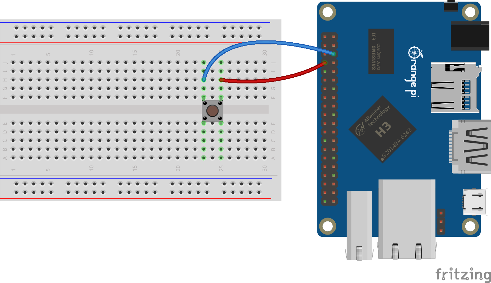

# GpioDriver for other boards and virtual GpioController and virtual GpioPin

This project contains some **full function(PULL-UP, PULL-DOWN)** generic GPIO drivers, and it can provide faster GPIO access.

## Documentation

* For Allwinner SoCs: [SunxiDriver](Drivers/Sunxi/README.md)
* For Rockchip SoCs: [RockchipDriver](Drivers/Rockchip/README.md)

## Usage of virtual GpioController and virtual GpioPin

When you have multiple GpioControllers and want to use them together in a specific binding, the `VirtualGpioController` allows to create a GpioController from a set of `GpioPin`s already open from different controllers. Usage is straight forward and the class is fully compatible with a normal `GpioController`.

```csharp
// Create pins from 2 different GpioControllers
var pinFromA = gpioControllerA.Open(42, PinMode.Output);
var pinFromB = gpioControllerB.Open(24, PinMode.Input);
var pinFromC = gpioControllerC.Open(12, PinMode.Input);
VirtualGpioController gpio = new();
// pin number will be 0 in this case
gpio.Add(pinFromA);
// pin number will be 12 in this case
gpio.Add(12, pinFromB);
// the pin number will be 13 in this case
gpio.Add(pinFromC);
```

When adding an existing GpioPin, by default, the new pin allocation will directly follow the higher pin number already existing. You can also use this method to change the numbering of your board. Note that the VirtualGpioController is only operating in the logical numbering.

## Board specific drivers

| Board | Driver |
| :-: | :-: |
| Orange Pi 4 | [OrangePi4Driver](./Drivers/OrangePi4Driver.cs) |
| Orange Pi Lite | [OrangePiLiteDriver](./Drivers/OrangePiLiteDriver.cs)  |
| Orange Pi Lite 2 | [OrangePiLite2Driver](./Drivers/OrangePiLite2Driver.cs) |
| Orange Pi Zero | [OrangePiZeroDriver](./Drivers/OrangePiZeroDriver.cs) |
| Orange Pi Zero 2 | [OrangePiZero2Driver](./Drivers/OrangePiZero2Driver.cs) |
| Rock Pi 4B Plus | [RockPi4bPlusDriver](./Drivers/RockPi4bPlusDriver.cs) |
| Orange Pi PC | [OrangePiPCDriver](./Drivers/OrangePiPCDriver.cs) |

## Benchmarks

The test uses different GPIO drivers to quickly switch the state of GPIO, and uses an oscilloscope to measure the average frequency of GPIO externally.

### SunxiDriver

Benchmarking with **Orange Pi Zero**, select GPIO 6 (Logical). The operating system is Armbian buster, Linux kernel version is 5.10.16, and .NET version is 5.0.3.

| Drivers| Language | Library Version | Test Date | Average Frequency |  |
| :-: | :-: | :-: | :-: | :-: | :-: |
| SunxiDriver | C# | - | 2020-02-20 | 185 KHz |  |
| SysFsDriver | C# | System.Device.Gpio 1.3.0 | 2020-02-20 | 692 Hz |  |
| LibGpiodDriver | C# | System.Device.Gpio 1.3.0 - libgpiod 1.2-3 | 2020-02-20 | 81 KHz |  |
| [wiringOP](https://github.com/orangepi-xunlong/wiringOP) | C | 35de015 | 2020-02-22 | 1.10 MHz |  |

### RockchipDriver

Benchmarking with **Orange Pi 4**, select GPIO 150 (Logical). The operating system is Armbian buster, Linux kernel version is 5.10.16, and .NET version is 5.0.3.

| Drivers| Language | Library Version | Test Date | Average Frequency |  |
| :-: | :-: | :-: | :-: | :-: | :-: |
| RockchipDriver | C# | - | 2020-02-22 | 516 KHz |  |
| SysFsDriver | C# | System.Device.Gpio 1.3.0 | 2020-02-22 | 4.27 KHz |  |
| LibGpiodDriver | C# | System.Device.Gpio 1.3.0 - libgpiod 1.2-3 | 2020-02-22 | 174 KHz |  |
| [wiringOP](https://github.com/orangepi-xunlong/wiringOP) | C | 35de015 | 2020-02-22 | 584 KHz |  |

## Usage

### Hardware required

* Orange Pi Zero
* Switch
* Male/Female Jumper Wires

### Circuit



* Switch 1 - Board Pin7 (GPIO 6)
* Switch 2 - GND

### Code

```csharp
using System;
using System.Device.Gpio;
using Iot.Device.BoardLed;
using Iot.Device.Gpio.Drivers;

// Set debounce delay to 5ms
int debounceDelay = 50000;
int pin = 7;

Console.WriteLine($"Let's blink an on-board LED!");

using GpioController controller = new GpioController(PinNumberingScheme.Board, new OrangePiZeroDriver());
using BoardLed led = new BoardLed("orangepi:red:status");

controller.OpenPin(pin, PinMode.InputPullUp);
led.Trigger = "none";
Console.WriteLine($"GPIO pin enabled for use: {pin}.");
Console.WriteLine("Press any key to exit.");

while (!Console.KeyAvailable)
{
    if (Debounce())
    {
        // Button is pressed
        led.Brightness = 1;
    }
    else
    {
        // Button is unpressed
        led.Brightness = 0;
    }
}

bool Debounce()
{
    long debounceTick = DateTime.Now.Ticks;
    PinValue buttonState = controller.Read(pin);

    do
    {
        PinValue currentState = controller.Read(pin);

        if (currentState != buttonState)
        {
            debounceTick = DateTime.Now.Ticks;
            buttonState = currentState;
        }
    }
    while (DateTime.Now.Ticks - debounceTick < debounceDelay);

    if (buttonState == PinValue.Low)
    {
        return true;
    }
    else
    {
        return false;
    }
}
```
