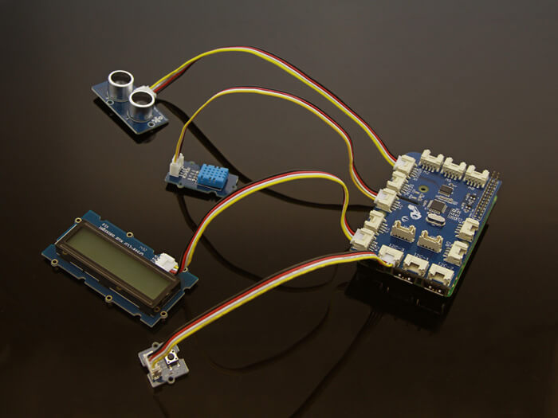

# GrovePi sample

You can refer to the main documentation to understand how to use GrovePi. This example uses multiple sensors. All of them can be foun d in the basic Grove Start Kit.

Once you have GrovePi on a Raspberry Pi, it looks like this:

See the GRovePi binding [documentation ](../README.md) for more information and how to use GrovePi.