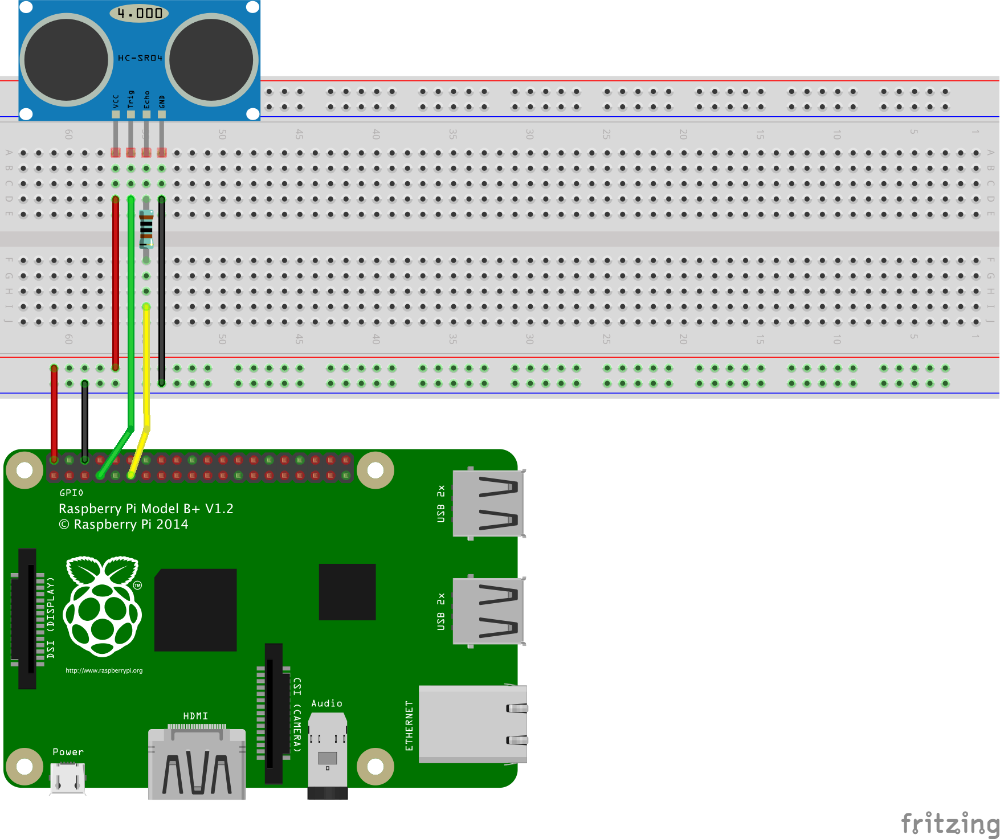

# HC-SR04 - Samples

## Hardware Required
* HC-SR04
* Male/Female Jumper Wires

## Circuit


* VCC - 5V
* GND - GND
* Trig - GPIO 4
* Echo - GPIO 17

The fritz diagram above depicts how you should wire your RPi in order to run the program, the resistance for R1 is 1kOhm. (Optional).

## Code
```C#
using (var sonar = new Hcsr04(4, 17))
{
    try
    {
        Console.WriteLine($"Distance: {sonar.Distance.Centimeters} cm");
    }
    catch
    {
        Console.WriteLine("Error reading sensor");
    }
    
    Thread.Sleep(1000);
}
```