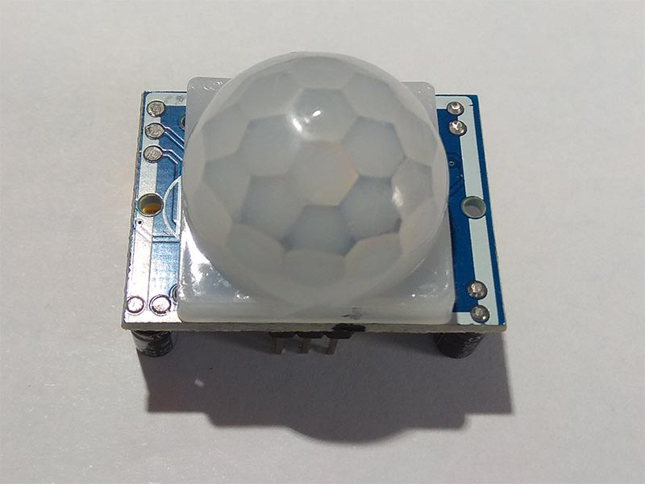

# HC-SR501
HC-SR501 is used to detect motion based on the infrared heat in the surrounding area. 

## Sensor Image


## Usage
* First, you need to create a HCSR501 object. After that you should call Initialize() to initialize.
    ```C#
    Hcsr501 sensor = new Hcsr501(hcsr501Pin, PinNumberingScheme.Logical);
    sensor.Initialize();
    ```

* Second, call Read() to detect motion.
    ```C#
    bool isDetected = sensor.Read();
    ```

* If you want to close the sensor, call Dispose().
    ```C#
    sensor.Dispose()
    ```

## References
In Chinese : http://wenku.baidu.com/view/26ef5a9c49649b6648d747b2.html

In English : https://github.com/ZhangGaoxing/windows-iot-demo/tree/master/src/HC_SR501/01_Datasheet
