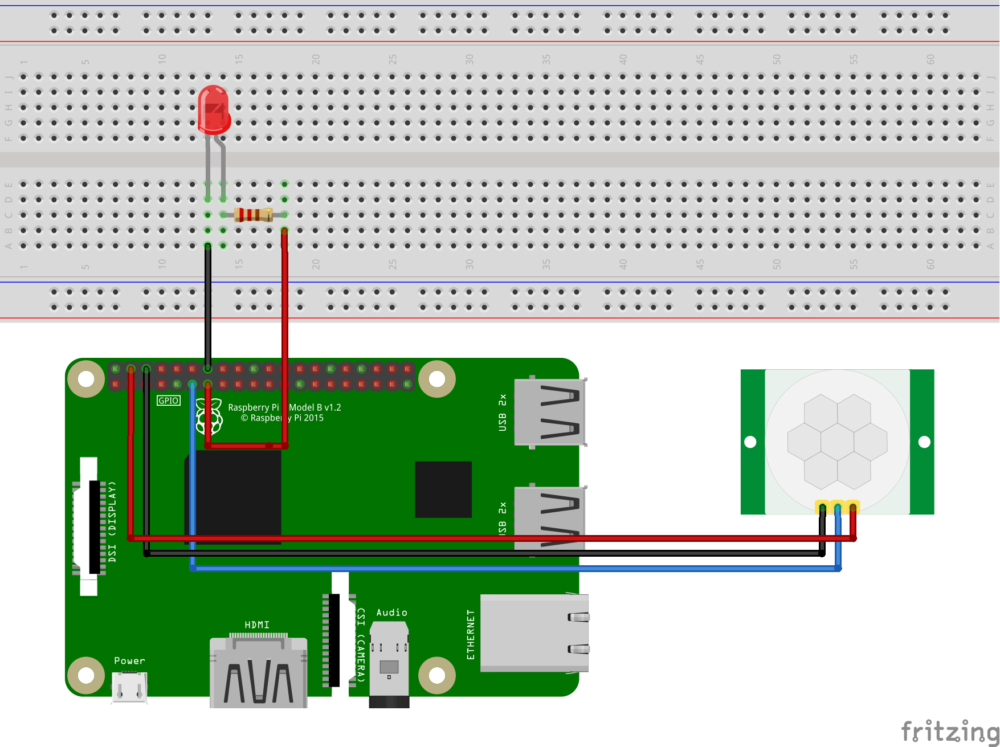

# Example of HC-SR501

## Hardware Required
* PIR Motion Sensor - HC-SR501
* LED
* 220 Ω resistor
* Male/Female Jumper Wires

## Circuit


HC-SR501
* VCC - 5V
* GND - GND
* OUT - GPIO 17

LED
* VCC & 220 Ω resistor - GPIO 27
* GND - GND

## Code
* First, you need to create a HCSR501 object. After that you should call Initialize() to initialize.
    ```C#
    Hcsr501 sensor = Hcsr501(17, PinNumberingScheme.Logical);
    sensor.Initialize();
    ```

* Second, initialize LED.
    ```C#
    GpioController ledController = new GpioController(PinNumberingScheme.Logical);
    // open PIN 27 for led
    ledController.OpenPin(27, PinMode.Output);
    ```

* Finially, in the loop, read the sensor data.
    ```C#
    while (true)
    {
        if (sensor.Read() == true)
        {
            // turn the led on when the sensor detected infrared heat
            ledController.Write(27, PinValue.High);
            Console.WriteLine("Detected! Turn the LED on.");
        }
        else
        {
            // turn the led off when the sensor undetected infrared heat
            ledController.Write(27, PinValue.Low);
            Console.WriteLine("Undetected! Turn the LED off.");
        }

        // wait for a second
        Thread.Sleep(1000);
    }
    ```

## Result

