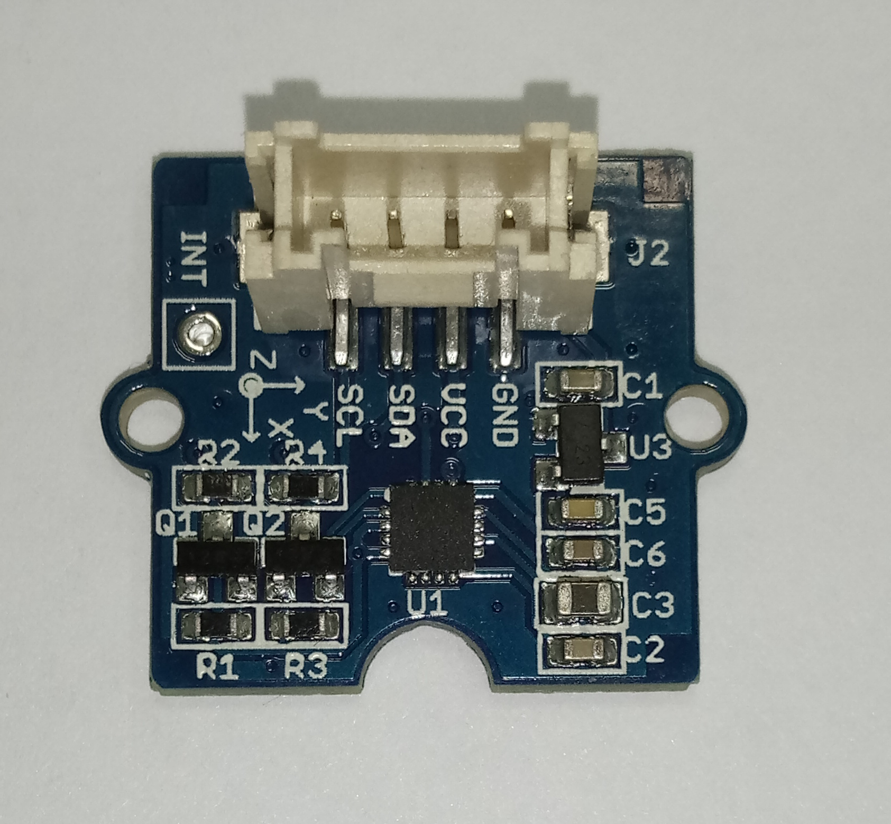

# Hmc5883
This 3-axis digital compass features a low field magnetic sensing multi-chip module HMC5883L, which provides up to 1° to 2° heading accuracy.

## Sensor Image


## Usage
```C#
int _deviceAddress = 0x1E;
var i2cConnectionSettings = new I2cConnectionSettings(1, _deviceAddress);
var i2cDevice = new UnixI2cDevice(i2cConnectionSettings);

using (Hmc5883 hmc5883 = new Hmc5883(i2cDevice))
{
    //configure device
    hmc5883.setOutputRateAndMeasurementMode(OutputRates.Rate15, MeasurementModes.Normal);
    hmc5883.setGain(GainConfiguration.Ga1_2);
    hmc5883.setOperatingMode(OperatingModes.ContinuousMeasurementMode);

    // read data
    RawValues values = hmc5883.getRawValues();
    var status = hmc5883.getStatus();
}
```

## References 
Device information: http://wiki.seeedstudio.com/Grove-3-Axis_Compass_V1.0/#play-with-arduino

Hmc5883 data-sheet: https://raw.githubusercontent.com/SeeedDocument/Grove-3-Axis_Compass_V1.0/master/res/HMC5883.pdf

