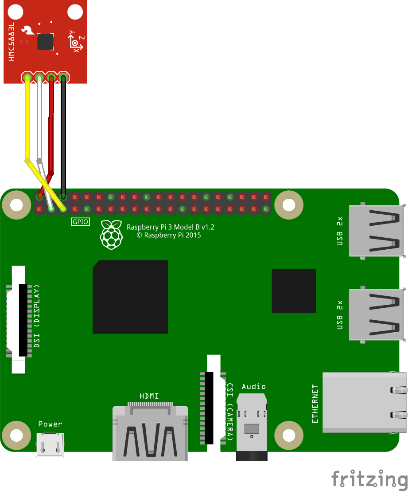
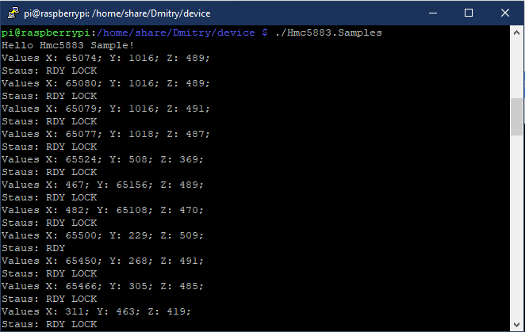

# Example of Hmc5883

## Hardware Required
* 3-Axis Digital Compass IC HMC5883
* Male/Female Jumper Wires

## Circuit


* VCC - 5v Power(Pin2)
* GND - Ground(Pin6)
* SDA - I2C1 SDA(Pin3)
* SCL - I2C1 SCL(Pin5)

## Code
```C#
static void Main(string[] args)
{
    var pauseSeconds = 1000;

    Console.WriteLine("Hello Hmc5883 Sample!");

    using (Hmc5883 hmc5883 = GetHmc5883Device())
    {
        //configure device
        hmc5883.setOutputRateAndMeasurementMode(OutputRates.Rate15, MeasurementModes.Normal);
        hmc5883.setGain(GainConfiguration.Ga1_2);
        hmc5883.setOperatingMode(OperatingModes.ContinuousMeasurementMode);

        while (true)
        {
            // read data
            RawValues values = hmc5883.getRawValues();

            Console.WriteLine($"Values X: {values.X}; Y: {values.Y}; Z: {values.Z};");

            var status = hmc5883.getStatus();
            Console.Write("Statuses: ");
            foreach (var item in status)
            {
                Console.Write($"{item} ");
            }

            Console.WriteLine();

            // waiting
            Thread.Sleep(pauseSeconds);
        }
    }
}
```

## Result



