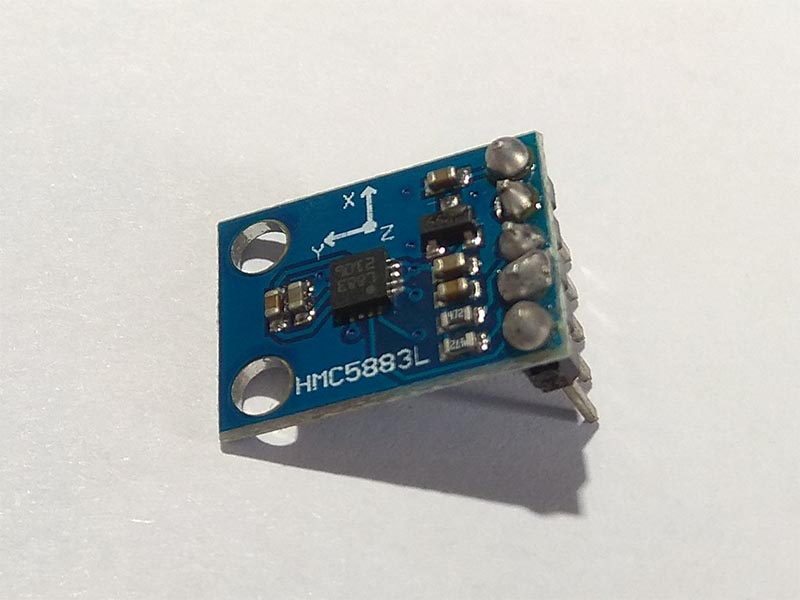

# HMC5883L - 3 Axis Digital Compass
HMC5883L is a surface-mount, multi-chip module designed for low-field magnetic sensing with a digital interface for applications such as lowcost compassing and magnetometry.

## Sensor Image


## Usage
```C#
I2cConnectionSettings settings = new I2cConnectionSettings(1, Hmc5883l.DefaultI2cAddress);
// get I2cDevice (in Linux)
I2cDevice device = I2cDevice.Create(settings);
// get I2cDevice (in Win10)
//Windows10I2cDevice device = new Windows10I2cDevice(settings);

using (Hmc5883l sensor = new Hmc5883l(device))
{
    // read direction vector
    Vector3 directionVector = sensor.DirectionVector;
    // read heading
    double heading = sensor.Heading;
    // read status
    Status status = sensor.DeviceStatus;
}

```

## References
https://cdn.datasheetspdf.com/pdf-down/H/M/C/HMC5883L-Honeywell.pdf
